# //max-potential-fid/samples/pages+cached

[→ Parent](../..)


## Raw


```yaml
p90min: 317
p90max: 641
p90range: 324
p90mean: 392.14893617021283
p90median: 367.0000000000009
p90stdev: 71.8304678802077
p90skewness: 1.6548145593122345
p90eccentricity: 0.9999999999999997
p90discretization: 1.146341463414634
outlandishness: 1.0645098258410262
confidence: 43.925727056656704
p90confidence: 29.041754855672885

```

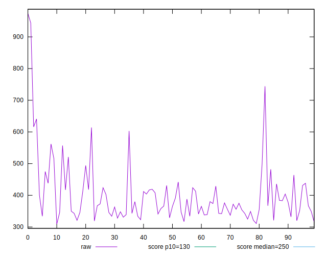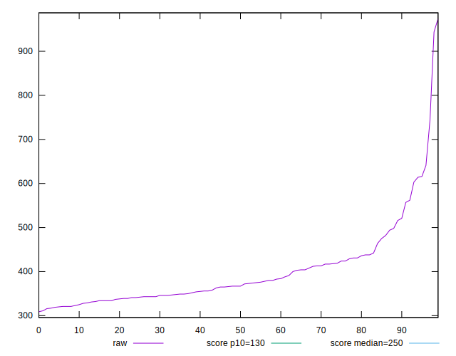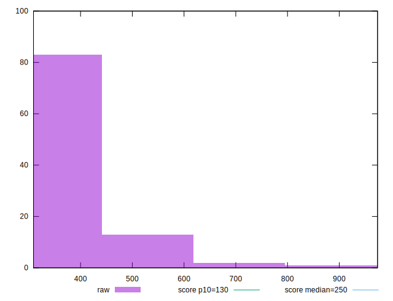
## Score


```yaml
p90min: 0.03
p90max: 0.32
p90range: 0.29000000000000004
p90mean: 0.2089361702127661
p90median: 0.23
p90stdev: 0.07585636041308576
p90skewness: -0.5900438730006415
p90eccentricity: 1.0000000000000002
p90discretization: 3.4814814814814814
outlandishness: 0.9768161971495046
confidence: 0.032971115111082167
p90confidence: 0.03066946225429536

```

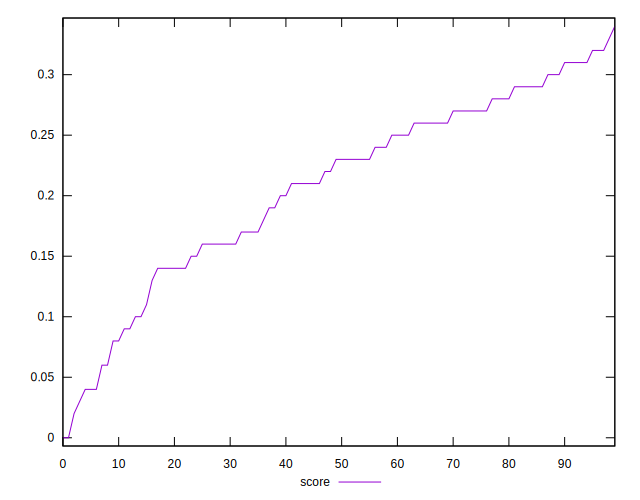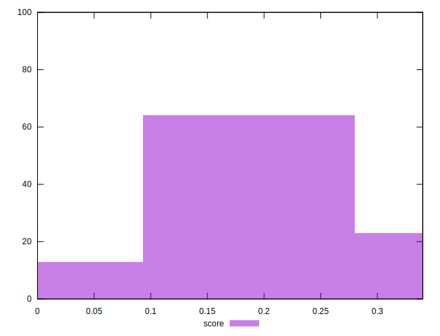
## Raw Estimate

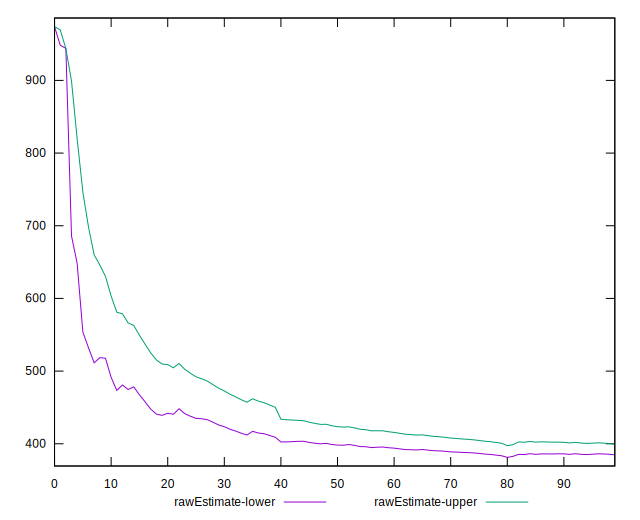
## Score Estimate

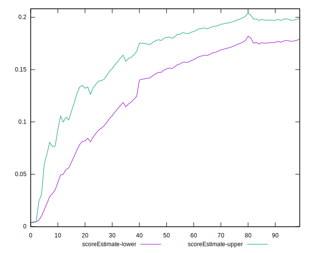
## P Score


```yaml
p90min: 0.03249932731513805
p90max: 0.32084699346177964
p90range: 0.2883476661466416
p90mean: 0.2085402300455809
p90median: 0.22591689812763438
p90stdev: 0.07553887305447246
p90skewness: -0.6021122581202082
p90eccentricity: 0.9999999999999996
p90discretization: 1.146341463414634
outlandishness: 0.9780559802832937
confidence: 0.032849354387102264
p90confidence: 0.030541099035862766

```

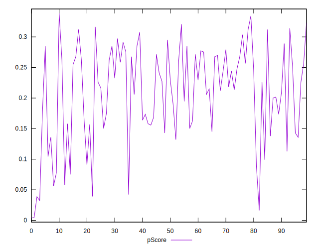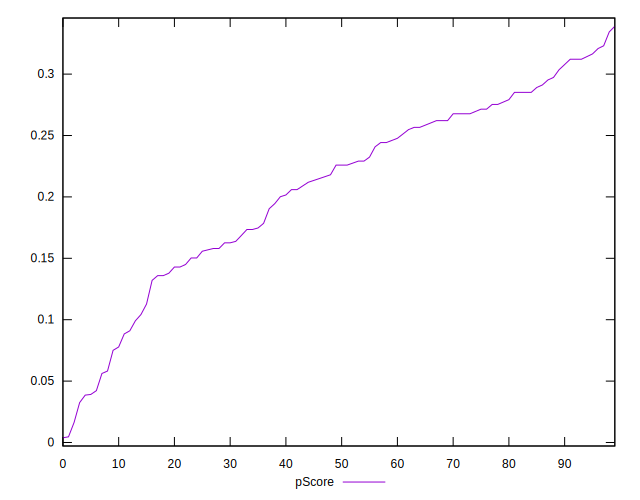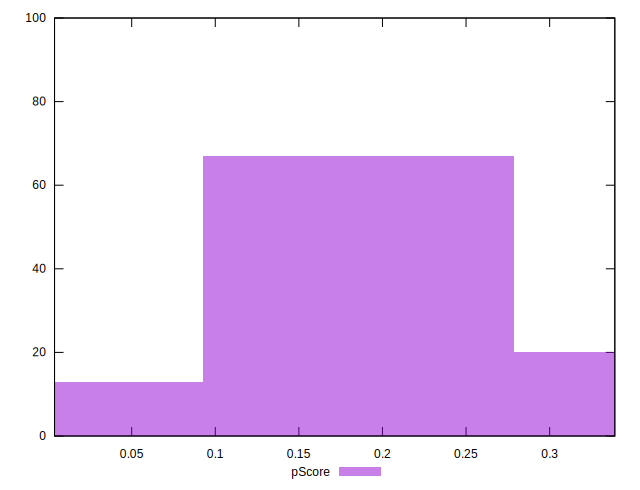
## Score Difference


```yaml
p90min: 0
p90max: 0
p90range: 0
p90mean: 0
p90median: 0
p90stdev: 0
p90skewness: .nan
p90eccentricity: .nan
p90discretization: 94
outlandishness: .nan
confidence: 0
p90confidence: 0

```


## P Score Difference


```yaml
p90min: -0.004883752116671913
p90max: 0.004701745187187495
p90range: 0.009585497303859408
p90mean: -0.00027746597020103205
p90median: -0.0008509335941211393
p90stdev: 0.0028845295665594142
p90skewness: 0.09188779241355571
p90eccentricity: 1.0000000000000007
p90discretization: 1.119047619047619
outlandishness: 0.8819042393103772
confidence: 0.0011934016656080133
p90confidence: 0.001166243281133374

```

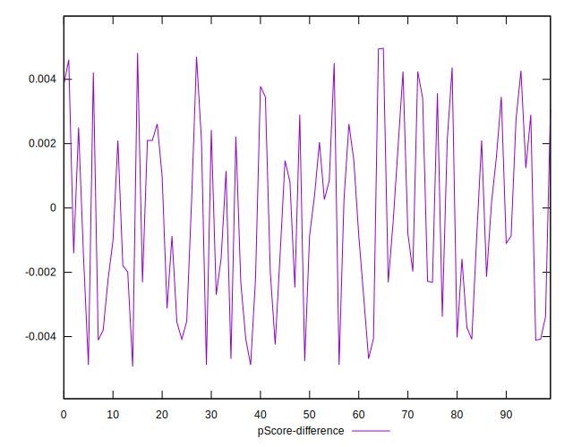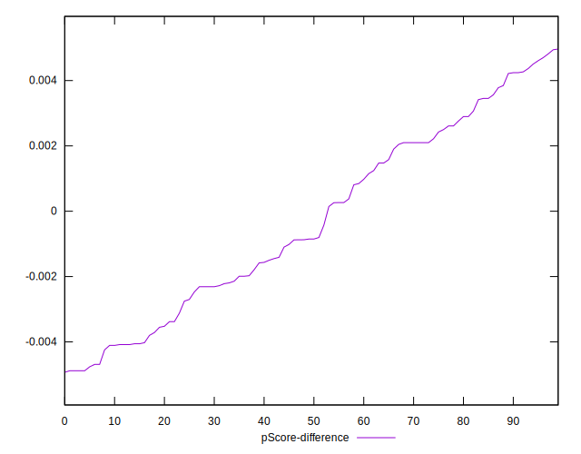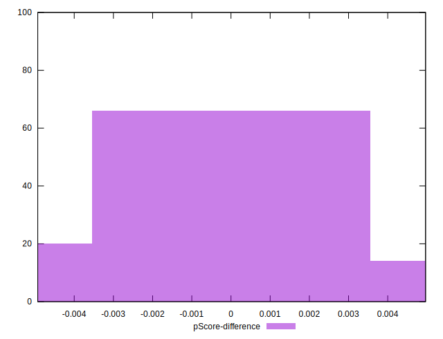