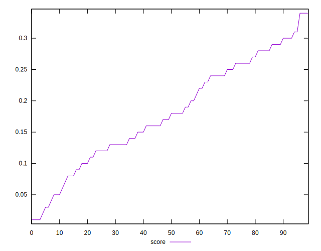
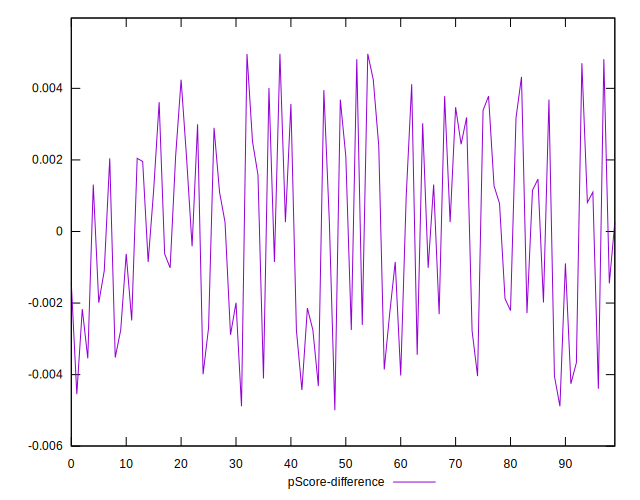

# //max-potential-fid/samples/pages

[→ Parent](../..)


## Raw


```yaml
p90min: 309
p90max: 767
p90range: 458
p90mean: 419.70212765957444
p90median: 402.5
p90stdev: 90.66595572422953
p90skewness: 1.5928152764828092
p90eccentricity: 0.9999999999999994
p90discretization: 1.1058823529411765
outlandishness: 1.0472346289918617
confidence: 46.01105519328843
p90confidence: 36.65712527850447

```


## Score


```yaml
p90min: 0.01
p90max: 0.34
p90range: 0.33
p90mean: 0.18085106382978716
p90median: 0.175
p90stdev: 0.08209568333519443
p90skewness: -0.11008575882446443
p90eccentricity: 1
p90discretization: 2.9375
outlandishness: 0.9961214152249133
confidence: 0.03499674721744735
p90confidence: 0.03319208102759155

```


## Raw Estimate


## Score Estimate


## P Score


```yaml
p90min: 0.014011483665038238
p90max: 0.33898361152324563
p90range: 0.3249721278582074
p90mean: 0.1809156583058738
p90median: 0.175330049412652
p90stdev: 0.08191351995636514
p90skewness: -0.11545900805599714
p90eccentricity: 0.9999999999999994
p90discretization: 1.1058823529411765
outlandishness: 0.9955812113527992
confidence: 0.034992809364942444
p90confidence: 0.03311843060670798

```


## Score Difference


```yaml
p90min: 0
p90max: 0
p90range: 0
p90mean: 0
p90median: 0
p90stdev: 0
p90skewness: .nan
p90eccentricity: .nan
p90discretization: 94
outlandishness: .nan
confidence: 0
p90confidence: 0

```


## P Score Difference


```yaml
p90min: -0.0045461176922079564
p90max: 0.004815770100113859
p90range: 0.009361887792321815
p90mean: 0.000015113683711877745
p90median: 0.0002609878135666488
p90stdev: 0.0028259925497058423
p90skewness: 0.03943291724046581
p90eccentricity: 1.0000000000000007
p90discretization: 1.1058823529411765
outlandishness: 1.0520103700306953
confidence: 0.0011741899620708856
p90confidence: 0.0011425761974624314

```

