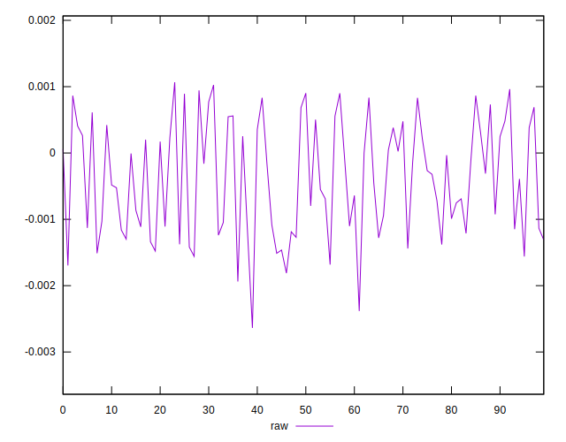
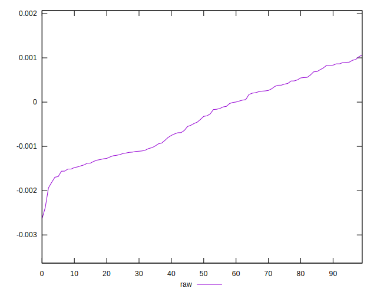
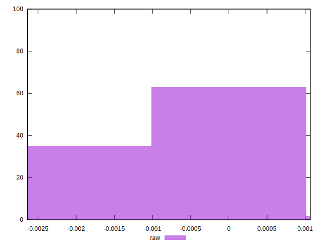

# //meta/pScore-difference/samples/pages+cached+noadtech+nomedia+nocss

[→ Parent](../..)


## Raw


```yaml
p90min: -0.0018112442378531734
p90max: 0.0009446585415965131
p90range: 0.0027559027794496864
p90mean: -0.0003816642005662506
p90median: -0.00035631222488423446
p90stdev: 0.0008237725726423995
p90skewness: 0.03749491401173865
p90eccentricity: 1.0000000000000002
p90discretization: 1
outlandishness: 1.0862682992731312
confidence: 0.00035314207354898274
p90confidence: 0.00033305924098121537

```

