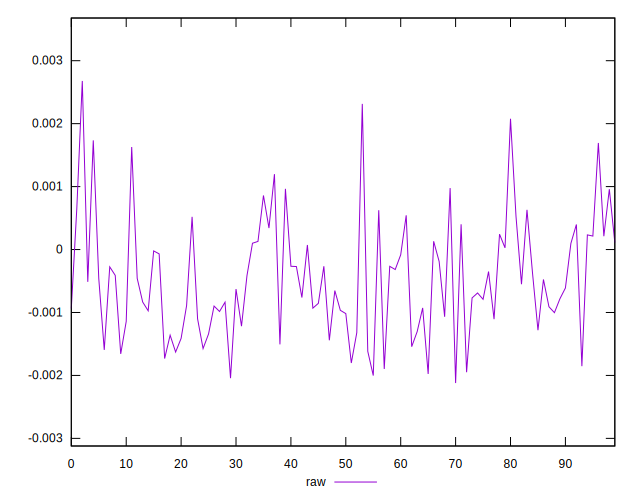
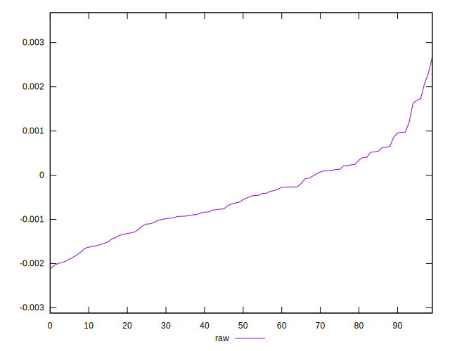
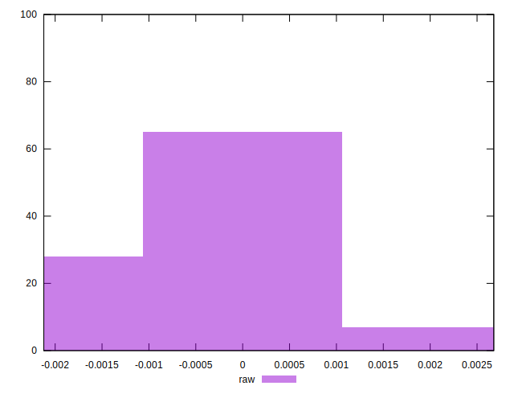

# //meta/pScore-difference/samples/pages+cached+noadtech+nomedia

[→ Parent](../..)


## Raw


```yaml
p90min: -0.0019762822155492132
p90max: 0.0017345244927342665
p90range: 0.0037108067082834797
p90mean: -0.000487923304956233
p90median: -0.000581064766245021
p90stdev: 0.0008639531824594436
p90skewness: 0.45026682786467503
p90eccentricity: 1
p90discretization: 1
outlandishness: 0.8491621467510057
confidence: 0.00039560923175269033
p90confidence: 0.00034930465124645427

```

