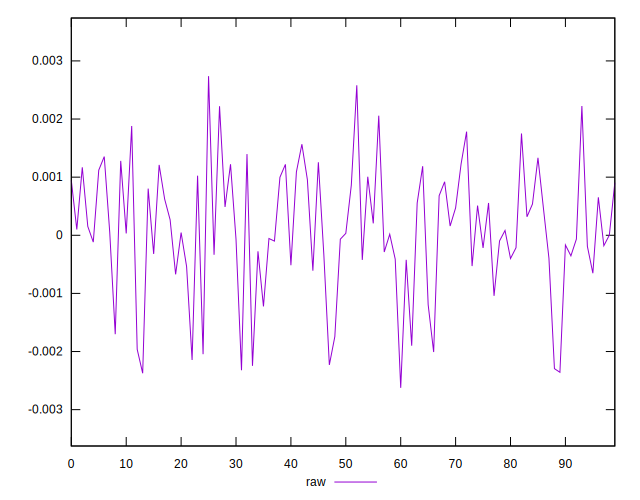
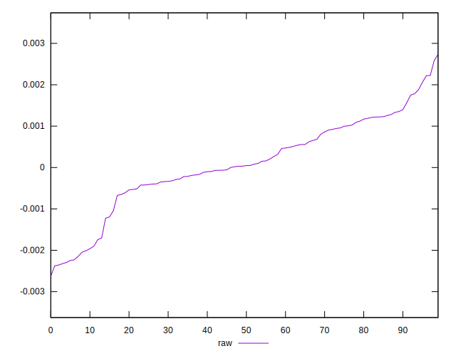
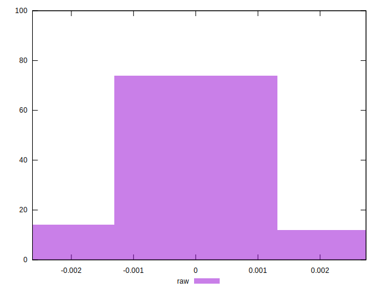

# //meta/pScore-difference/samples/pages+cached+noadtech

[→ Parent](../..)


## Raw


```yaml
p90min: -0.0023221394370706804
p90max: 0.0022200960813733373
p90range: 0.004542235518444017
p90mean: 0.00008151273759874956
p90median: 0.00003976781318810992
p90stdev: 0.0010657008064911828
p90skewness: -0.4873375124053447
p90eccentricity: 1.0000000000000007
p90discretization: 1
outlandishness: 0.9269740032554926
confidence: 0.0004703174927049789
p90confidence: 0.0004308731724151526

```

