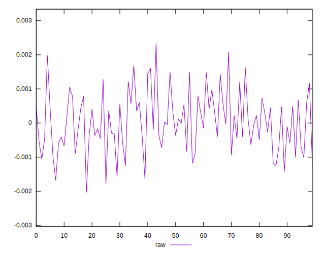
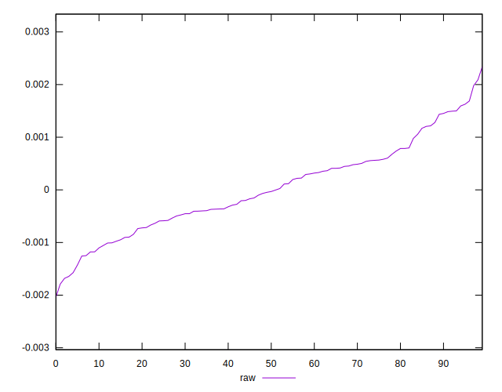
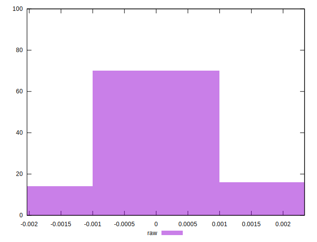

# //meta/pScore-difference/samples/pages+cached

[→ Parent](../..)


## Raw


```yaml
p90min: -0.0016430329699756593
p90max: 0.0016879976275510323
p90range: 0.0033310305975266918
p90mean: 0.00002113655685875426
p90median: -0.00003922433679884648
p90stdev: 0.0008120780469701506
p90skewness: 0.17073154503734342
p90eccentricity: 1.0000000000000002
p90discretization: 1
outlandishness: 1.8684339069483396
confidence: 0.0003632538742034402
p90confidence: 0.0003283310308254187

```

