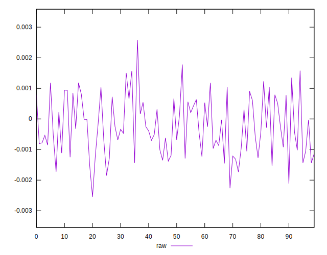
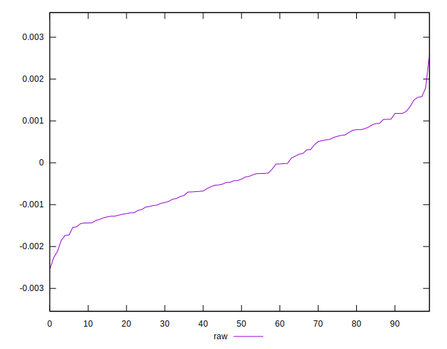
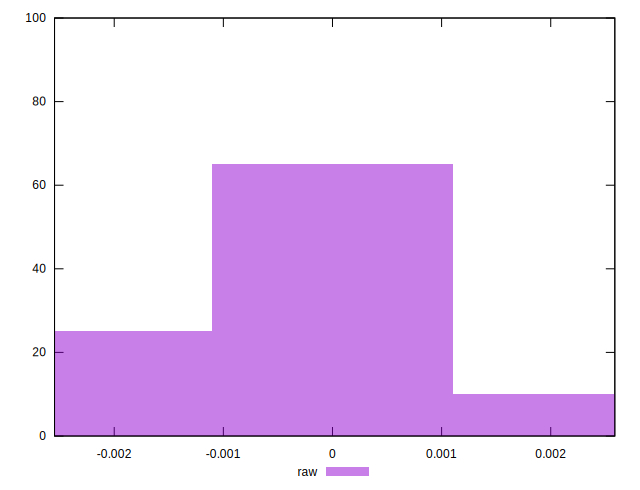

# //meta/pScore-difference/samples/pages

[→ Parent](../..)


## Raw


```yaml
p90min: -0.0018495792366287351
p90max: 0.001565631746170345
p90range: 0.00341521098279908
p90mean: -0.0002656297703750038
p90median: -0.00040691113716008253
p90stdev: 0.0009009946651773568
p90skewness: 0.2309662294961549
p90eccentricity: 0.9999999999999994
p90discretization: 1
outlandishness: 0.9545430498629177
confidence: 0.0004009958253234815
p90confidence: 0.0003642808819787713

```

