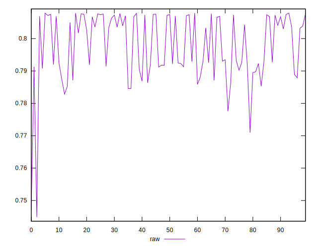
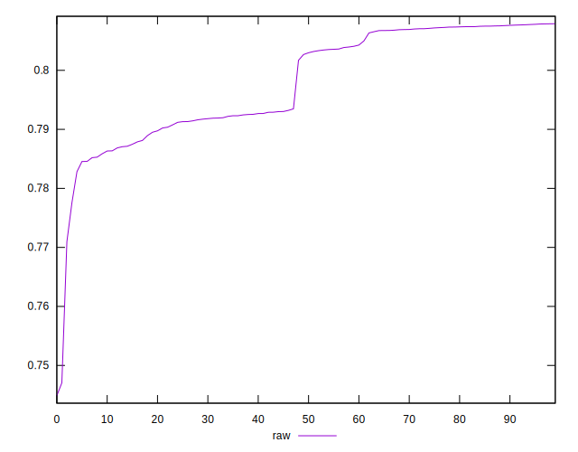
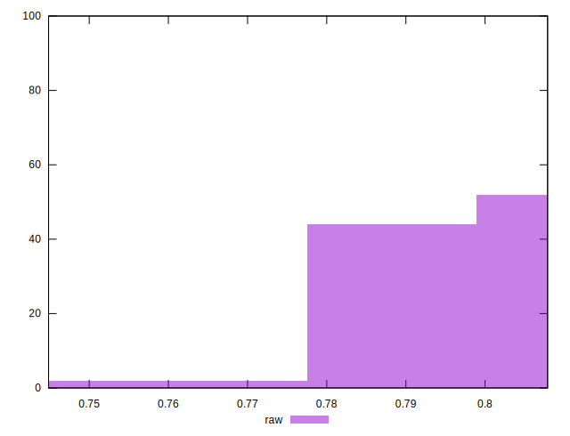

# //meta/pScore/samples/pages+cached+noadtech+nomedia+nocss

[→ Parent](../..)


## Raw


```yaml
p90min: 0.7775597934740448
p90max: 0.8078505454436176
p90range: 0.03029075196957276
p90mean: 0.7982997641428836
p90median: 0.8028256933817395
p90stdev: 0.008657923281027111
p90skewness: -0.2787968716520887
p90eccentricity: 1.0000000000000004
p90discretization: 1
outlandishness: 0.997414798642508
confidence: 0.004544986116122098
p90confidence: 0.0035004823566810567

```

