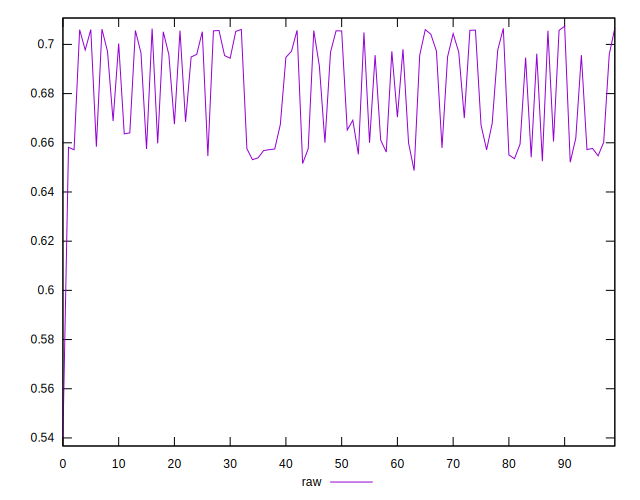
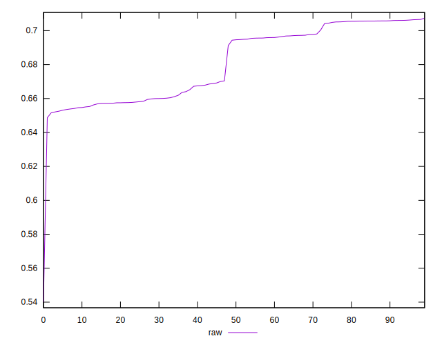
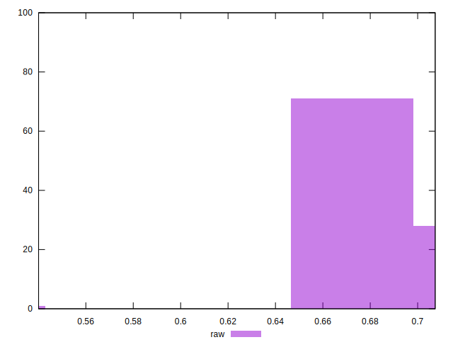

# //meta/pScore/samples/pages+cached+noadtech+nomedia

[→ Parent](../..)


## Raw


```yaml
p90min: 0.6520982521585256
p90max: 0.7064311029371707
p90range: 0.054332850778645136
p90mean: 0.6812093423851088
p90median: 0.6945014665260529
p90stdev: 0.021016327856877414
p90skewness: -0.08546455083780687
p90eccentricity: 0.9999999999999997
p90discretization: 1
outlandishness: 0.9962925022274335
confidence: 0.01000829762324422
p90confidence: 0.008497105192239186

```

