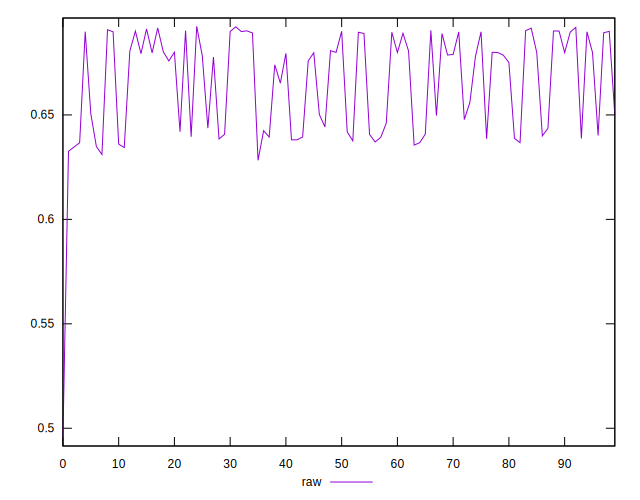
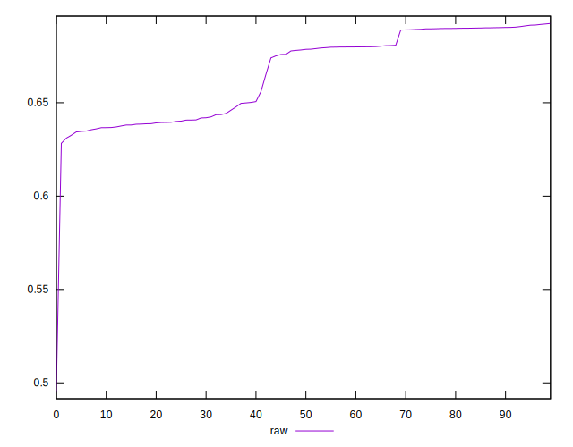
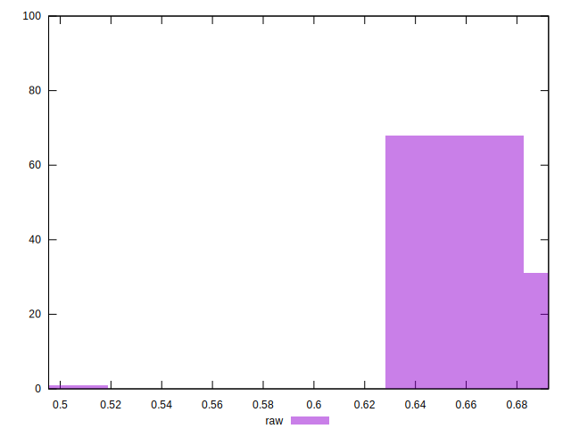

# //meta/pScore/samples/pages+cached+noadtech

[→ Parent](../..)


## Raw


```yaml
p90min: 0.6325992174159731
p90max: 0.691623357084989
p90range: 0.059024139669015874
p90mean: 0.6662501256763348
p90median: 0.6784102551944282
p90stdev: 0.022199406432829614
p90skewness: -0.2766917213245038
p90eccentricity: 1
p90discretization: 1
outlandishness: 0.9950181666893466
confidence: 0.011081880695694638
p90confidence: 0.00897543533530748

```

