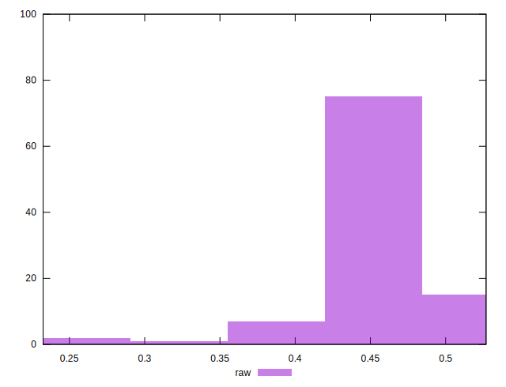

# //meta/pScore/samples/pages+cached

[→ Parent](../..)


## Raw


```yaml
p90min: 0.36294342657837525
p90max: 0.5093223993224264
p90range: 0.14637897274405115
p90mean: 0.4647874949066424
p90median: 0.4694746574344815
p90stdev: 0.026251194226905413
p90skewness: -1.3145523110748911
p90eccentricity: 0.9999999999999999
p90discretization: 1
outlandishness: 0.9819295555091703
confidence: 0.01711785632085537
p90confidence: 0.01061361243919323

```

