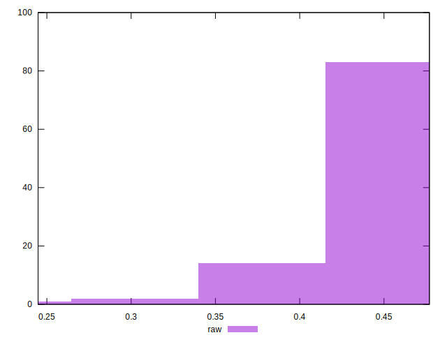

# //meta/pScore/samples/pages

[→ Parent](../..)


## Raw


```yaml
p90min: 0.3447189488798773
p90max: 0.47357748569124136
p90range: 0.12885853681136406
p90mean: 0.4381938405950035
p90median: 0.444261083732572
p90stdev: 0.03069822377168774
p90skewness: -1.3731139909511605
p90eccentricity: 1
p90discretization: 1
outlandishness: 0.9817209108305471
confidence: 0.016614118563842244
p90confidence: 0.01241158961638337

```

