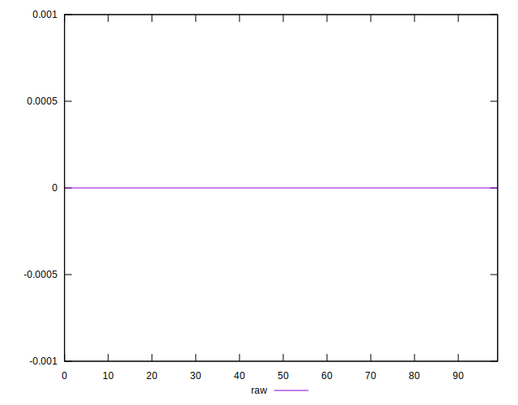

# //meta/score-difference/samples/pages+cached+noadtech+nomedia

[→ Parent](../..)


## Raw


```yaml
p90min: 0
p90max: 1.6653345369377347e-17
p90range: 1.6653345369377347e-17
p90mean: 2.8346119777663566e-18
p90median: 0
p90stdev: 6.258653784115268e-18
p90skewness: 1.7550294029241298
p90eccentricity: 1.0000000000000013
p90discretization: 47
outlandishness: 1.2460140624999994
confidence: 2.5609369449832054e-18
p90confidence: 2.5304344282976352e-18

```

