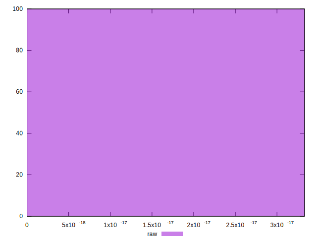

# //meta/score-difference/samples/pages+cached+noadtech

[→ Parent](../..)


## Raw


```yaml
p90min: 0
p90max: 1.6653345369377347e-17
p90range: 1.6653345369377347e-17
p90mean: 4.163336342344335e-18
p90median: 0
p90stdev: 7.159784794739846e-18
p90skewness: 1.154611318866509
p90eccentricity: 0.9999999999999989
p90discretization: 31.333333333333332
outlandishness: 1.2995999999999999
confidence: 3.206533176331051e-18
p90confidence: 2.894770436063148e-18

```

