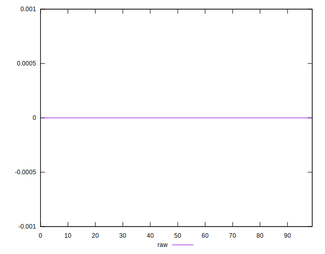
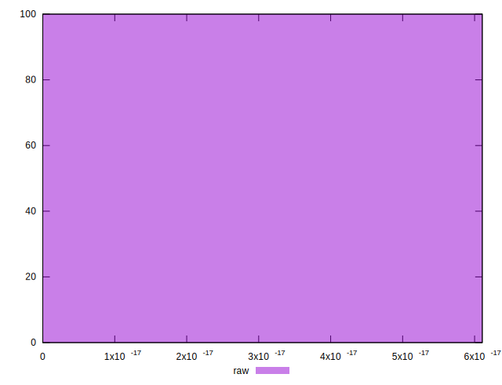

# //meta/score-difference/samples/pages+cached

[→ Parent](../..)


## Raw


```yaml
p90min: 0
p90max: 4.4408920985006264e-17
p90range: 4.4408920985006264e-17
p90mean: 1.987181105246625e-17
p90median: 1.6653345369377347e-17
p90stdev: 1.177780335159843e-17
p90skewness: 0.8975163066767505
p90eccentricity: 0.9999999999999979
p90discretization: 15.666666666666666
outlandishness: 1.0396120363235724
confidence: 5.19853869435522e-18
p90confidence: 4.7618801292771845e-18

```

