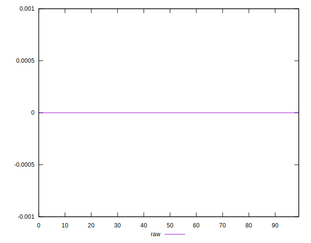

# //meta/score-difference/samples/pages

[→ Parent](../..)


## Raw


```yaml
p90min: 0
p90max: 2.7755575615628914e-17
p90range: 2.7755575615628914e-17
p90mean: 6.0530776608552436e-18
p90median: 0
p90stdev: 1.0153453347599434e-17
p90skewness: 1.3234131074336477
p90eccentricity: 1.000000000000001
p90discretization: 23.5
outlandishness: 1.3140987507436053
confidence: 4.5657066377744826e-18
p90confidence: 4.105139667908861e-18

```

