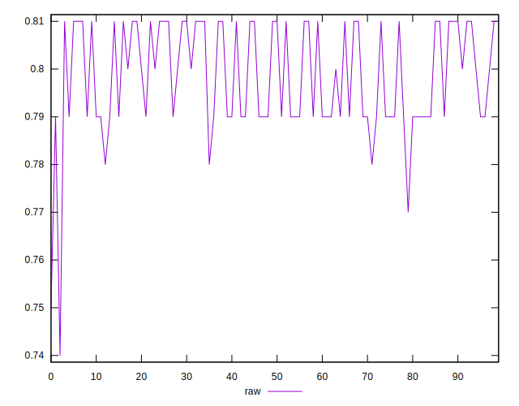
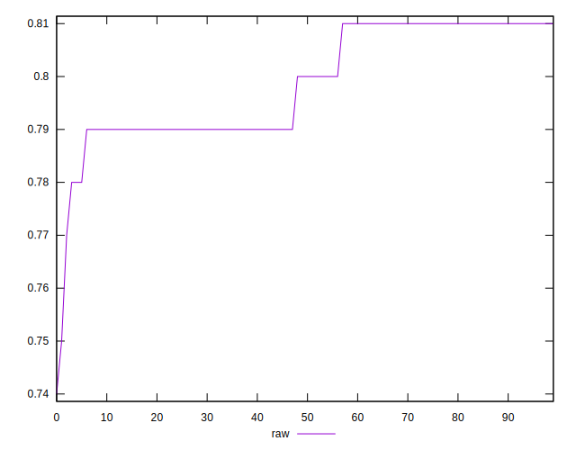
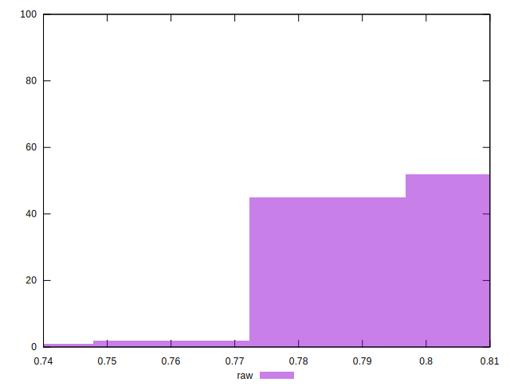

# //meta/score/samples/pages+cached+noadtech+nomedia+nocss

[→ Parent](../..)


## Raw


```yaml
p90min: 0.78
p90max: 0.81
p90range: 0.030000000000000027
p90mean: 0.799148936170213
p90median: 0.8
p90stdev: 0.00996371870124946
p90skewness: -0.022756253594595124
p90eccentricity: 0.9999999999999971
p90discretization: 23.5
outlandishness: 0.9973765897106349
confidence: 0.0050106125642009666
p90confidence: 0.004028428110132108

```

