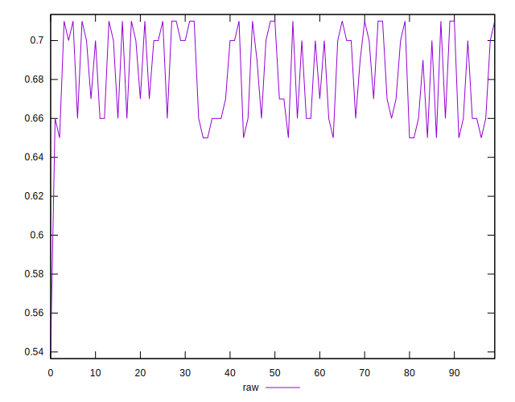
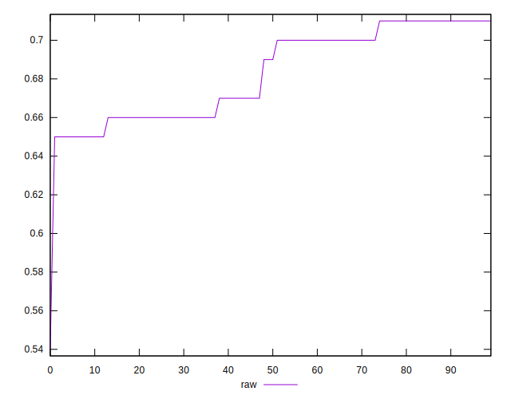
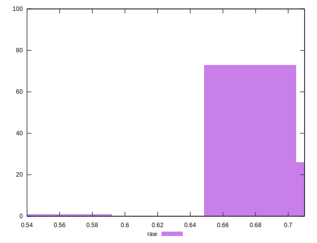

# //meta/score/samples/pages+cached+noadtech+nomedia

[→ Parent](../..)


## Raw


```yaml
p90min: 0.65
p90max: 0.71
p90range: 0.05999999999999994
p90mean: 0.6829787234042553
p90median: 0.69
p90stdev: 0.022916582643850488
p90skewness: -0.1022072644593865
p90eccentricity: 1.000000000000001
p90discretization: 15.666666666666666
outlandishness: 0.9962589571238631
confidence: 0.010664149450910602
p90confidence: 0.009265396633395135

```

