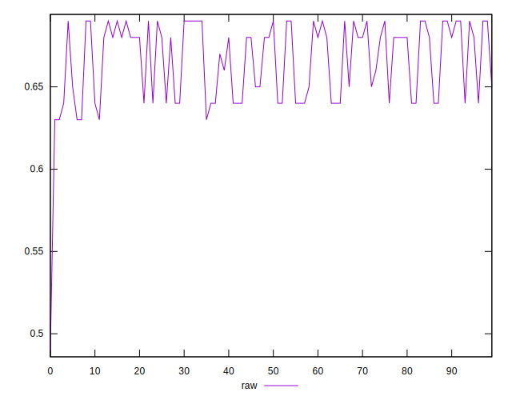
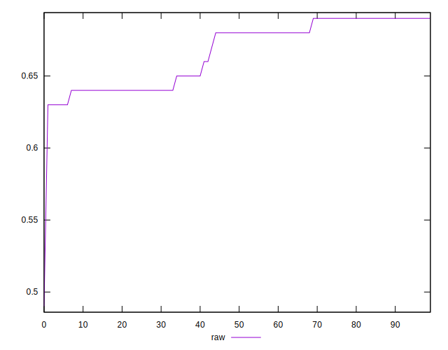
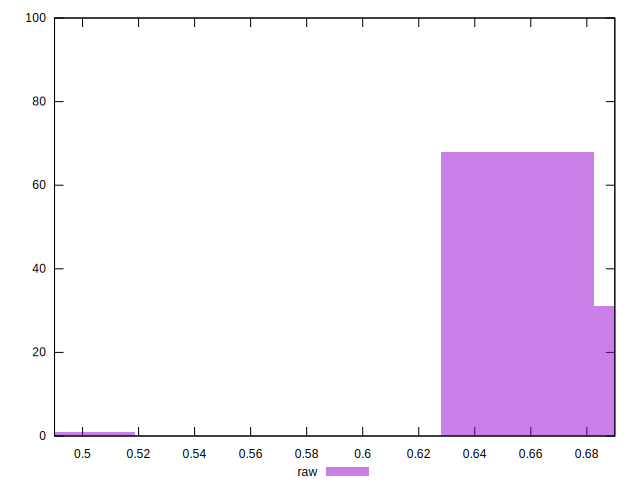

# //meta/score/samples/pages+cached+noadtech

[→ Parent](../..)


## Raw


```yaml
p90min: 0.63
p90max: 0.69
p90range: 0.05999999999999994
p90mean: 0.6665957446808507
p90median: 0.68
p90stdev: 0.022196088954385226
p90skewness: -0.3087140568874481
p90eccentricity: 1.0000000000000007
p90discretization: 13.428571428571429
outlandishness: 0.9946194499031091
confidence: 0.011190416043227139
p90confidence: 0.008974094046595821

```

