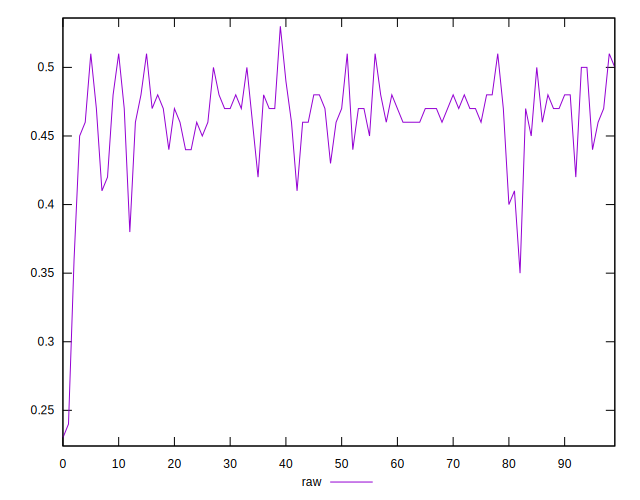
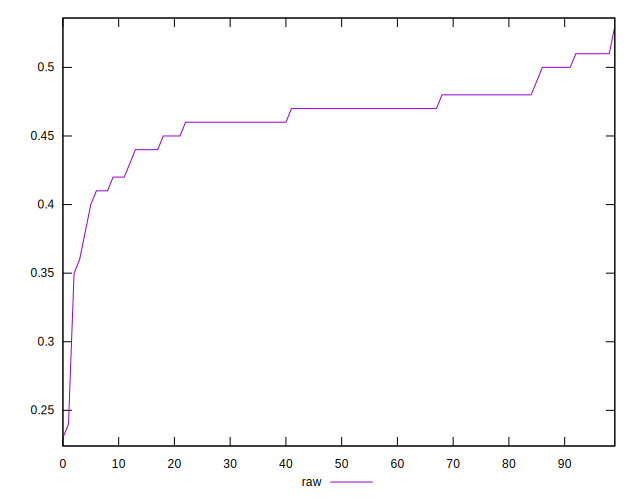
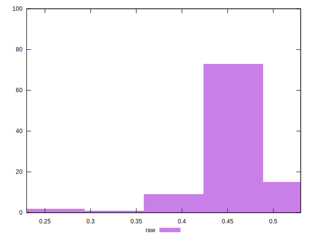

# //meta/score/samples/pages+cached

[→ Parent](../..)


## Raw


```yaml
p90min: 0.36
p90max: 0.51
p90range: 0.15000000000000002
p90mean: 0.46478723404255295
p90median: 0.47
p90stdev: 0.02648679813280952
p90skewness: -1.216245634408462
p90eccentricity: 1.0000000000000007
p90discretization: 6.714285714285714
outlandishness: 0.9820633077015642
confidence: 0.017147791995044858
p90confidence: 0.010708869383498774

```

