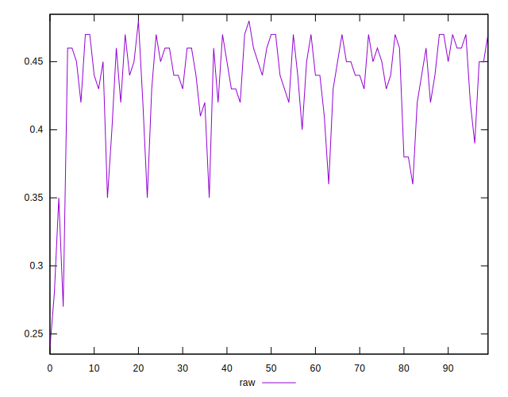
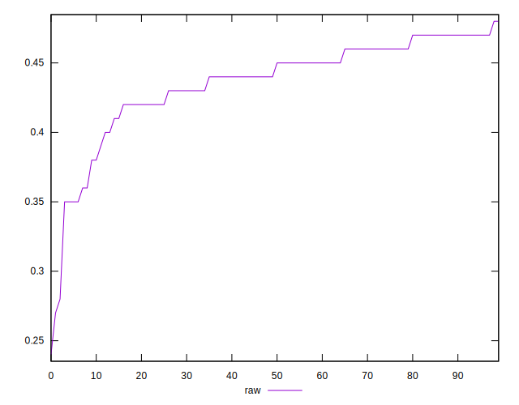
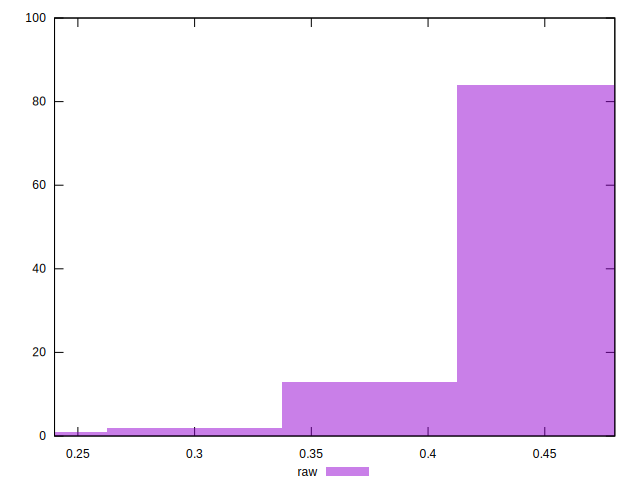

# //meta/score/samples/pages

[→ Parent](../..)


## Raw


```yaml
p90min: 0.35
p90max: 0.47
p90range: 0.12
p90mean: 0.4382978723404257
p90median: 0.445
p90stdev: 0.030479790928540394
p90skewness: -1.400446190780763
p90eccentricity: 0.9999999999999997
p90discretization: 7.833333333333333
outlandishness: 0.9813883842963517
confidence: 0.016761347976107784
p90confidence: 0.012323275099294434

```

