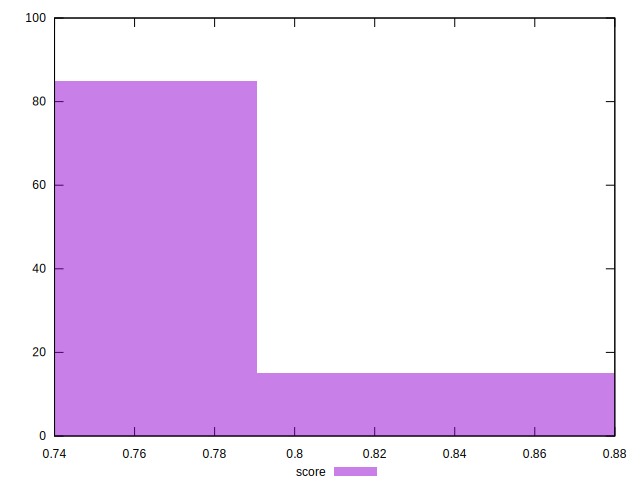
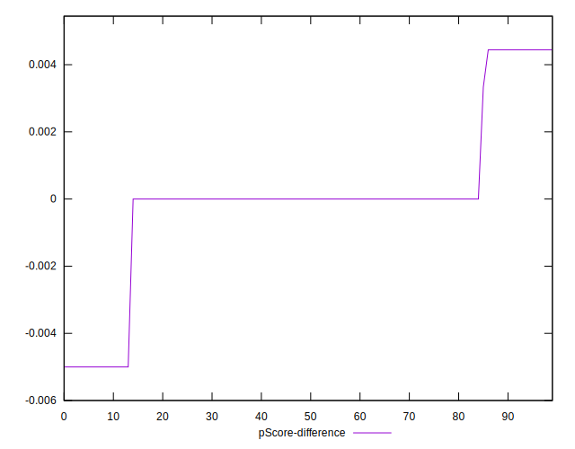

# //offscreen-images/samples/pages+cached+noadtech

[→ Parent](../..)


## Raw


```yaml
p90min: 150
p90max: 310
p90range: 160
p90mean: 282.5531914893617
p90median: 300
p90stdev: 49.46385248421673
p90skewness: -2.2483338656236813
p90eccentricity: 0.9999999999999976
p90discretization: 23.5
outlandishness: 0.9778052604242268
confidence: 20.888619031037823
p90confidence: 19.998715314780913

```


## Score


```yaml
p90min: 0.74
p90max: 0.88
p90range: 0.14
p90mean: 0.7648936170212768
p90median: 0.75
p90stdev: 0.04284421758573935
p90skewness: 2.2519193939847884
p90eccentricity: 1.0000000000000004
p90discretization: 23.5
outlandishness: 1.0070890143279665
confidence: 0.018109218728016106
p90confidence: 0.01732233272075066

```


## Raw Estimate


## Score Estimate


## P Score


```yaml
p90min: 0.7444444444444445
p90max: 0.875
p90range: 0.13055555555555554
p90mean: 0.7648640661938536
p90median: 0.75
p90stdev: 0.04104882238685221
p90skewness: 2.259317449332662
p90eccentricity: 1.0000000000000016
p90discretization: 23.5
outlandishness: 1.0070502067962532
confidence: 0.0173235445756486
p90confidence: 0.01659643702810267

```


## Score Difference


```yaml
p90min: 0
p90max: 0
p90range: 0
p90mean: 0
p90median: 0
p90stdev: 0
p90skewness: .nan
p90eccentricity: .nan
p90discretization: 94
outlandishness: .inf
confidence: 4.330179641073934e-18
p90confidence: 0

```


## P Score Difference


```yaml
p90min: -0.0050000000000000044
p90max: 0.004444444444444473
p90range: 0.009444444444444478
p90mean: -0.00002955082742316538
p90median: 0
p90stdev: 0.0023139562145231937
p90skewness: -0.2813169451348032
p90eccentricity: 0.9999999999999971
p90discretization: 23.5
outlandishness: 2.2620160000000675
confidence: 0.000989699754315648
p90confidence: 0.0009355549408506663

```

