# //offscreen-images/samples/pages+cached

[→ Parent](../..)


## Raw


```yaml
p90min: 150
p90max: 310
p90range: 160
p90mean: 185.85106382978722
p90median: 150
p90stdev: 63.45394668523065
p90skewness: 1.2476012492004982
p90eccentricity: 1.0000000000000016
p90discretization: 18.8
outlandishness: 0.9962256631615438
confidence: 27.581227134811428
p90confidence: 25.65504609173202

```

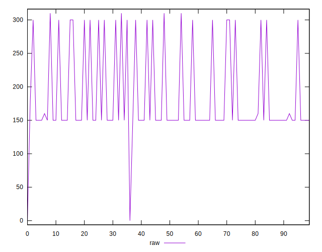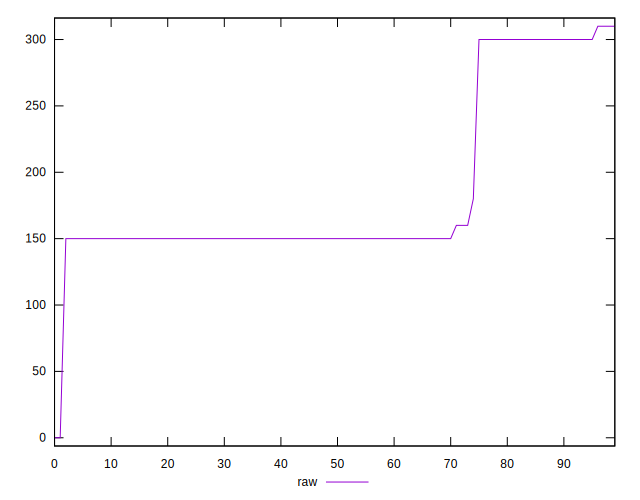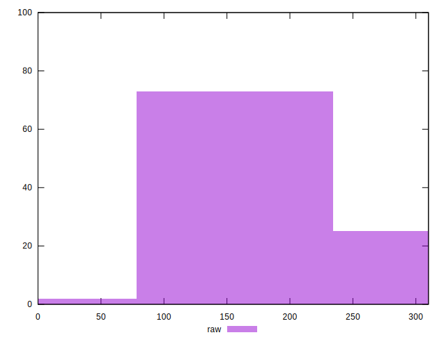
## Score


```yaml
p90min: 0.74
p90max: 0.88
p90range: 0.14
p90mean: 0.8488297872340426
p90median: 0.88
p90stdev: 0.055002057659357055
p90skewness: -1.2449663070620376
p90eccentricity: 0.9999999999999999
p90discretization: 18.8
outlandishness: 1.0001654411070693
confidence: 0.02373350486574818
p90confidence: 0.022237865382758713

```

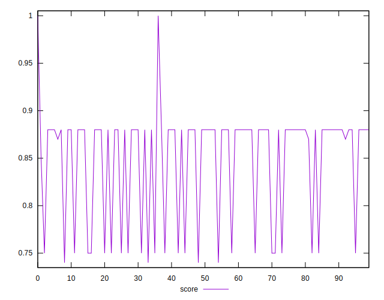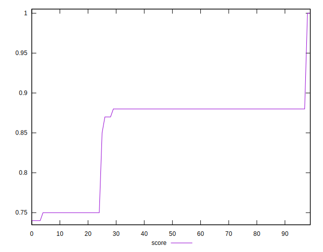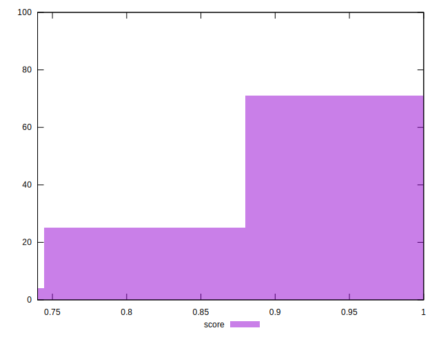
## Raw Estimate

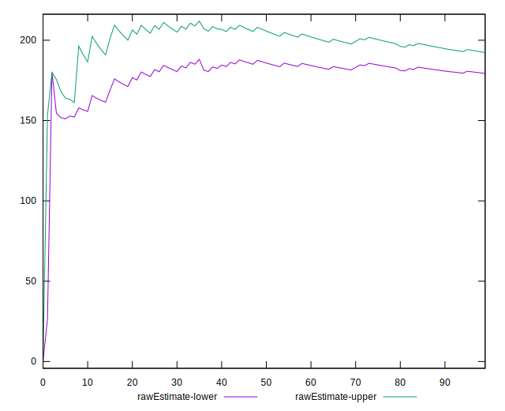
## Score Estimate

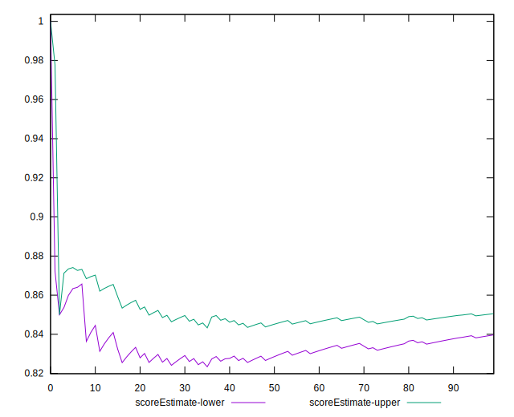
## P Score


```yaml
p90min: 0.7444444444444445
p90max: 0.875
p90range: 0.13055555555555554
p90mean: 0.8451536643026003
p90median: 0.875
p90stdev: 0.05282120922054527
p90skewness: -1.2470612777056231
p90eccentricity: 0.9999999999999991
p90discretization: 18.8
outlandishness: 1.0008855106308379
confidence: 0.022908152870717926
p90confidence: 0.021356127206655307

```

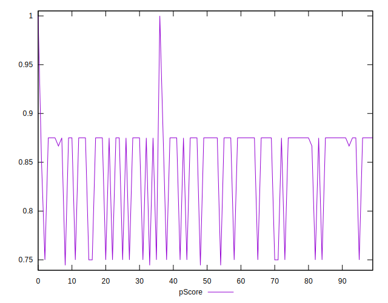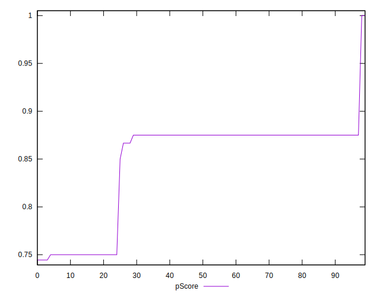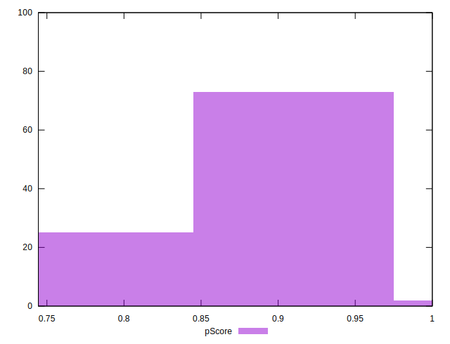
## Score Difference


```yaml
p90min: 0
p90max: 0
p90range: 0
p90mean: 0
p90median: 0
p90stdev: 0
p90skewness: .nan
p90eccentricity: .nan
p90discretization: 94
outlandishness: .nan
confidence: 0
p90confidence: 0

```


## P Score Difference


```yaml
p90min: -0.0050000000000000044
p90max: 0.004444444444444473
p90range: 0.009444444444444478
p90mean: -0.003569739952718678
p90median: -0.0050000000000000044
p90stdev: 0.0023183824761318435
p90skewness: 1.2066597919957702
p90eccentricity: 0.9999999999999971
p90discretization: 23.5
outlandishness: 0.8923992818297438
confidence: 0.0010372320566892496
p90confidence: 0.0009373445213498475

```

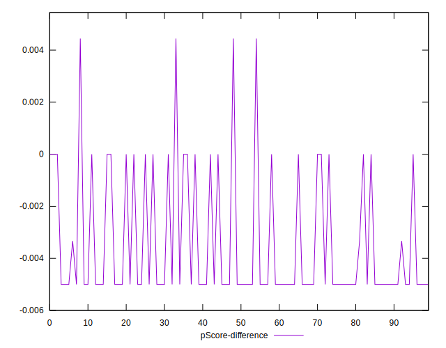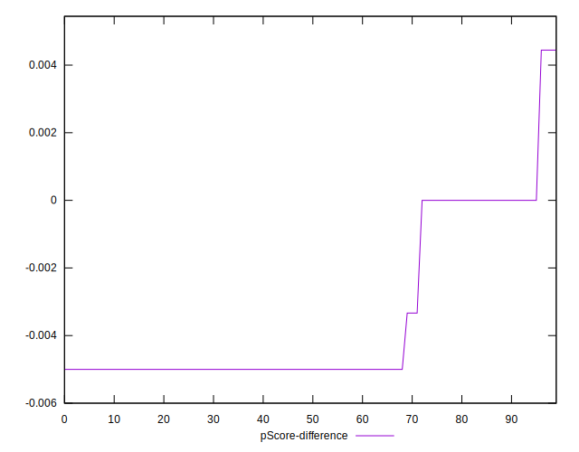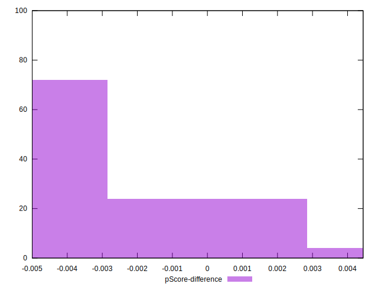