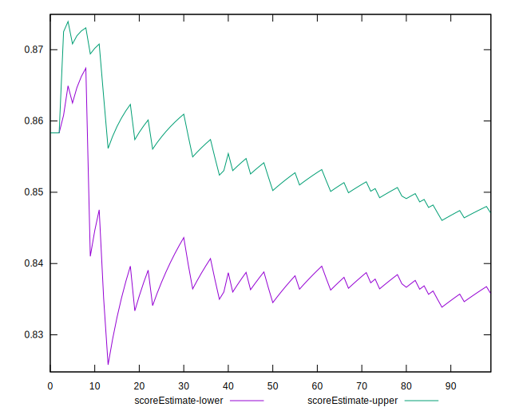
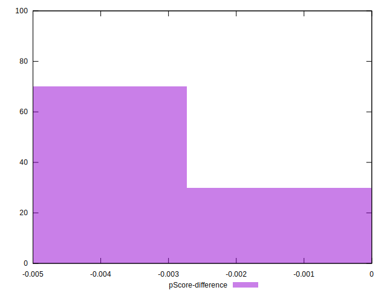

# //offscreen-images/samples/pages

[→ Parent](../..)


## Raw


```yaml
p90min: 150
p90max: 300
p90range: 150
p90mean: 190.31914893617022
p90median: 150
p90stdev: 66.08267110636714
p90skewness: 1.053515231022904
p90eccentricity: 1
p90discretization: 31.333333333333332
outlandishness: 1.0219865058220206
confidence: 26.325577852307443
p90confidence: 26.717864871488327

```


## Score


```yaml
p90min: 0.75
p90max: 0.88
p90range: 0.13
p90mean: 0.8450000000000001
p90median: 0.88
p90stdev: 0.057255493093341714
p90skewness: -1.051675186990267
p90eccentricity: 1.0000000000000009
p90discretization: 31.333333333333332
outlandishness: 0.9957441826266582
confidence: 0.02280899613464245
p90confidence: 0.023148951185039863

```


## Raw Estimate


## Score Estimate


## P Score


```yaml
p90min: 0.75
p90max: 0.875
p90range: 0.125
p90mean: 0.8414007092198582
p90median: 0.875
p90stdev: 0.05506889258863924
p90skewness: -1.0535152310229094
p90eccentricity: 1.0000000000000016
p90discretization: 31.333333333333332
outlandishness: 0.9958824477083641
confidence: 0.02193798154358952
p90confidence: 0.022264887392906923

```


## Score Difference


```yaml
p90min: 0
p90max: 0
p90range: 0
p90mean: 0
p90median: 0
p90stdev: 0
p90skewness: .nan
p90eccentricity: .nan
p90discretization: 94
outlandishness: .nan
confidence: 0
p90confidence: 0

```


## P Score Difference


```yaml
p90min: -0.0050000000000000044
p90max: 0
p90range: 0.0050000000000000044
p90mean: -0.0035992907801418454
p90median: -0.0050000000000000044
p90stdev: 0.0022188637792803978
p90skewness: 0.9699476906895802
p90eccentricity: 0.9999999999999989
p90discretization: 31.333333333333332
outlandishness: 0.9636855638331434
confidence: 0.0008827335840104387
p90confidence: 0.0008971081469698877

```

