# //render-blocking-resources/samples/pages+cached+noadtech+nomedia

[→ Parent](../..)


## Raw


```yaml
p90min: 318
p90max: 508
p90range: 190
p90mean: 356.1595744680851
p90median: 331
p90stdev: 57.174295517339154
p90skewness: 1.8059177995533089
p90eccentricity: 1.0000000000000007
p90discretization: 2.186046511627907
outlandishness: 1.016919741141261
confidence: 25.56025816053845
p90confidence: 23.1161222175177

```

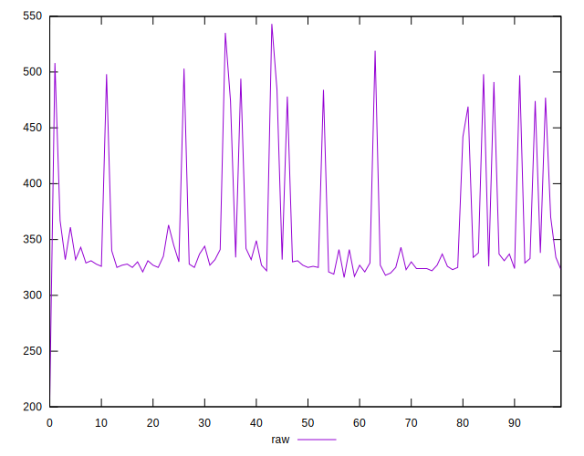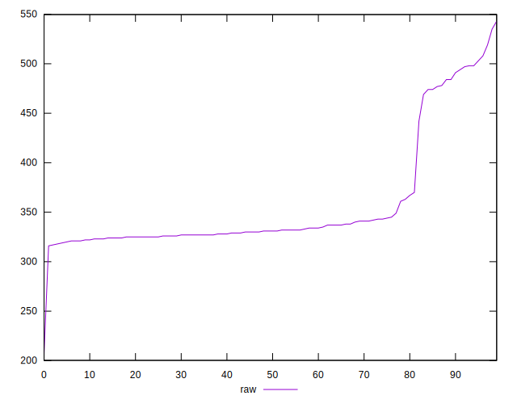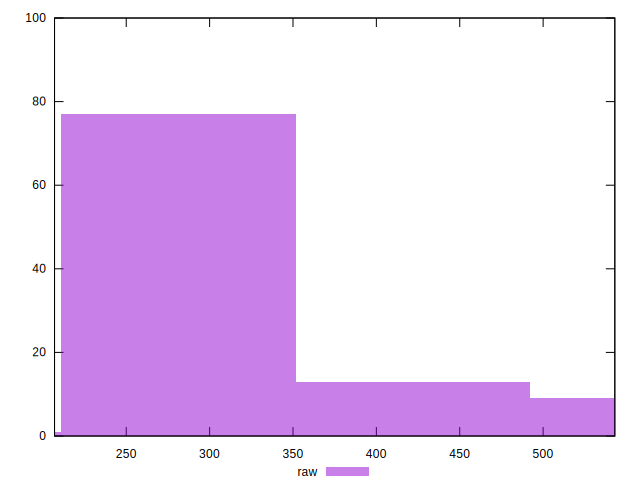
## Score


```yaml
p90min: 0.63
p90max: 0.74
p90range: 0.10999999999999999
p90mean: 0.7196808510638298
p90median: 0.73
p90stdev: 0.03263114709871254
p90skewness: -1.7719074725587962
p90eccentricity: 1.0000000000000016
p90discretization: 10.444444444444445
outlandishness: 0.9961662830325869
confidence: 0.014709448092987864
p90confidence: 0.013193089265138038

```

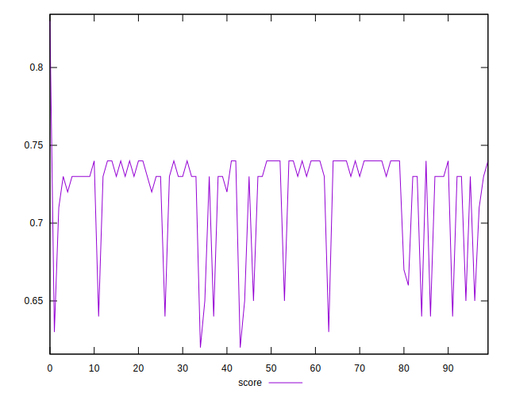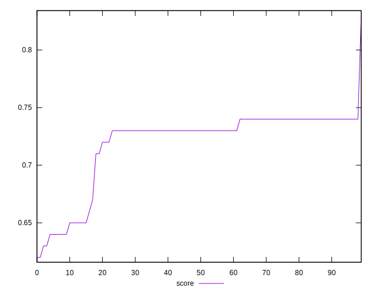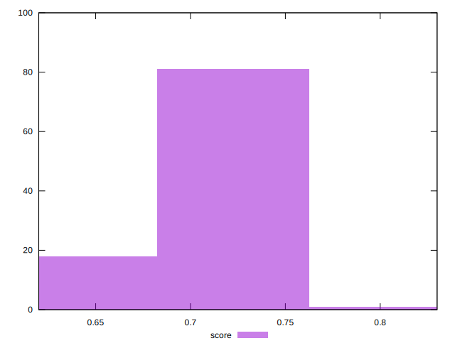
## Raw Estimate

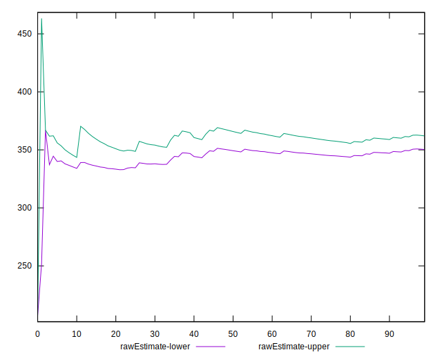
## Score Estimate

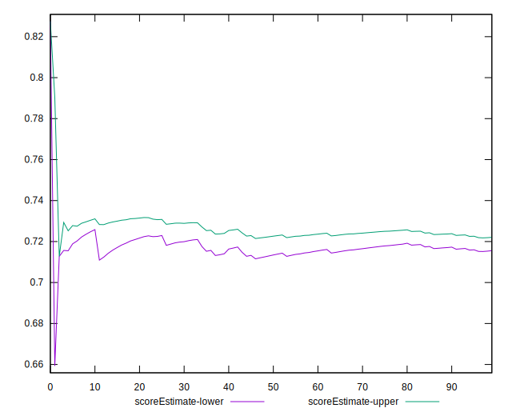
## P Score


```yaml
p90min: 0.6344444444444445
p90max: 0.74
p90range: 0.10555555555555551
p90mean: 0.7188002364066196
p90median: 0.7327777777777778
p90stdev: 0.03176349750963287
p90skewness: -1.805917799553329
p90eccentricity: 0.9999999999999994
p90discretization: 2.186046511627907
outlandishness: 0.9960846156040866
confidence: 0.014469636784505682
p90confidence: 0.01284229012084317

```

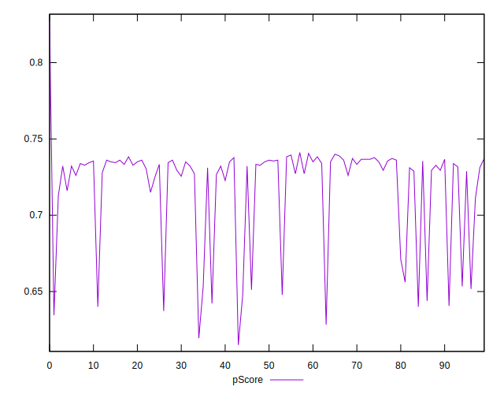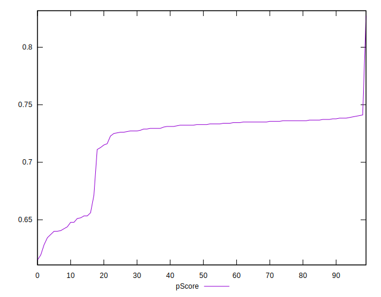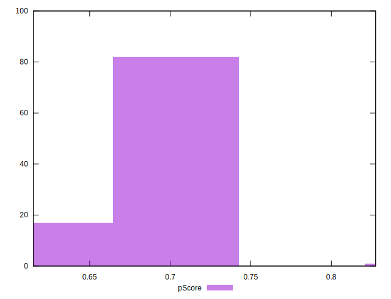
## Score Difference


```yaml
p90min: 0
p90max: 0
p90range: 0
p90mean: 0
p90median: 0
p90stdev: 0
p90skewness: .nan
p90eccentricity: .nan
p90discretization: 94
outlandishness: .inf
confidence: 4.330179641073934e-18
p90confidence: 0

```


## P Score Difference


```yaml
p90min: -0.0050000000000000044
p90max: 0.004444444444444473
p90range: 0.009444444444444478
p90mean: -0.0009485815602836791
p90median: -0.001388888888888884
p90stdev: 0.0029004840877643436
p90skewness: 0.2248105640979592
p90eccentricity: 1
p90discretization: 4.086956521739131
outlandishness: 0.9169404838850542
confidence: 0.0011935766248787167
p90confidence: 0.0011726938488012043

```

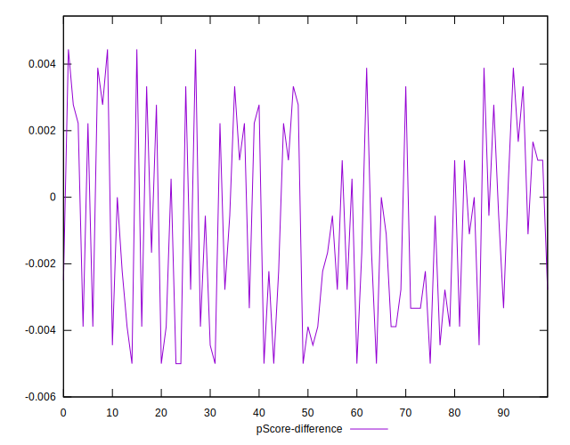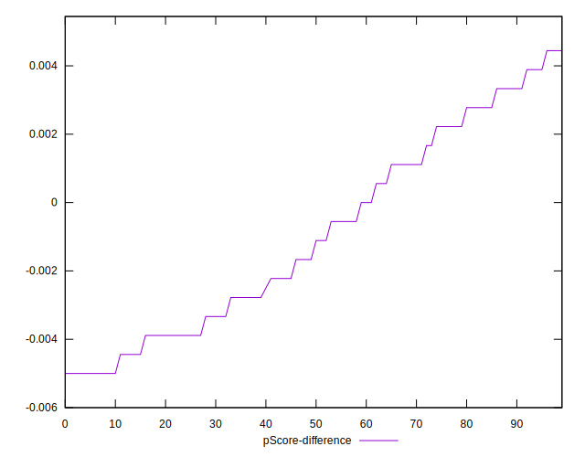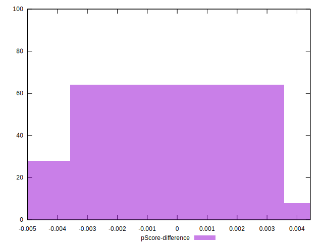