# //render-blocking-resources/samples/pages+cached+noadtech

[→ Parent](../..)


## Raw


```yaml
p90min: 319
p90max: 514
p90range: 195
p90mean: 359.9468085106383
p90median: 329
p90stdev: 60.35151763877819
p90skewness: 1.4816492052126384
p90eccentricity: 1.0000000000000004
p90discretization: 2.186046511627907
outlandishness: 1.0483169517187492
confidence: 34.83968910199542
p90confidence: 24.40070393744658

```

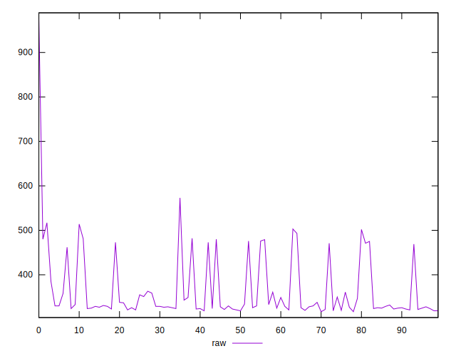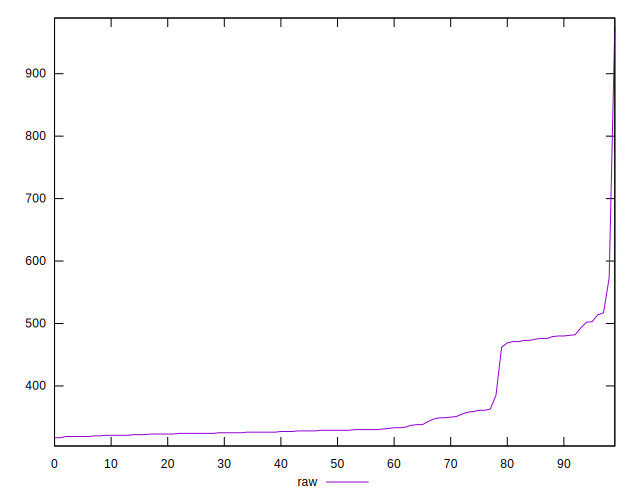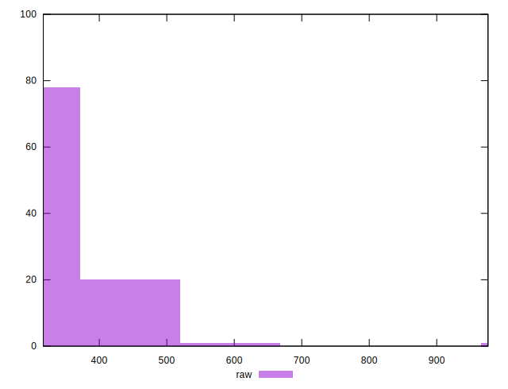
## Score


```yaml
p90min: 0.63
p90max: 0.74
p90range: 0.10999999999999999
p90mean: 0.7173404255319145
p90median: 0.73
p90stdev: 0.03402675830386999
p90skewness: -1.4454292078370308
p90eccentricity: 0.9999999999999996
p90discretization: 11.75
outlandishness: 0.9893212618381746
confidence: 0.017152764531613063
p90confidence: 0.013757348411571649

```

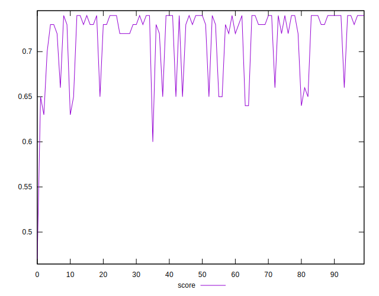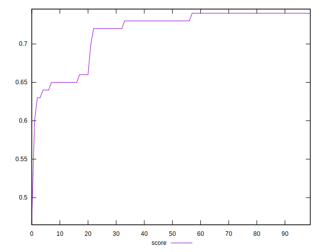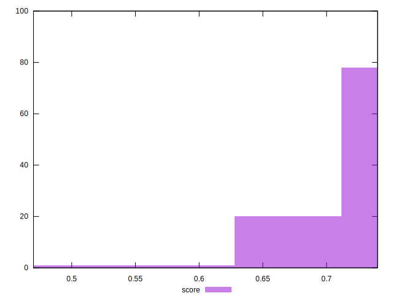
## Raw Estimate

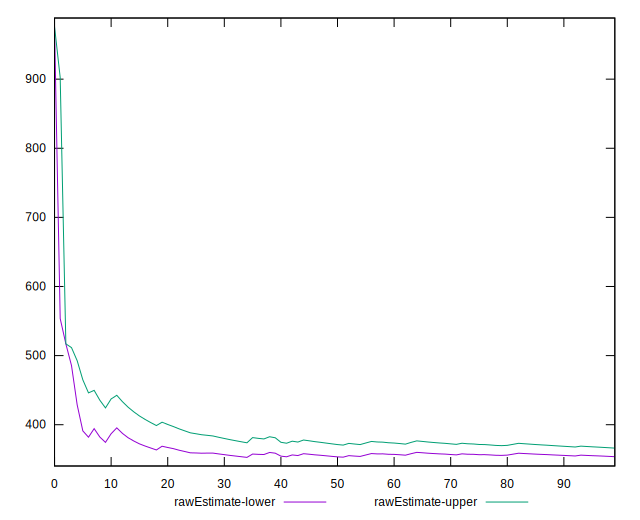
## Score Estimate

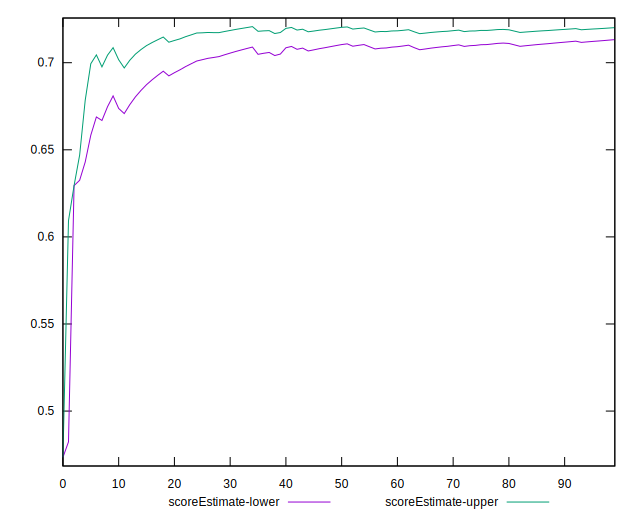
## P Score


```yaml
p90min: 0.6311111111111111
p90max: 0.7394444444444445
p90range: 0.10833333333333339
p90mean: 0.71669621749409
p90median: 0.7338888888888889
p90stdev: 0.03352862091043233
p90skewness: -1.4816492052126478
p90eccentricity: 1.0000000000000002
p90discretization: 2.186046511627907
outlandishness: 0.9894674174957416
confidence: 0.01693779552986827
p90confidence: 0.013555946631914766

```

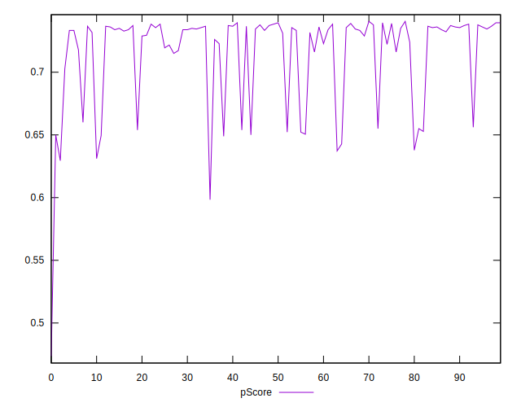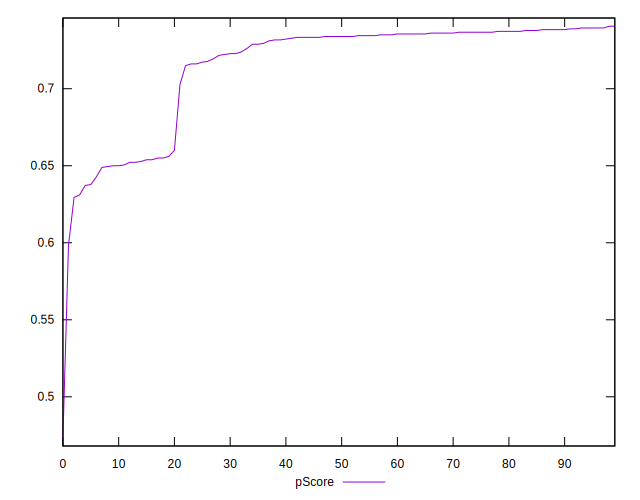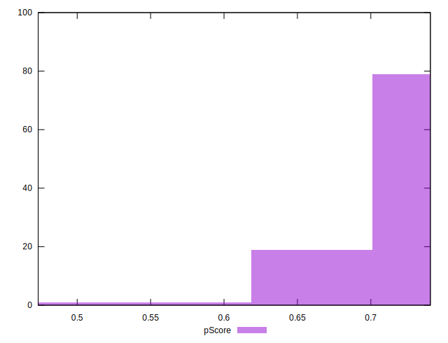
## Score Difference


```yaml
p90min: 0
p90max: 0
p90range: 0
p90mean: 0
p90median: 0
p90stdev: 0
p90skewness: .nan
p90eccentricity: .nan
p90discretization: 94
outlandishness: .inf
confidence: 4.821687579291883e-18
p90confidence: 0

```

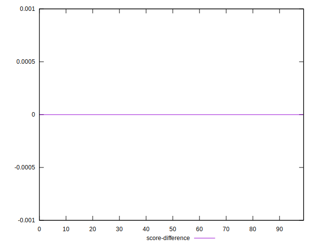
## P Score Difference


```yaml
p90min: -0.0050000000000000044
p90max: 0.004444444444444473
p90range: 0.009444444444444478
p90mean: -0.0006079126686135351
p90median: -0.0011111111111110628
p90stdev: 0.002876588608174973
p90skewness: 0.24130309194290597
p90eccentricity: 0.9999999999999997
p90discretization: 3.9166666666666665
outlandishness: 0.9358941401829806
confidence: 0.0011839471458662924
p90confidence: 0.001163032674638305

```

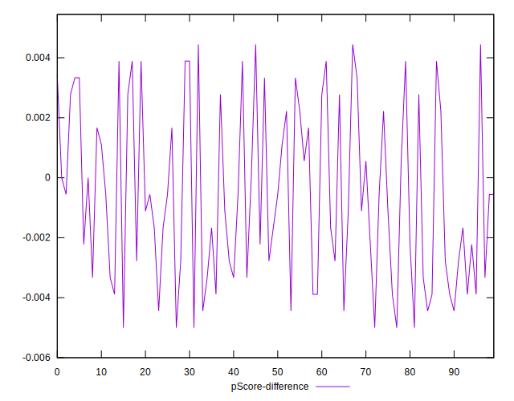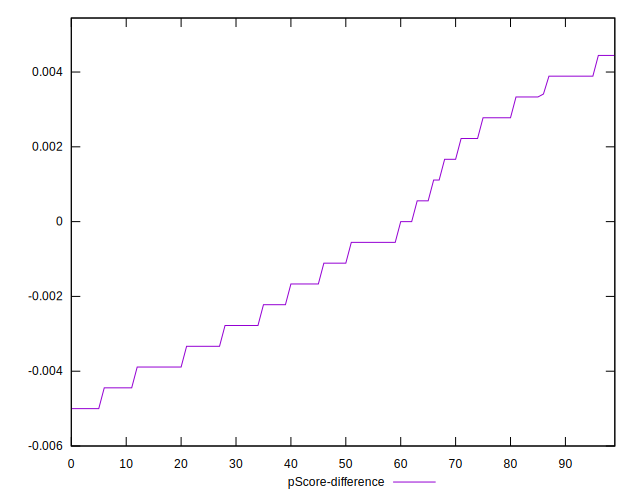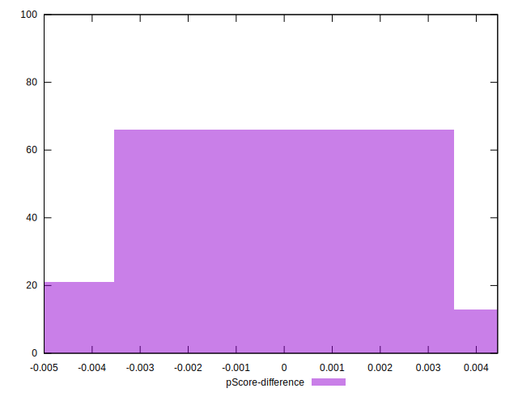