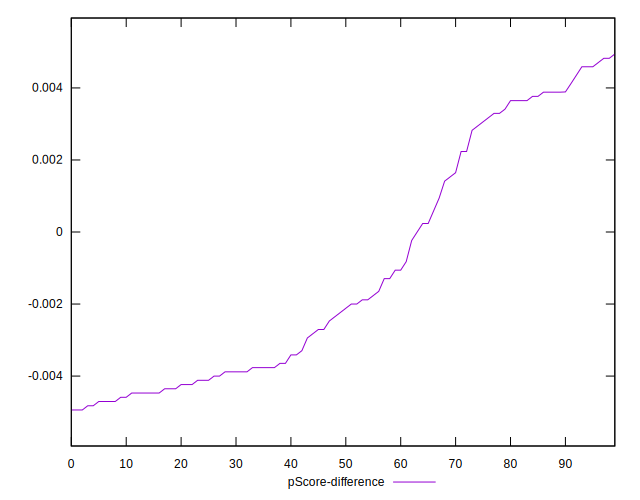

# //render-blocking-resources/samples/pages+cached

[→ Parent](../..)


## Raw


```yaml
p90min: 1182
p90max: 1312
p90range: 130
p90mean: 1216.1808510638298
p90median: 1213
p90stdev: 19.953649890597497
p90skewness: 1.4084195019474401
p90eccentricity: 1.0000000000000002
p90discretization: 1.8076923076923077
outlandishness: 1.0173900571679524
confidence: 52.754287934678025
p90confidence: 8.067454183440312

```


## Score


```yaml
p90min: 0.43
p90max: 0.45
p90range: 0.020000000000000018
p90mean: 0.44627659574468104
p90median: 0.45
p90stdev: 0.0050495507601301375
p90skewness: -0.7745997132001905
p90eccentricity: 0.9999999999999997
p90discretization: 31.333333333333332
outlandishness: 0.9969701173626017
confidence: 0.007747586653186796
p90confidence: 0.002041582348475607

```


## Raw Estimate


## Score Estimate


## P Score


```yaml
p90min: 0.4338823529411765
p90max: 0.4491764705882353
p90range: 0.015294117647058791
p90mean: 0.44515519399249054
p90median: 0.4455294117647059
p90stdev: 0.0023474882224232326
p90skewness: -1.4084195019472705
p90eccentricity: 1
p90discretization: 1.8076923076923077
outlandishness: 0.9974071649150749
confidence: 0.0077574074131903014
p90confidence: 0.0009491122568753297

```


## Score Difference


```yaml
p90min: 0
p90max: 0
p90range: 0
p90mean: 0
p90median: 0
p90stdev: 0
p90skewness: .nan
p90eccentricity: .nan
p90discretization: 94
outlandishness: .inf
confidence: 3.046396000301406e-18
p90confidence: 0

```


## P Score Difference


```yaml
p90min: -0.0048235294117647265
p90max: 0.004705882352941171
p90range: 0.009529411764705897
p90mean: -0.0010850368516200904
p90median: -0.0021764705882353075
p90stdev: 0.0033142821735757436
p90skewness: 0.5076462213680581
p90eccentricity: 1
p90discretization: 1.8076923076923077
outlandishness: 0.887681549711563
confidence: 0.0013481891661451882
p90confidence: 0.0013399964283684561

```

