# //render-blocking-resources/samples/pages

[→ Parent](../..)


## Raw


```yaml
p90min: 1364
p90max: 1565
p90range: 201
p90mean: 1497.4468085106382
p90median: 1521
p90stdev: 55.195131033582975
p90skewness: -1.5729227699731232
p90eccentricity: 1.0000000000000013
p90discretization: 1.6785714285714286
outlandishness: 0.9989093626100581
confidence: 25.019684853637568
p90confidence: 22.315926820598406

```

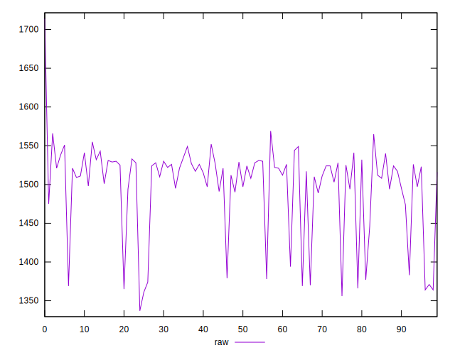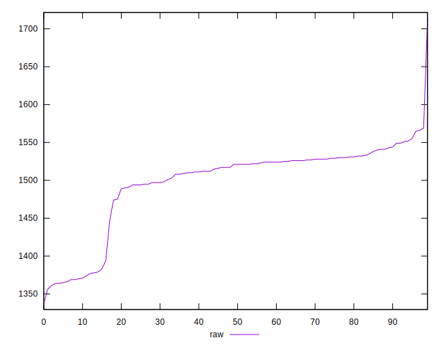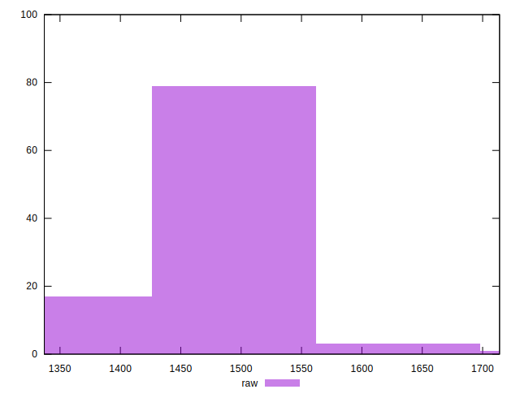
## Score


```yaml
p90min: 0.4
p90max: 0.43
p90range: 0.02999999999999997
p90mean: 0.41287234042553156
p90median: 0.41
p90stdev: 0.007089449821934528
p90skewness: 1.8529226051328966
p90eccentricity: 1.0000000000000013
p90discretization: 23.5
outlandishness: 1.0001339905741278
confidence: 0.0031503639486804326
p90confidence: 0.002866333324371226

```

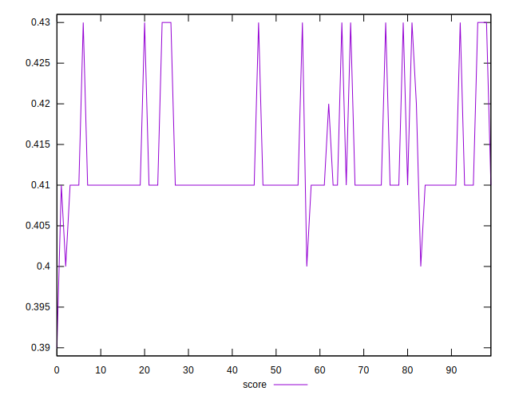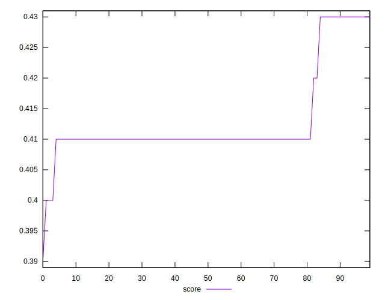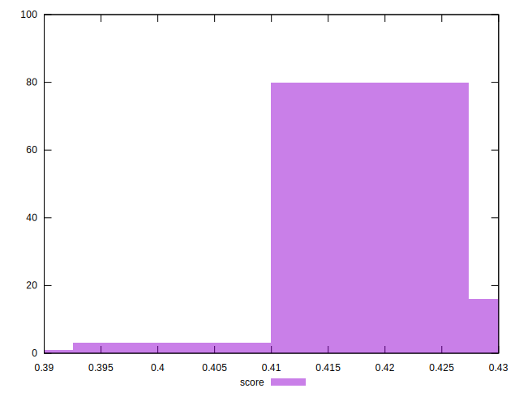
## Raw Estimate

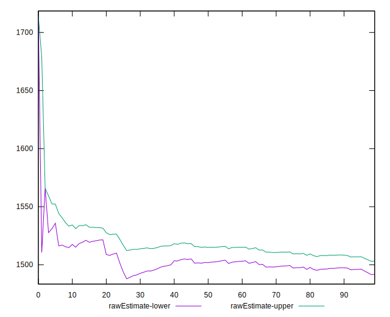
## Score Estimate

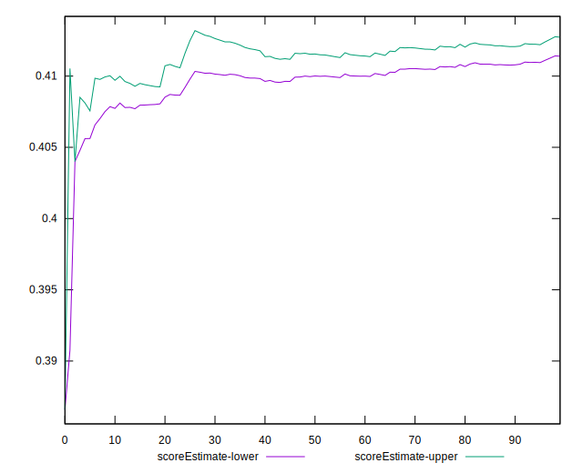
## P Score


```yaml
p90min: 0.4041176470588235
p90max: 0.42776470588235294
p90range: 0.02364705882352941
p90mean: 0.41206508135168957
p90median: 0.4092941176470588
p90stdev: 0.0064935448274803485
p90skewness: 1.5729227699731976
p90eccentricity: 1.0000000000000002
p90discretization: 1.6785714285714286
outlandishness: 1.0004664618678873
confidence: 0.002943492335722066
p90confidence: 0.002625403155364518

```

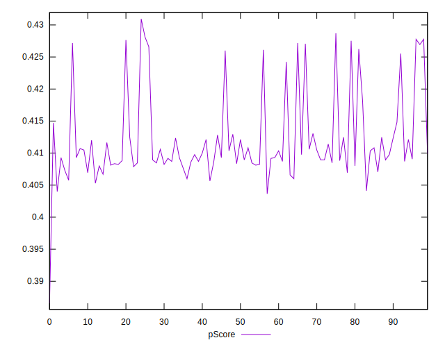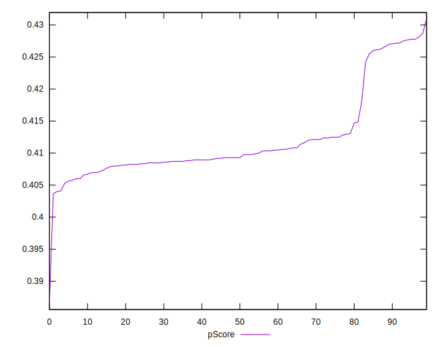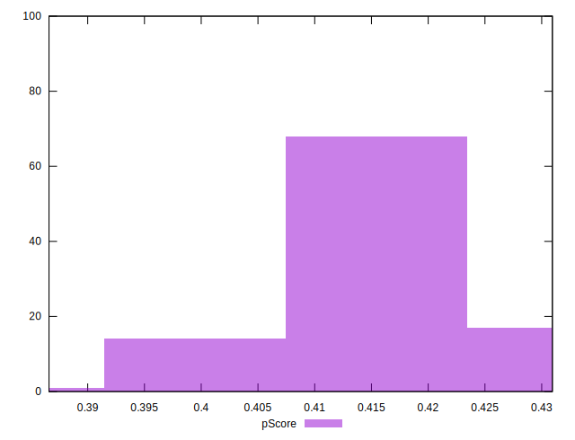
## Score Difference


```yaml
p90min: 0
p90max: 5.551115123125783e-17
p90range: 5.551115123125783e-17
p90mean: 4.429081215259933e-17
p90median: 5.551115123125783e-17
p90stdev: 2.2292553250386822e-17
p90skewness: -1.4834762399128516
p90eccentricity: 0.9999999999999999
p90discretization: 47
outlandishness: 0.9557017600000001
confidence: 9.01398773040406e-18
p90confidence: 9.013095497087214e-18

```

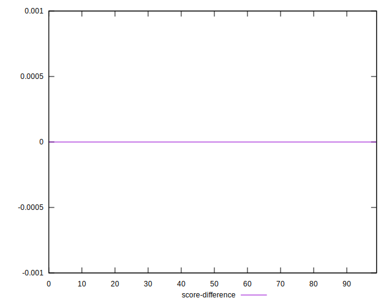
## P Score Difference


```yaml
p90min: -0.004235294117647059
p90max: 0.004117647058823504
p90range: 0.008352941176470563
p90mean: -0.0007884856070087424
p90median: -0.0011764705882352788
p90stdev: 0.0020179442223601956
p90skewness: 0.5274846480792407
p90eccentricity: 0.9999999999999997
p90discretization: 1.88
outlandishness: 0.8779987462836973
confidence: 0.0008861647550151066
p90confidence: 0.000815874421365899

```

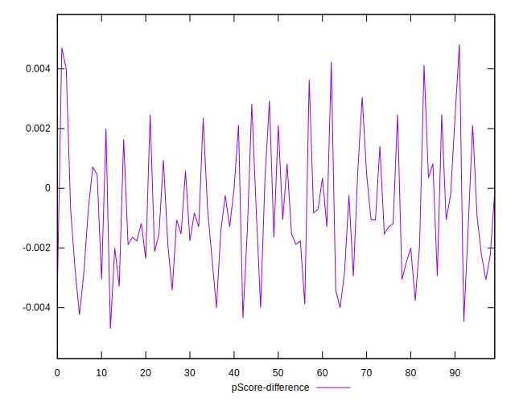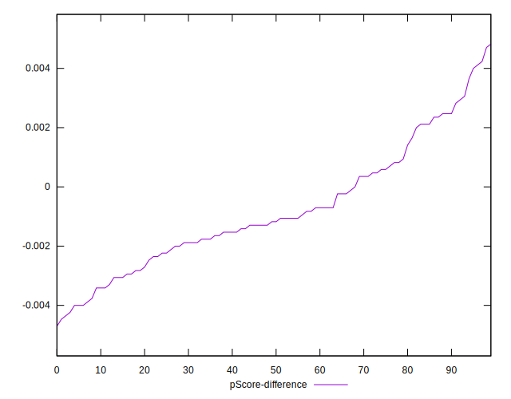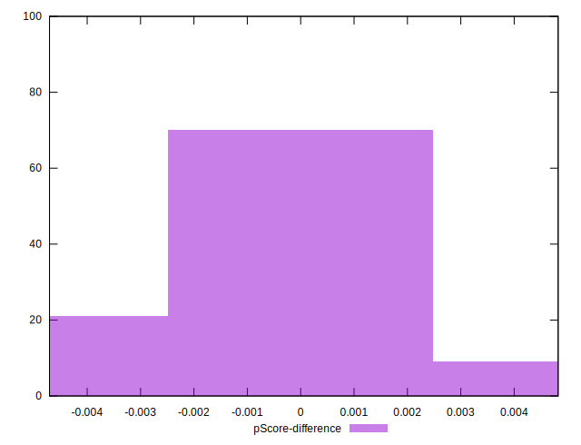