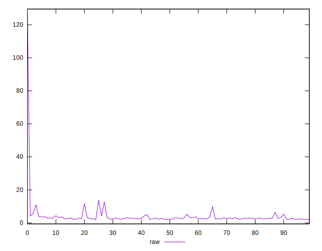
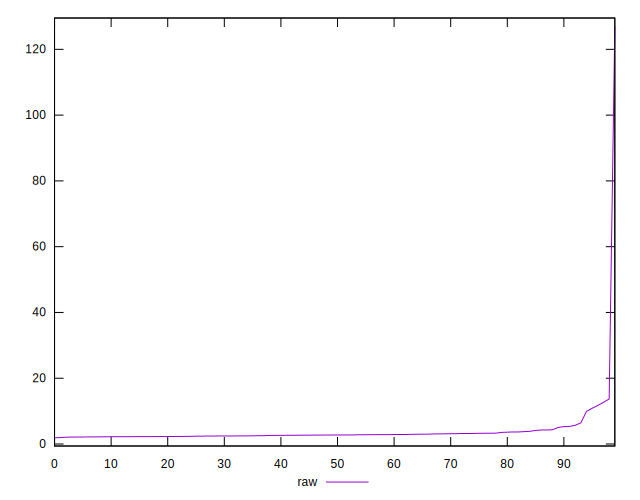
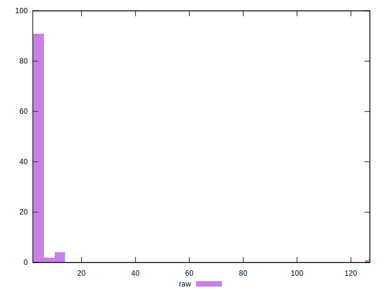
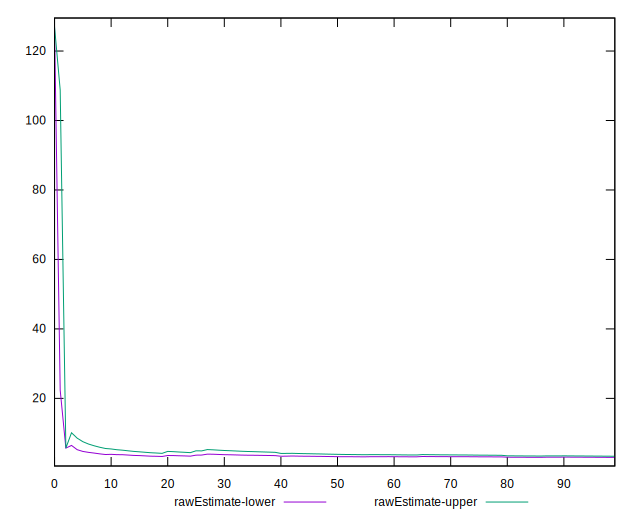

# //server-response-time/samples/pages+cached+noadtech

[→ Parent](../..)


## Raw


```yaml
p90min: 2.091
p90max: 11.736
p90range: 9.645
p90mean: 3.179712765957447
p90median: 2.7415000000000003
p90stdev: 1.6173112085050854
p90skewness: 3.629860031774536
p90eccentricity: 0.9999999999999997
p90discretization: 1.0444444444444445
outlandishness: 2.0766114327173657
confidence: 4.894727622403777
p90confidence: 0.6538946080800737

```


## Score


```yaml
p90min: 1
p90max: 1
p90range: 0
p90mean: 1
p90median: 1
p90stdev: 0
p90skewness: .nan
p90eccentricity: .nan
p90discretization: 94
outlandishness: 1
confidence: 0
p90confidence: 0

```


## Raw Estimate


## Score Estimate


## P Score


```yaml
p90min: 1
p90max: 1
p90range: 0
p90mean: 1
p90median: 1
p90stdev: 0
p90skewness: .nan
p90eccentricity: .nan
p90discretization: 94
outlandishness: 1
confidence: 0
p90confidence: 0

```


## Score Difference


```yaml
p90min: 0
p90max: 0
p90range: 0
p90mean: 0
p90median: 0
p90stdev: 0
p90skewness: .nan
p90eccentricity: .nan
p90discretization: 94
outlandishness: .nan
confidence: 0
p90confidence: 0

```


## P Score Difference


```yaml
p90min: 0
p90max: 0
p90range: 0
p90mean: 0
p90median: 0
p90stdev: 0
p90skewness: .nan
p90eccentricity: .nan
p90discretization: 94
outlandishness: .nan
confidence: 0
p90confidence: 0

```

