# //speed-index/samples/pages+cached+noadtech+nomedia+nocss

[→ Parent](../..)


## Raw


```yaml
p90min: 1585.2314999999999
p90max: 1604.2685999999999
p90range: 19.03710000000001
p90mean: 1590.8908164893612
p90median: 1589.831475
p90stdev: 4.305824732225921
p90skewness: 1.2145871013093126
p90eccentricity: 1
p90discretization: 1
outlandishness: 1.077607010211538
confidence: 166.27176473426505
p90confidence: 1.7408867019123884

```

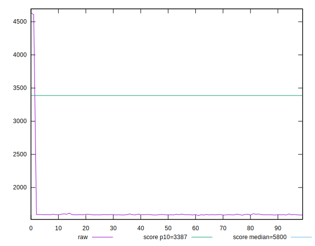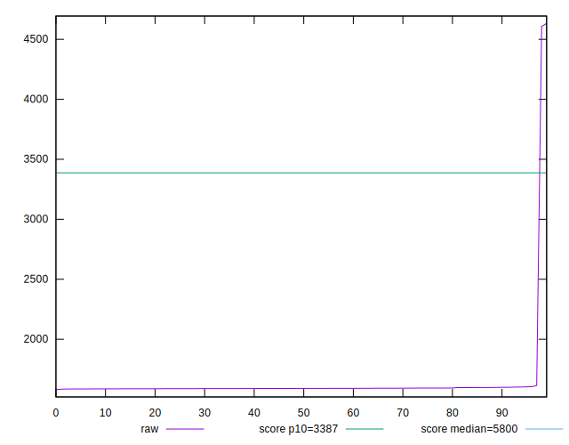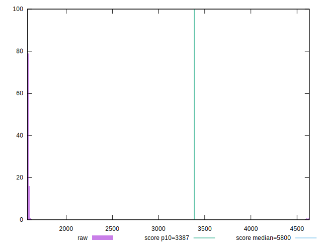
## Score


```yaml
p90min: 1
p90max: 1
p90range: 0
p90mean: 1
p90median: 1
p90stdev: 0
p90skewness: .nan
p90eccentricity: .nan
p90discretization: 94
outlandishness: 0.98823481
confidence: 0.016191675176188677
p90confidence: 0

```

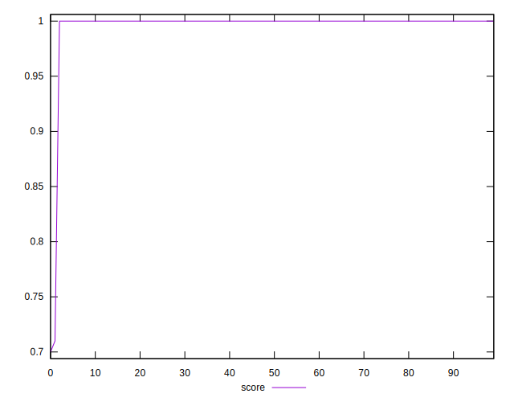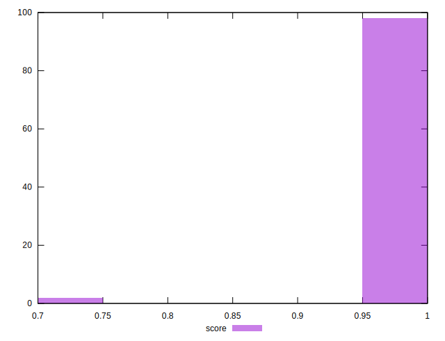
## Raw Estimate

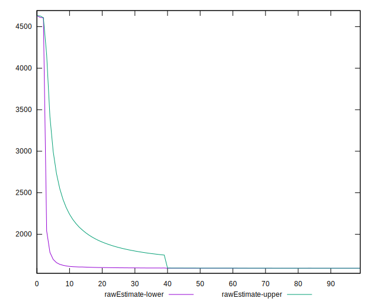
## Score Estimate

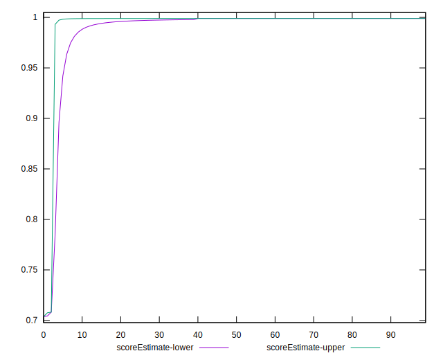
## P Score


```yaml
p90min: 0.9989002489015811
p90max: 0.9990002980593353
p90range: 0.00010004915775418954
p90mean: 0.9989711499833513
p90median: 0.9989768121992411
p90stdev: 0.000022517184794240258
p90skewness: -1.2506531788713646
p90eccentricity: 0.9999999999999996
p90discretization: 1
outlandishness: 0.9883029035761511
confidence: 0.016079229581709074
p90confidence: 0.00000910391620899351

```

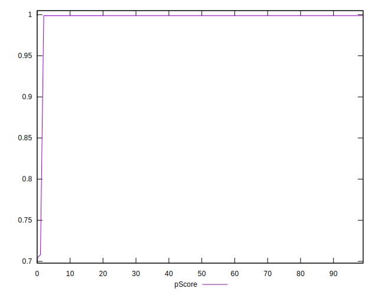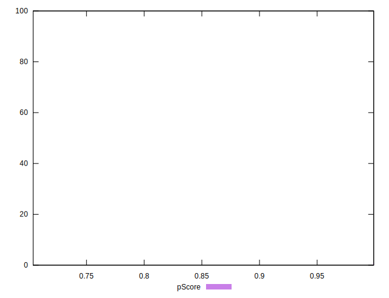
## Score Difference


```yaml
p90min: 0
p90max: 0
p90range: 0
p90mean: 0
p90median: 0
p90stdev: 0
p90skewness: .nan
p90eccentricity: .nan
p90discretization: 94
outlandishness: .inf
confidence: 4.330179641073934e-18
p90confidence: 0

```


## P Score Difference


```yaml
p90min: -0.0010940338377720682
p90max: -0.0009971776287276413
p90range: 0.00009685620904442693
p90mean: -0.001027758809524039
p90median: -0.0010223593726660929
p90stdev: 0.00002151804470348068
p90skewness: -1.1708620209258709
p90eccentricity: 0.9999999999999988
p90discretization: 1
outlandishness: 0.9251871685830264
confidence: 0.00018865610218570067
p90confidence: 0.000008699954179528437

```

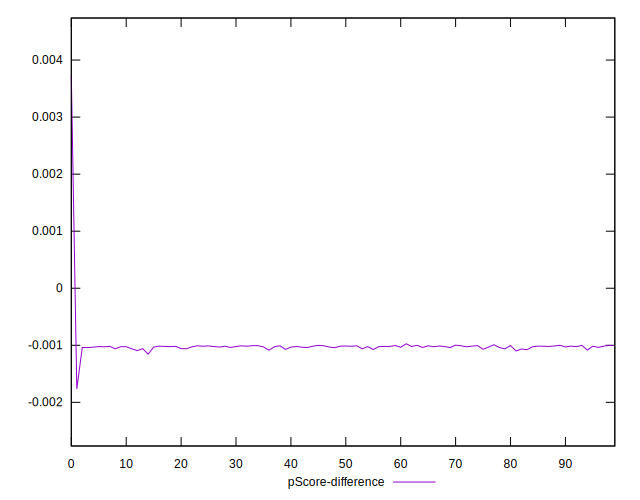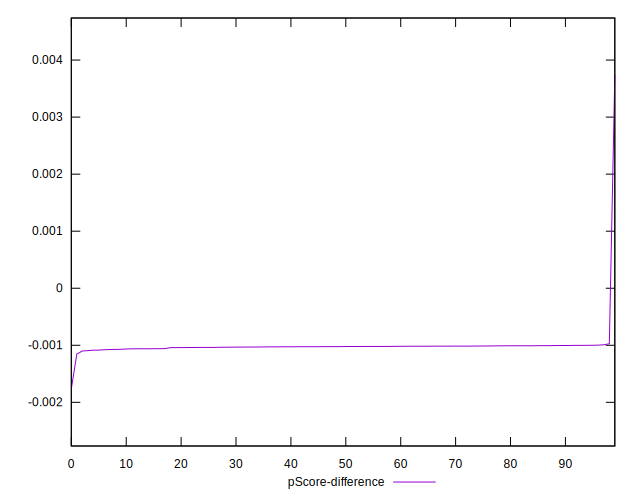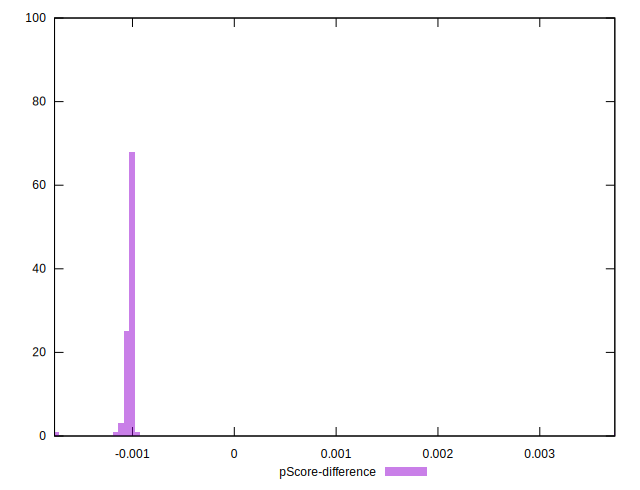