# //speed-index/samples/pages+cached+noadtech+nomedia

[→ Parent](../..)


## Raw


```yaml
p90min: 1908.1375
p90max: 2141.0334999999995
p90range: 232.8959999999995
p90mean: 1953.3695452127656
p90median: 1924.73675
p90stdev: 63.69724920449317
p90skewness: 1.6855972983987837
p90eccentricity: 1.0000000000000002
p90discretization: 1
outlandishness: 1.0424937267366587
confidence: 151.088445378344
p90confidence: 25.75341566008808

```

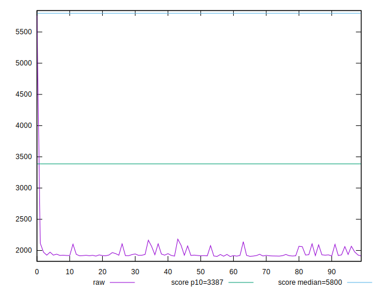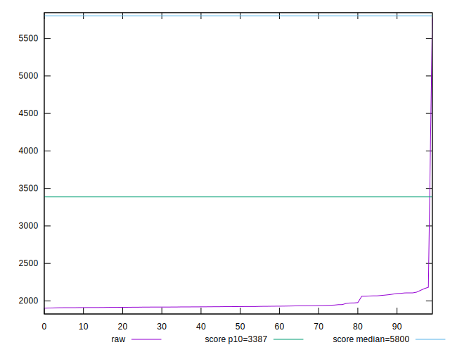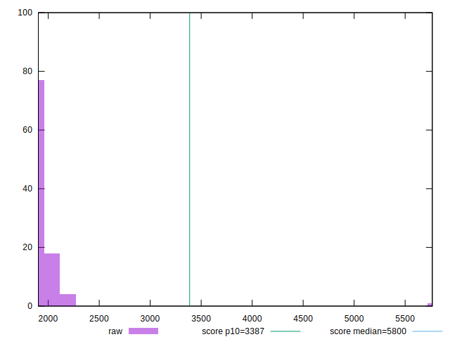
## Score


```yaml
p90min: 0.99
p90max: 1
p90range: 0.010000000000000009
p90mean: 0.9979787234042551
p90median: 1
p90stdev: 0.004015869380463166
p90skewness: -1.4834762399127612
p90eccentricity: 1.0000000000000004
p90discretization: 47
outlandishness: 0.9900472738700826
confidence: 0.019095320663981702
p90confidence: 0.001623654940885469

```

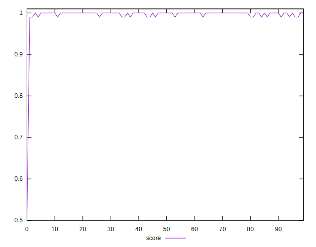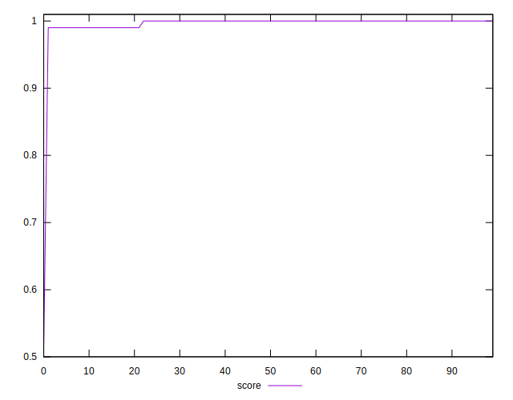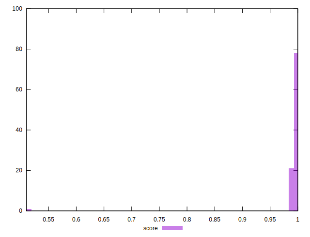
## Raw Estimate

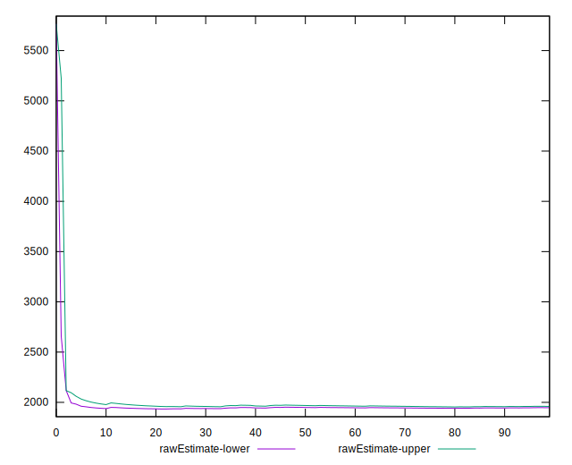
## Score Estimate

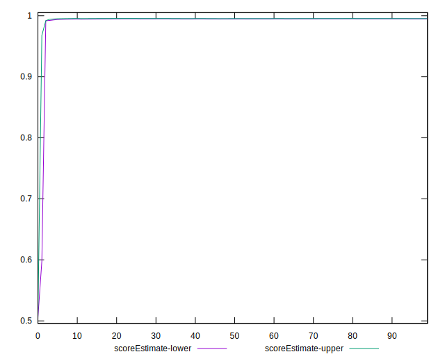
## P Score


```yaml
p90min: 0.9912083184994362
p90max: 0.9959591592613375
p90range: 0.004750840761901243
p90mean: 0.9951445709501816
p90median: 0.9957056056288125
p90stdev: 0.001242265034413023
p90skewness: -1.7773058277614455
p90eccentricity: 0.9999999999999992
p90discretization: 1
outlandishness: 0.9900428060729692
confidence: 0.019101911045417818
p90confidence: 0.0005022598022800563

```

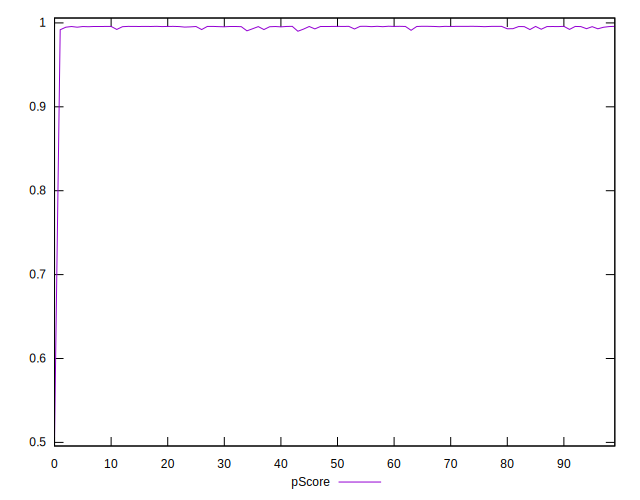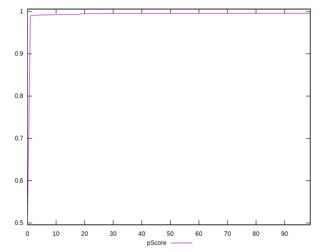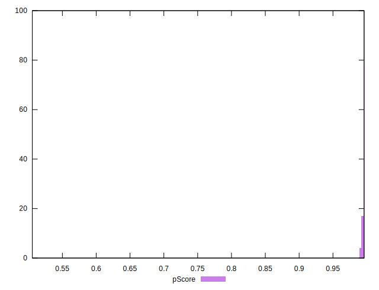
## Score Difference


```yaml
p90min: 0
p90max: 0
p90range: 0
p90mean: 0
p90median: 0
p90stdev: 0
p90skewness: .nan
p90eccentricity: .nan
p90discretization: 94
outlandishness: .nan
confidence: 0
p90confidence: 0

```


## P Score Difference


```yaml
p90min: -0.004610068993907812
p90max: 0.003132413095540354
p90range: 0.007742482089448166
p90mean: -0.003004947452924518
p90median: -0.004190193210362347
p90stdev: 0.002586533940493068
p90skewness: 1.6278033030508758
p90eccentricity: 1.0000000000000004
p90discretization: 1
outlandishness: 0.8820972443155581
confidence: 0.0011235032088785508
p90confidence: 0.0010457607592219969

```

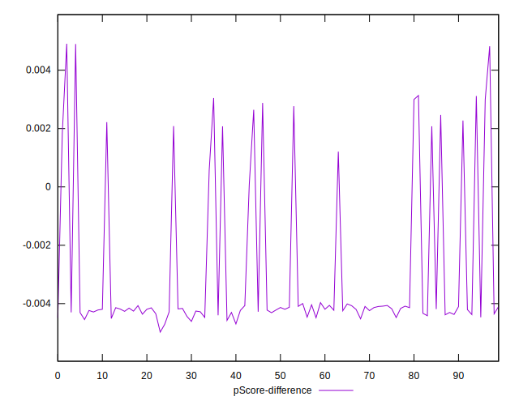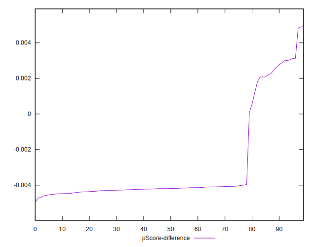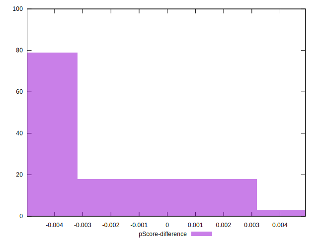