# //speed-index/samples/pages+cached+noadtech

[→ Parent](../..)


## Raw


```yaml
p90min: 1906.0104999999999
p90max: 2122.05965
p90range: 216.04915000000028
p90mean: 1954.2384303191493
p90median: 1920.888875
p90stdev: 63.750200876553876
p90skewness: 1.4132660879366556
p90eccentricity: 1.0000000000000002
p90discretization: 1
outlandishness: 1.0489420731420378
confidence: 175.59927247840983
p90confidence: 25.77482453468639

```

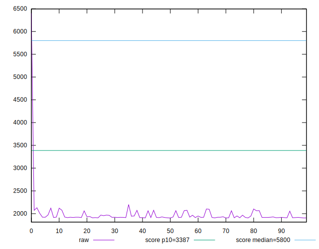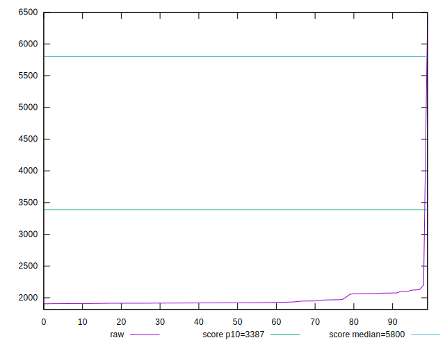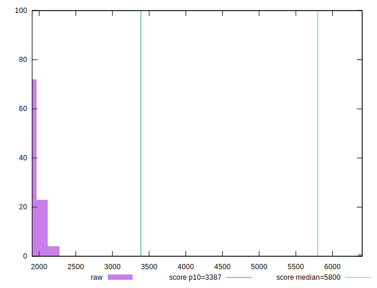
## Score


```yaml
p90min: 0.99
p90max: 1
p90range: 0.010000000000000009
p90mean: 0.9976595744680851
p90median: 1
p90stdev: 0.004233989094070726
p90skewness: -1.2562972690738328
p90eccentricity: 1.000000000000002
p90discretization: 47
outlandishness: 0.9880885731028287
confidence: 0.02297796776773377
p90confidence: 0.0017118428566643908

```

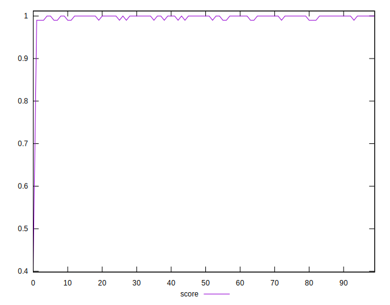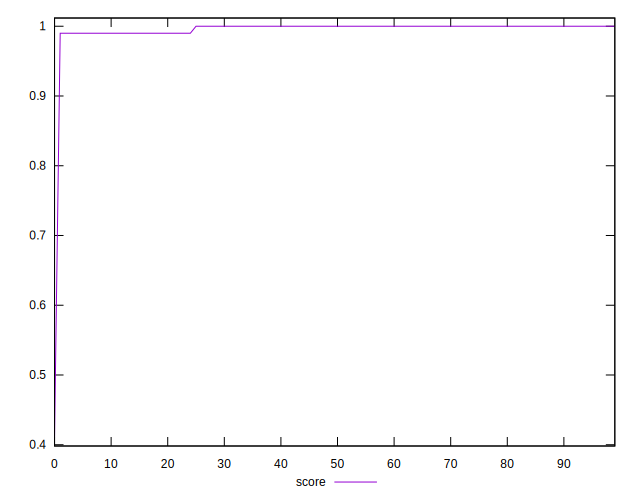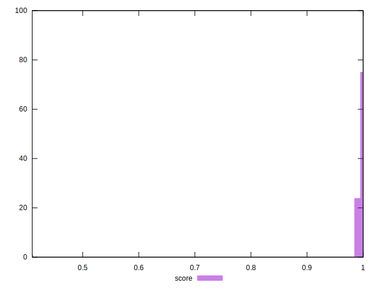
## Raw Estimate

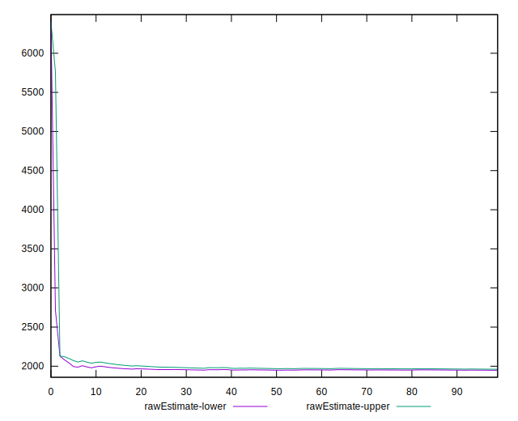
## Score Estimate

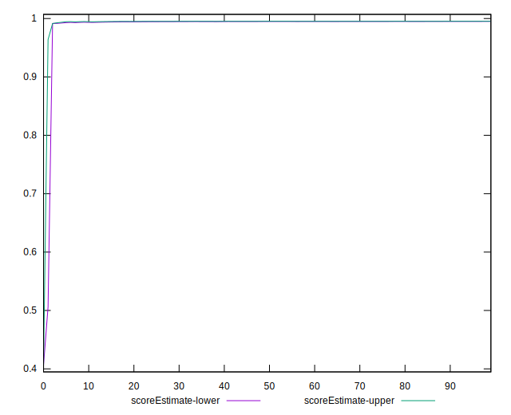
## P Score


```yaml
p90min: 0.9917007811543825
p90max: 0.9959908145806223
p90range: 0.004290033426239792
p90mean: 0.9951304229720396
p90median: 0.9957654210733637
p90stdev: 0.0012189445793439138
p90skewness: -1.5112417636644515
p90eccentricity: 0.9999999999999996
p90discretization: 1
outlandishness: 0.988073821859476
confidence: 0.02295940322386771
p90confidence: 0.0004928311161079254

```

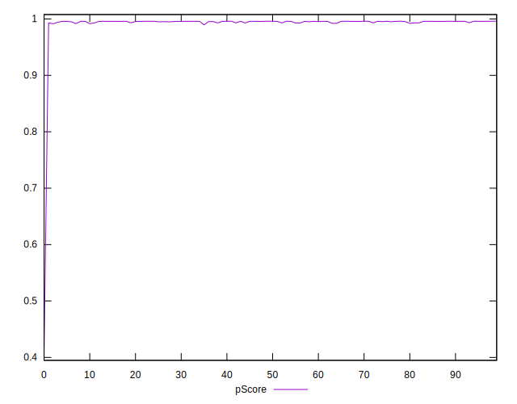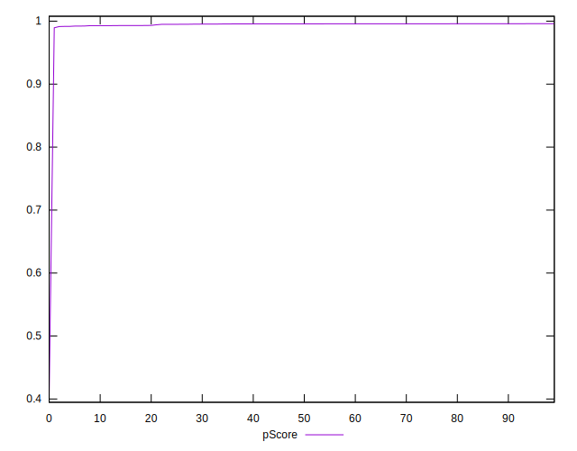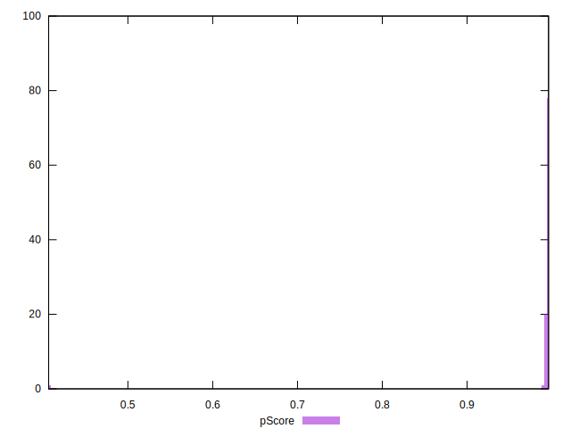
## Score Difference


```yaml
p90min: 0
p90max: 0
p90range: 0
p90mean: 0
p90median: 0
p90stdev: 0
p90skewness: .nan
p90eccentricity: .nan
p90discretization: 94
outlandishness: .inf
confidence: 2.165089820536967e-18
p90confidence: 0

```


## P Score Difference


```yaml
p90min: -0.00480598702945334
p90max: 0.004240640588524691
p90range: 0.009046627617978031
p90mean: -0.0026824750830900276
p90median: -0.004124741308005442
p90stdev: 0.0028675768370297157
p90skewness: 1.3841672662017508
p90eccentricity: 0.9999999999999997
p90discretization: 1
outlandishness: 0.8835304303800703
confidence: 0.0012153968818706218
p90confidence: 0.0011593891281581057

```

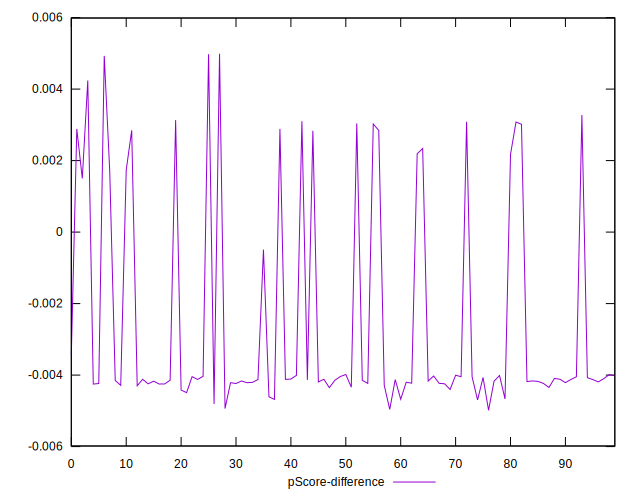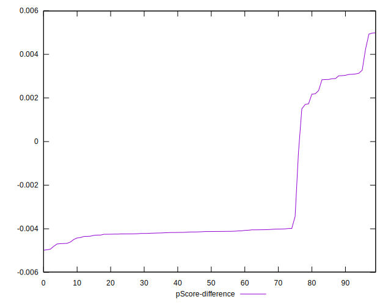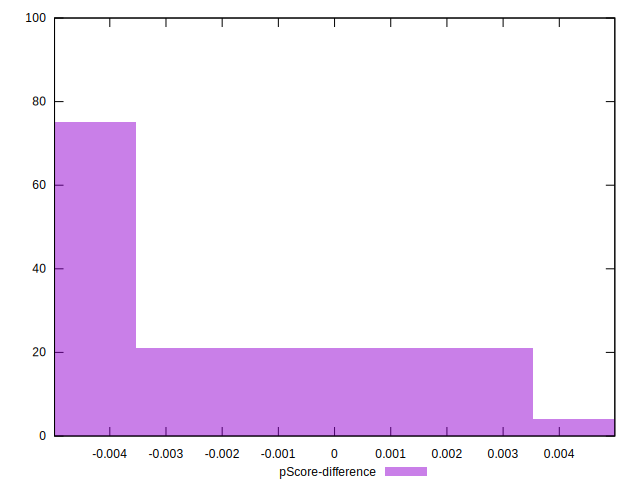