# //speed-index/samples/pages+cached

[→ Parent](../..)


## Raw


```yaml
p90min: 4122.940246931773
p90max: 6691.518736221211
p90range: 2568.578489289438
p90mean: 5493.867814342504
p90median: 5715.22348463402
p90stdev: 621.5817157278003
p90skewness: -0.46764502908004146
p90eccentricity: 1.0000000000000004
p90discretization: 1
outlandishness: 1.0204064497597238
confidence: 358.5771167891587
p90confidence: 251.31151645901167

```

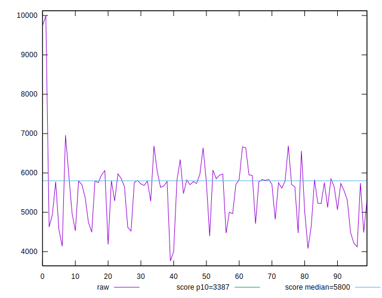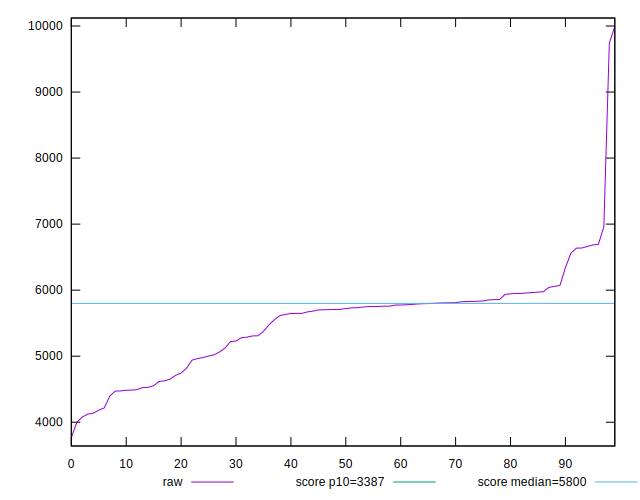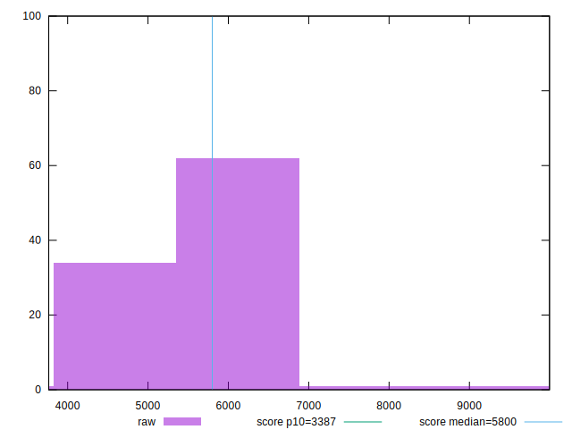
## Score


```yaml
p90min: 0.37
p90max: 0.79
p90range: 0.42000000000000004
p90mean: 0.555
p90median: 0.515
p90stdev: 0.10568671085365387
p90skewness: 0.5921826586834837
p90eccentricity: 0.9999999999999992
p90discretization: 3.032258064516129
outlandishness: 0.9881434623812999
confidence: 0.05135870118159363
p90confidence: 0.04273016226530701

```

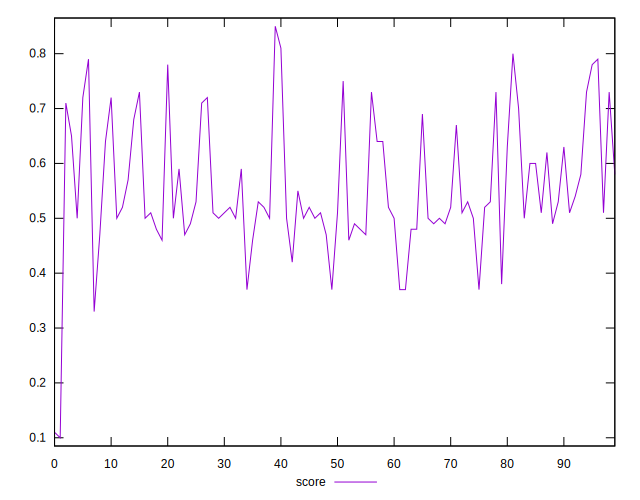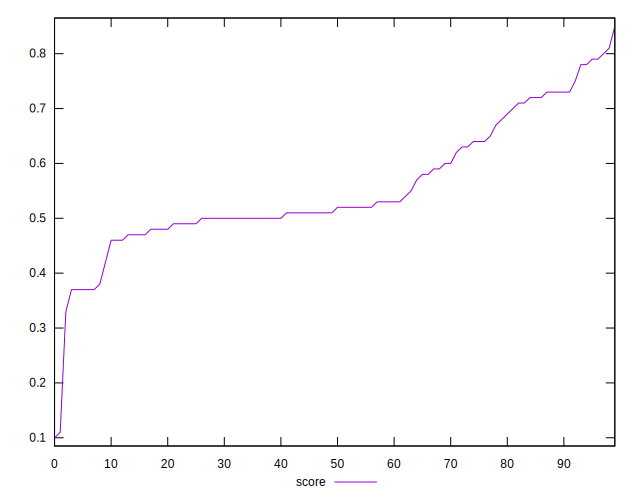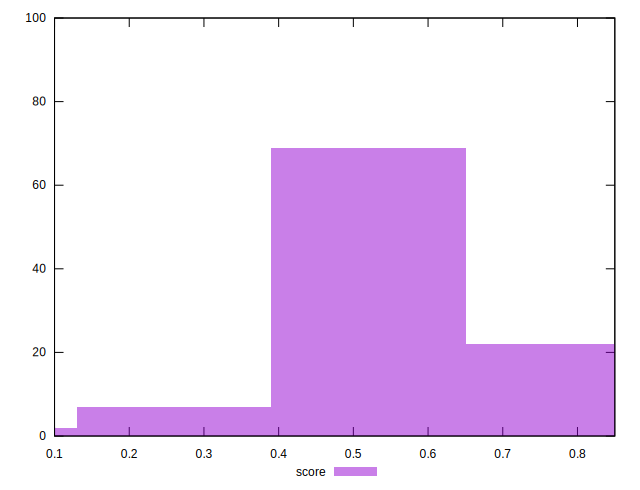
## Raw Estimate

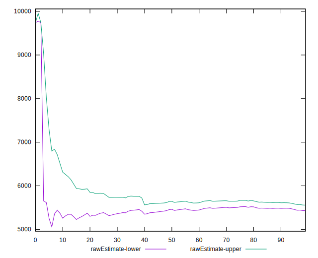
## Score Estimate

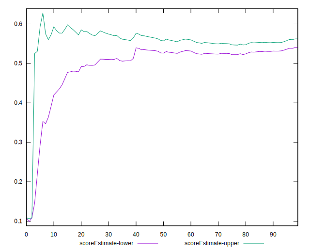
## P Score


```yaml
p90min: 0.3666837216415739
p90max: 0.791922428745244
p90range: 0.42523870710367007
p90mean: 0.5546628473384541
p90median: 0.513992744082497
p90stdev: 0.10567526183968262
p90skewness: 0.6012452000262888
p90eccentricity: 1.0000000000000007
p90discretization: 1
outlandishness: 0.9881088971472423
confidence: 0.05139051162205503
p90confidence: 0.04272553331791317

```

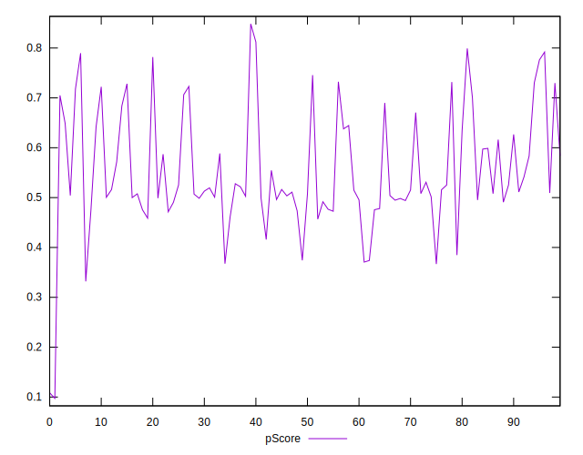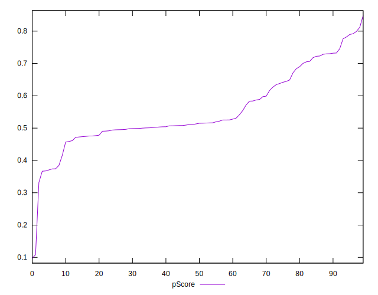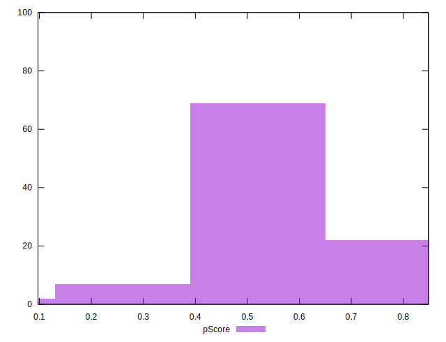
## Score Difference


```yaml
p90min: 0
p90max: 5.551115123125783e-17
p90range: 5.551115123125783e-17
p90mean: 2.362176648138631e-18
p90median: 0
p90stdev: 1.1204787665670327e-17
p90skewness: 4.532597979574668
p90eccentricity: 1.0000000000000027
p90discretization: 47
outlandishness: 5.522500000000001
confidence: 8.427600696514447e-18
p90confidence: 4.530204329713519e-18

```

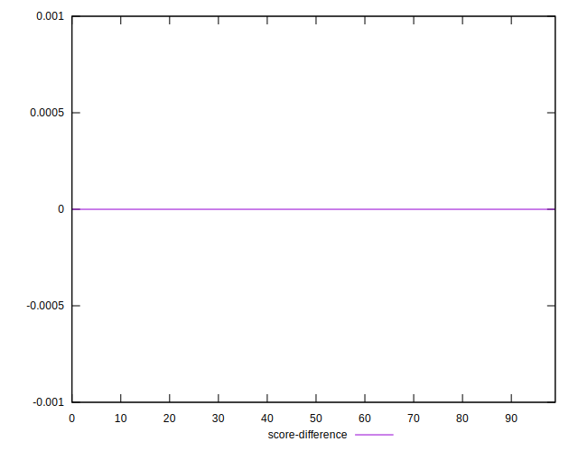
## P Score Difference


```yaml
p90min: -0.004837355047948355
p90max: 0.004552758265124468
p90range: 0.009390113313072823
p90mean: -0.00035801200664265295
p90median: -0.0003937254098509424
p90stdev: 0.0027651438767335203
p90skewness: 0.09276290943159353
p90eccentricity: 1.0000000000000002
p90discretization: 1
outlandishness: 0.9275081054978928
confidence: 0.0011487136887581898
p90confidence: 0.001117974488801668

```

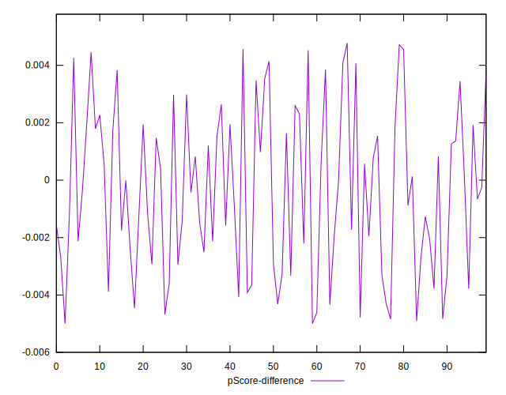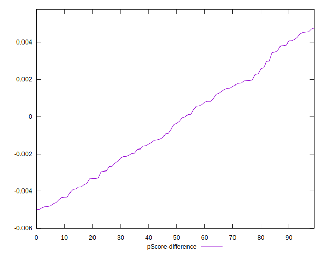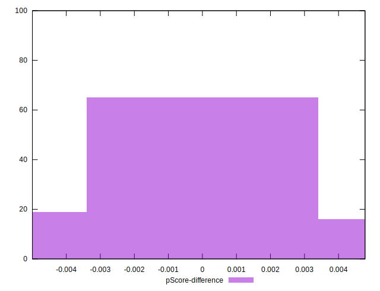