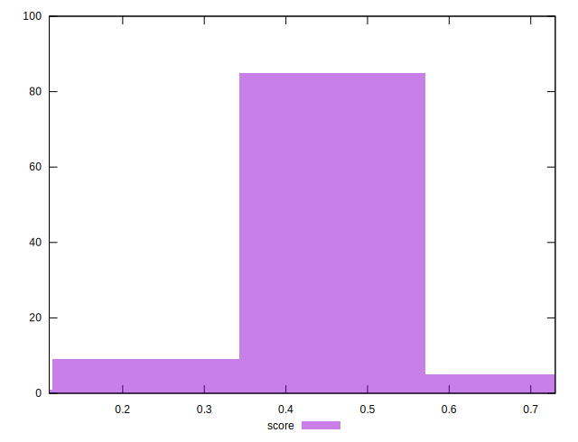

# //speed-index/samples/pages

[→ Parent](../..)


## Raw


```yaml
p90min: 5154.612766046621
p90max: 7114.941019675414
p90range: 1960.3282536287934
p90mean: 6091.464120483711
p90median: 5973.704962260379
p90stdev: 603.313673771648
p90skewness: 0.06486505402063494
p90eccentricity: 1
p90discretization: 1
outlandishness: 1.0120993784685206
confidence: 309.4517241025228
p90confidence: 243.92556991236657

```


## Score


```yaml
p90min: 0.31
p90max: 0.61
p90range: 0.3
p90mean: 0.45978723404255323
p90median: 0.47
p90stdev: 0.0928391278869937
p90skewness: -0.012215885921043614
p90eccentricity: 0.9999999999999997
p90discretization: 3.6153846153846154
outlandishness: 0.9931077060190096
confidence: 0.043191772175695864
p90confidence: 0.03753575986174877

```


## Raw Estimate


## Score Estimate


## P Score


```yaml
p90min: 0.31319030357840083
p90max: 0.6106631008017147
p90range: 0.2974727972233139
p90mean: 0.45930669576102856
p90median: 0.47205856111346245
p90stdev: 0.0926271138915414
p90skewness: -0.006993706910263502
p90eccentricity: 1.0000000000000004
p90discretization: 1
outlandishness: 0.9931983110895055
confidence: 0.04298004876635339
p90confidence: 0.03745004054704006

```


## Score Difference


```yaml
p90min: 0
p90max: 1.1102230246251565e-16
p90range: 1.1102230246251565e-16
p90mean: 1.4173059888831785e-17
p90median: 0
p90stdev: 3.429226439680187e-17
p90skewness: 2.209302409339354
p90eccentricity: 0.9999999999999988
p90discretization: 31.333333333333332
outlandishness: 1.3806250000000002
confidence: 1.459703259226591e-17
p90confidence: 1.3864695100117162e-17

```


## P Score Difference


```yaml
p90min: -0.0047129588789091015
p90max: 0.004596615672766757
p90range: 0.009309574551675859
p90mean: -0.0004867664068158272
p90median: -0.001016450852862949
p90stdev: 0.0027539401920352764
p90skewness: 0.2309314650201482
p90eccentricity: 0.9999999999999999
p90discretization: 1
outlandishness: 0.8852987617648082
confidence: 0.0011485924305345686
p90confidence: 0.001113444730412383

```

