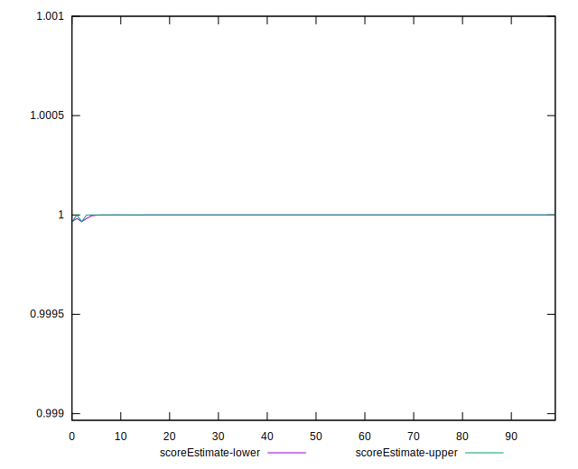

# //total-blocking-time/samples/pages+cached+noadtech+nomedia+nocss

[→ Parent](../..)


## Raw


```yaml
p90min: 8.5
p90max: 80.5
p90range: 72
p90mean: 18.182776063829788
p90median: 14.5
p90stdev: 12.38652316563684
p90skewness: 3.007635888500608
p90eccentricity: 0.9999999999999996
p90discretization: 2.292682926829268
outlandishness: 1.3215839708091424
confidence: 8.489395483289172
p90confidence: 5.007991454134158

```


## Score


```yaml
p90min: 1
p90max: 1
p90range: 0
p90mean: 1
p90median: 1
p90stdev: 0
p90skewness: .nan
p90eccentricity: .nan
p90discretization: 94
outlandishness: 0.9998000100000003
confidence: 0.0003900279083597579
p90confidence: 0

```


## Raw Estimate


## Score Estimate


## P Score


```yaml
p90min: 0.9997590882791803
p90max: 0.9999999999999302
p90range: 0.00024091172074991452
p90mean: 0.9999959332877854
p90median: 0.9999999999506068
p90stdev: 0.00002584362183271994
p90skewness: -8.326344955705174
p90eccentricity: 1.000000000000001
p90discretization: 2.292682926829268
outlandishness: 0.9997669096010431
confidence: 0.00035338716571251075
p90confidence: 0.000010448826967134015

```


## Score Difference


```yaml
p90min: 0
p90max: 0
p90range: 0
p90mean: 0
p90median: 0
p90stdev: 0
p90skewness: .nan
p90eccentricity: .nan
p90discretization: 94
outlandishness: .nan
confidence: 0
p90confidence: 0

```


## P Score Difference


```yaml
p90min: -0.000051307671019018564
p90max: -3.141931159689193e-14
p90range: 0.00005130767098759925
p90mean: -0.0000015038215677673436
p90median: -4.939315623175844e-11
p90stdev: 0.000008046058806275444
p90skewness: -5.554035251454599
p90eccentricity: 1.0000000000000007
p90discretization: 2.292682926829268
outlandishness: 187.9793471810344
confidence: 0.00011850497980043273
p90confidence: 0.0000032530996149972973

```

