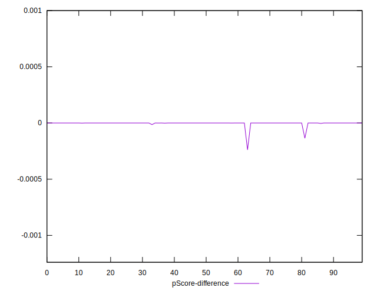

# //total-blocking-time/samples/pages+cached+noadtech+nomedia

[→ Parent](../..)


## Raw


```yaml
p90min: 9
p90max: 45.5
p90range: 36.5
p90mean: 16.743659574468083
p90median: 14.5
p90stdev: 7.559988775677232
p90skewness: 1.7311192252022614
p90eccentricity: 0.9999999999999994
p90discretization: 2.473684210526316
outlandishness: 1.1642089490865941
confidence: 4.657194873890613
p90confidence: 3.056576787179099

```


## Score


```yaml
p90min: 1
p90max: 1
p90range: 0
p90mean: 1
p90median: 1
p90stdev: 0
p90skewness: .nan
p90eccentricity: .nan
p90discretization: 94
outlandishness: 1
confidence: 0
p90confidence: 0

```


## Raw Estimate


## Score Estimate


## P Score


```yaml
p90min: 0.9999963031040896
p90max: 0.9999999999998532
p90range: 0.000003696895763627417
p90mean: 0.9999999159151404
p90median: 0.9999999999471277
p90stdev: 4.24260975968953e-7
p90skewness: -7.072329044262961
p90eccentricity: 0.9999999999999997
p90discretization: 2.473684210526316
outlandishness: 0.9999922325726998
confidence: 0.000010674693697551965
p90confidence: 1.715328275386869e-7

```


## Score Difference


```yaml
p90min: 0
p90max: 0
p90range: 0
p90mean: 0
p90median: 0
p90stdev: 0
p90skewness: .nan
p90eccentricity: .nan
p90discretization: 94
outlandishness: .nan
confidence: 0
p90confidence: 0

```


## P Score Difference


```yaml
p90min: -0.0000036968959103989008
p90max: -1.467714838554457e-13
p90range: 0.000003696895763627417
p90mean: -8.40848598361381e-8
p90median: -5.287226212402629e-11
p90stdev: 4.2426097596895297e-7
p90skewness: -7.072329047520089
p90eccentricity: 0.9999999999999997
p90discretization: 2.473684210526316
outlandishness: 2226.7178487244446
confidence: 0.00001067469369755196
p90confidence: 1.7153282753868687e-7

```

