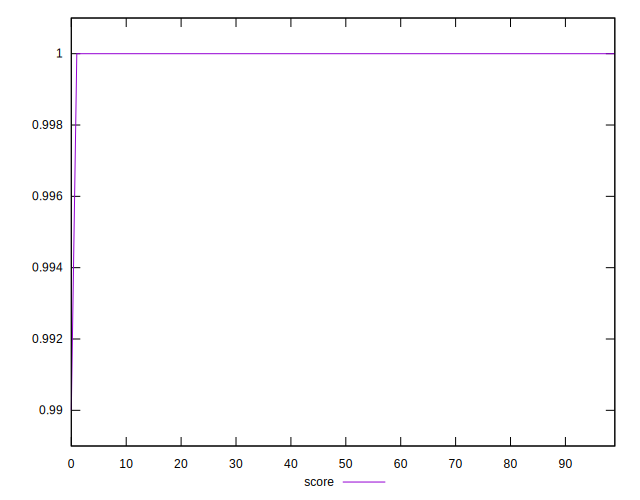

# //total-blocking-time/samples/pages+cached+noadtech

[→ Parent](../..)


## Raw


```yaml
p90min: 8.5
p90max: 86
p90range: 77.5
p90mean: 20.287234042553184
p90median: 13.75
p90stdev: 16.781526279345766
p90skewness: 2.294490856437944
p90eccentricity: 1.0000000000000007
p90discretization: 2.292682926829268
outlandishness: 1.2993250276559547
confidence: 9.786811828224279
p90confidence: 6.784933840631176

```


## Score


```yaml
p90min: 1
p90max: 1
p90range: 0
p90mean: 1
p90median: 1
p90stdev: 0
p90skewness: .nan
p90eccentricity: .nan
p90discretization: 94
outlandishness: 0.9998000100000003
confidence: 0.0003900279083597579
p90confidence: 0

```


## Raw Estimate


## Score Estimate


## P Score


```yaml
p90min: 0.9996320202224948
p90max: 0.9999999999999302
p90range: 0.0003679797774354121
p90mean: 0.9999898059939204
p90median: 0.9999999999727511
p90stdev: 0.00004815927355943974
p90skewness: -6.006344926129525
p90eccentricity: 1.0000000000000002
p90discretization: 2.292682926829268
outlandishness: 0.9997168550827483
confidence: 0.0004222395651095048
p90confidence: 0.000019471261402237347

```


## Score Difference


```yaml
p90min: 0
p90max: 0
p90range: 0
p90mean: 0
p90median: 0
p90stdev: 0
p90skewness: .nan
p90eccentricity: .nan
p90discretization: 94
outlandishness: .nan
confidence: 0
p90confidence: 0

```


## P Score Difference


```yaml
p90min: -0.00036797977750524513
p90max: -6.983302824892235e-14
p90range: 0.0003679797774354121
p90mean: -0.000010194006079367518
p90median: -2.7248925338341223e-11
p90stdev: 0.00004815927355943975
p90skewness: -6.006344926123267
p90eccentricity: 0.9999999999999999
p90discretization: 2.292682926829268
outlandishness: 25.795929440494543
confidence: 0.0001108741368299267
p90confidence: 0.000019471261402237347

```

