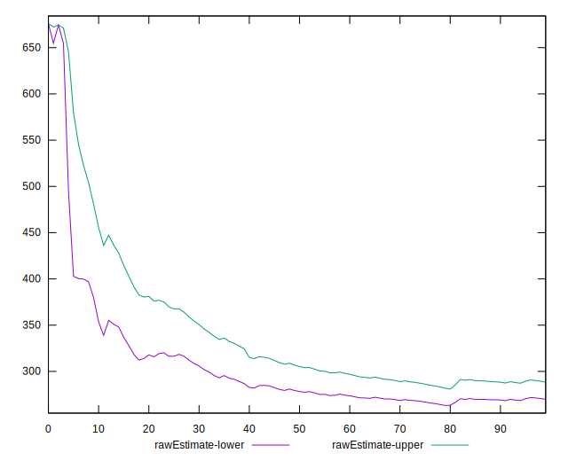
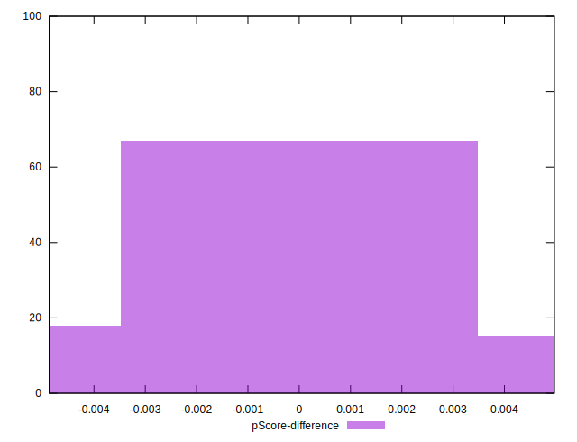

# //total-blocking-time/samples/pages+cached

[→ Parent](../..)


## Raw


```yaml
p90min: 192.4999999999991
p90max: 651
p90range: 458.5000000000009
p90mean: 279.1117021276596
p90median: 244.2500000000009
p90stdev: 90.41376972937928
p90skewness: 1.718027475415575
p90eccentricity: 1
p90discretization: 1.032967032967033
outlandishness: 1.0705525009484047
confidence: 44.56214898285539
p90confidence: 36.55516403480648

```


## Score


```yaml
p90min: 0.44
p90max: 0.98
p90range: 0.54
p90mean: 0.8952127659574474
p90median: 0.94
p90stdev: 0.10424734012020026
p90skewness: -2.099205165243561
p90eccentricity: 1.0000000000000002
p90discretization: 3.76
outlandishness: 0.9729015016827954
confidence: 0.05194015499203936
p90confidence: 0.04214821071715472

```


## Raw Estimate


## Score Estimate


## P Score


```yaml
p90min: 0.44363026096554276
p90max: 0.9759007570850196
p90range: 0.5322704961194769
p90mean: 0.8952662441251868
p90median: 0.9408360290530602
p90stdev: 0.10374636149598933
p90skewness: -2.0962538345900366
p90eccentricity: 0.9999999999999999
p90discretization: 1.032967032967033
outlandishness: 0.9727387834736246
confidence: 0.05174351228590466
p90confidence: 0.04194566020033879

```


## Score Difference


```yaml
p90min: 0
p90max: 1.1102230246251565e-16
p90range: 1.1102230246251565e-16
p90mean: 1.8897413185109047e-17
p90median: 0
p90stdev: 4.172435856076855e-17
p90skewness: 1.7550294029241154
p90eccentricity: 0.999999999999997
p90discretization: 47
outlandishness: 1.2460140625
confidence: 1.70729129665547e-17
p90confidence: 1.686956285531761e-17

```


## P Score Difference


```yaml
p90min: -0.004832458771380166
p90max: 0.00475263434392359
p90range: 0.009585093115303756
p90mean: -0.0000213101982434425
p90median: 0.00007523599914932566
p90stdev: 0.00282307972468838
p90skewness: -0.07852361402126484
p90eccentricity: 0.9999999999999994
p90discretization: 1.032967032967033
outlandishness: 0.9803668688673914
confidence: 0.0011697886947451656
p90confidence: 0.0011413985140560573

```

