# //total-blocking-time/samples/pages

[→ Parent](../..)


## Raw


```yaml
p90min: 190.5
p90max: 553.5
p90range: 363
p90mean: 281.5343829787234
p90median: 266.75000000000045
p90stdev: 82.71227588390902
p90skewness: 1.4475379307691592
p90eccentricity: 1.0000000000000002
p90discretization: 1.0804597701149425
outlandishness: 1.1080292621814318
confidence: 53.522932989552274
p90confidence: 33.44137537543663

```

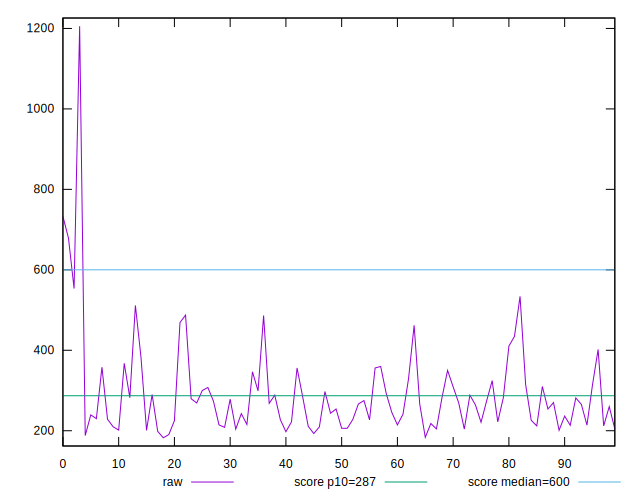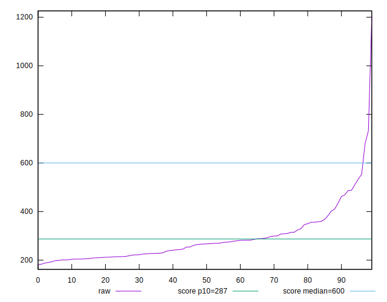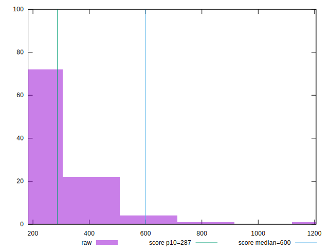
## Score


```yaml
p90min: 0.56
p90max: 0.98
p90range: 0.41999999999999993
p90mean: 0.8943617021276593
p90median: 0.92
p90stdev: 0.09487459259731772
p90skewness: -1.854215922072218
p90eccentricity: 1.0000000000000007
p90discretization: 3.357142857142857
outlandishness: 0.9659426951227538
confidence: 0.05502299997060734
p90confidence: 0.038358717986331614

```

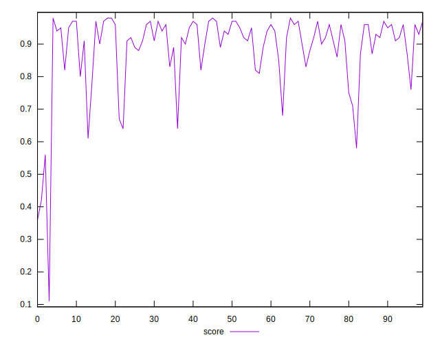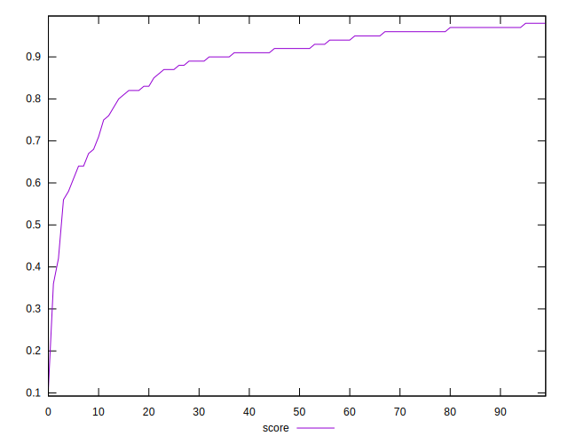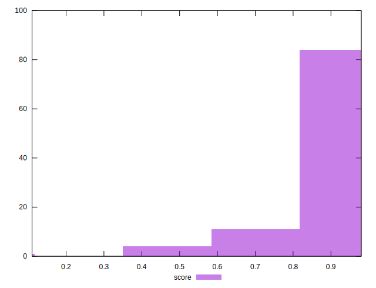
## Raw Estimate

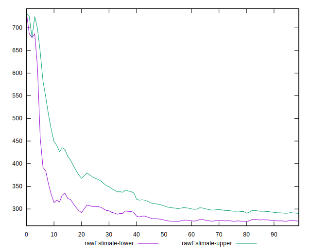
## Score Estimate

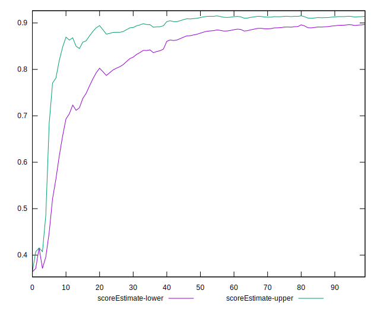
## P Score


```yaml
p90min: 0.5557436543746351
p90max: 0.9769110744045221
p90range: 0.42116742002988694
p90mean: 0.8941650210875995
p90median: 0.9205390914221688
p90stdev: 0.0953983796241639
p90skewness: -1.8476554507281564
p90eccentricity: 0.9999999999999997
p90discretization: 1.0804597701149425
outlandishness: 0.9659866354901588
confidence: 0.05508752027990878
p90confidence: 0.038570490161554206

```

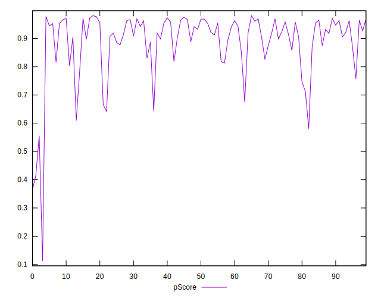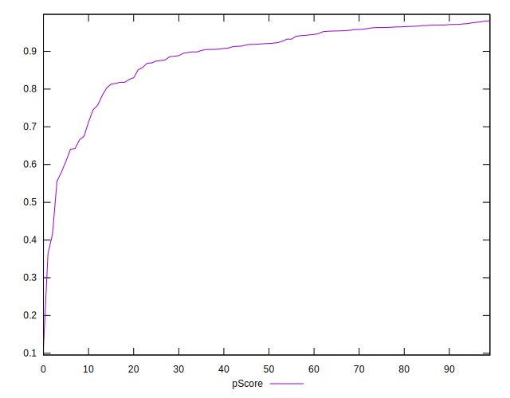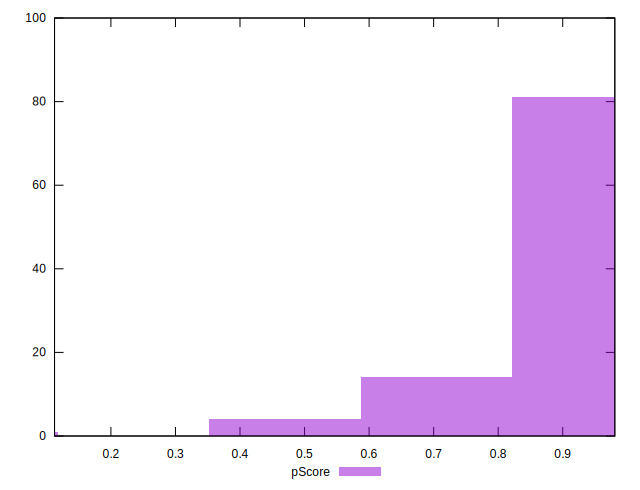
## Score Difference


```yaml
p90min: 0
p90max: 1.1102230246251565e-16
p90range: 1.1102230246251565e-16
p90mean: 1.5354148212901102e-17
p90median: 0
p90stdev: 3.8326270619553746e-17
p90skewness: 2.095534074628642
p90eccentricity: 0.9999999999999987
p90discretization: 47
outlandishness: 1.3384710059171598
confidence: 1.5954674592219336e-17
p90confidence: 1.549568294225121e-17

```

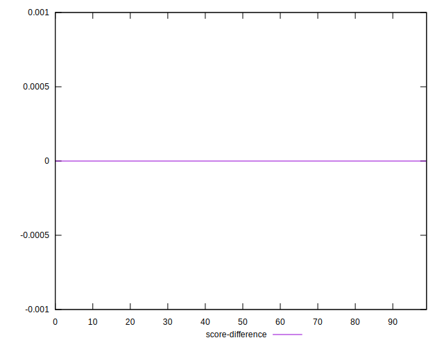
## P Score Difference


```yaml
p90min: -0.0047514142757782984
p90max: 0.004691391558088509
p90range: 0.009442805833866807
p90mean: -0.00018134679804519398
p90median: -0.0004115744011272682
p90stdev: 0.0028596340007708138
p90skewness: -0.010550977000343277
p90eccentricity: 0.9999999999999999
p90discretization: 1.0681818181818181
outlandishness: 0.9133795122374279
confidence: 0.0011795915433765692
p90confidence: 0.0011561777624201786

```

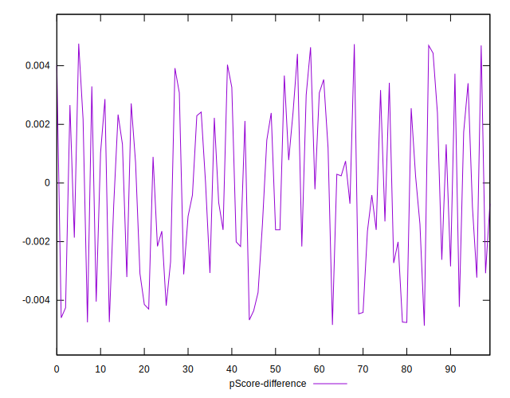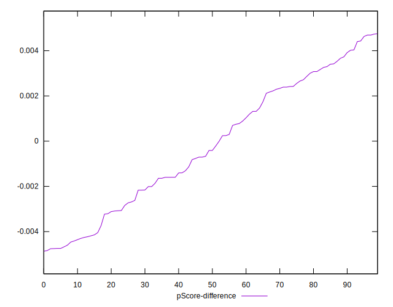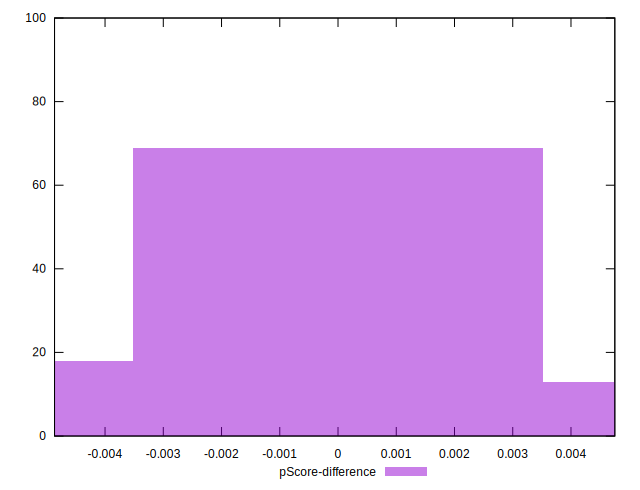