# //total-byte-weight/samples/pages+cached

[→ Parent](../..)


## Raw


```yaml
p90min: 2201027
p90max: 2209277
p90range: 8250
p90mean: 2201205.1063829786
p90median: 2201030
p90stdev: 1189.9886685325425
p90skewness: 6.634882648690229
p90eccentricity: 1.0000000000000007
p90discretization: 13.428571428571429
outlandishness: 1.000386419869218
confidence: 1091.0976350323942
p90confidence: 481.1239605202853

```

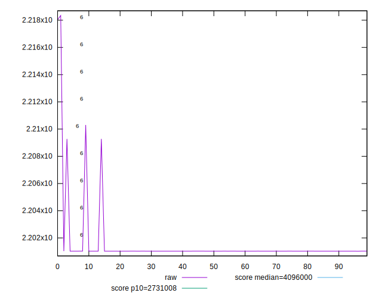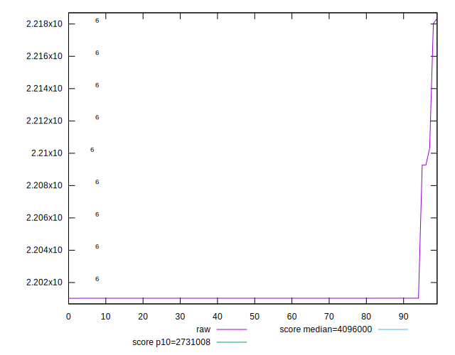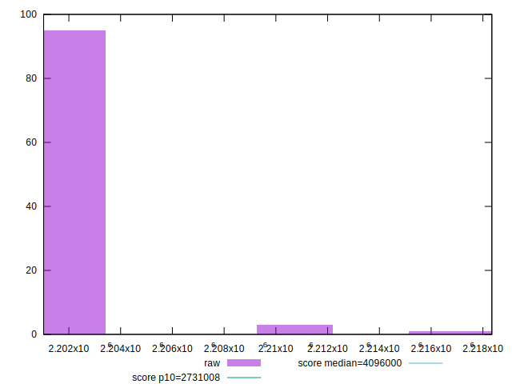
## Score


```yaml
p90min: 0.97
p90max: 0.98
p90range: 0.010000000000000009
p90mean: 0.9797872340425534
p90median: 0.98
p90stdev: 0.0014430489325798458
p90skewness: -6.634888026970641
p90eccentricity: 1.0000000000000044
p90discretization: 47
outlandishness: 0.9994137667243159
confidence: 0.0008543284941589421
p90confidence: 0.0005834386797342844

```

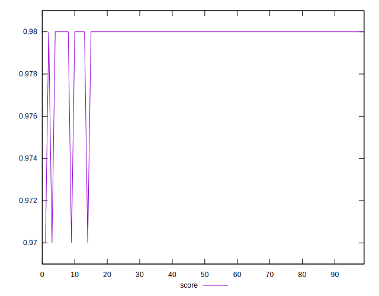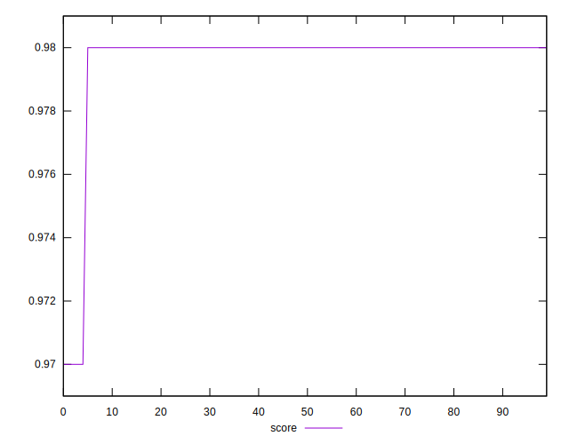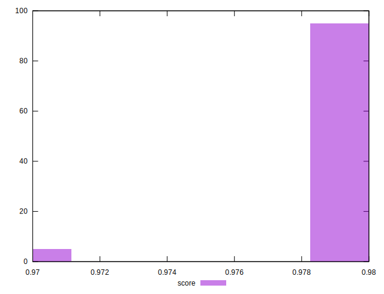
## Raw Estimate

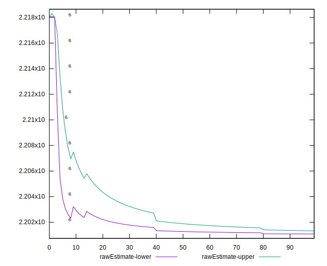
## Score Estimate


## P Score


```yaml
p90min: 0
p90max: 0
p90range: 0
p90mean: 0
p90median: 0
p90stdev: 0
p90skewness: .nan
p90eccentricity: .nan
p90discretization: 94
outlandishness: .nan
confidence: 0
p90confidence: 0

```


## Score Difference


```yaml
p90min: -0.98
p90max: -0.97
p90range: 0.010000000000000009
p90mean: -0.9797872340425534
p90median: -0.98
p90stdev: 0.0014430489325798458
p90skewness: 6.63488802697064
p90eccentricity: 1.000000000000004
p90discretization: 47
outlandishness: 0.9994137667243159
confidence: 0.0008543284941589421
p90confidence: 0.0005834386797342844

```

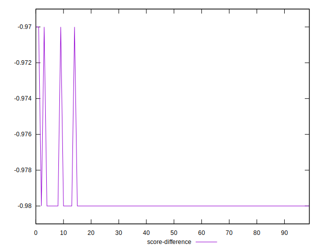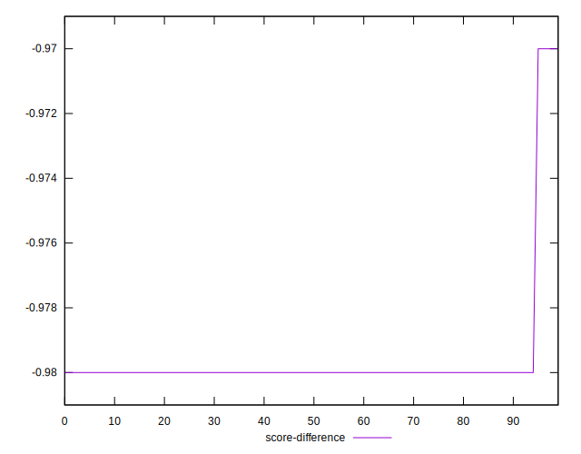
## P Score Difference


```yaml
p90min: -0.98
p90max: -0.97
p90range: 0.010000000000000009
p90mean: -0.9797872340425534
p90median: -0.98
p90stdev: 0.0014430489325798458
p90skewness: 6.63488802697064
p90eccentricity: 1.000000000000004
p90discretization: 47
outlandishness: 0.9994137667243159
confidence: 0.0008543284941589421
p90confidence: 0.0005834386797342844

```

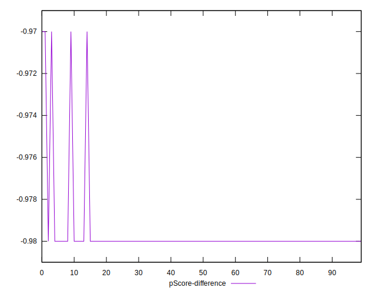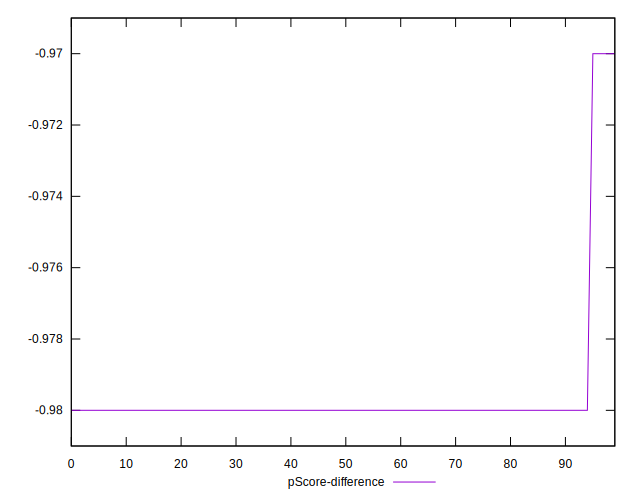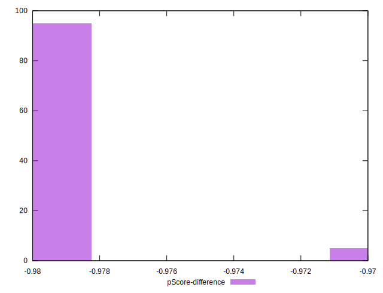