# //total-byte-weight/samples/pages

[→ Parent](../..)


## Raw


```yaml
p90min: 2201569
p90max: 2210200
p90range: 8631
p90mean: 2202087.3936170214
p90median: 2201950
p90stdev: 1174.7032329448882
p90skewness: 6.548174117542484
p90eccentricity: 0.9999999999999994
p90discretization: 2.473684210526316
outlandishness: 1.000339512507685
confidence: 1004.8703235094259
p90confidence: 474.94391065705514

```

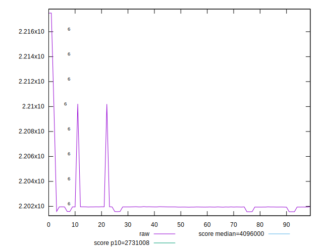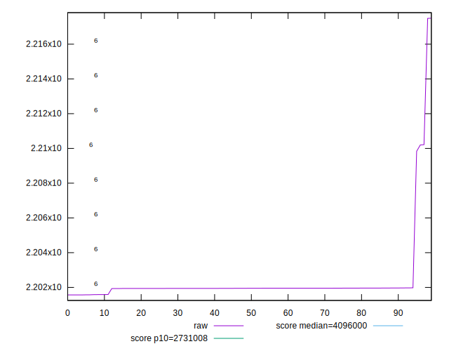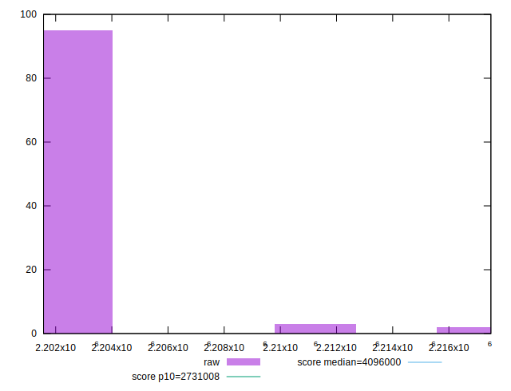
## Score


```yaml
p90min: 0.97
p90max: 0.98
p90range: 0.010000000000000009
p90mean: 0.9797872340425534
p90median: 0.98
p90stdev: 0.0014430489325798458
p90skewness: -6.634888026970641
p90eccentricity: 1.0000000000000044
p90discretization: 47
outlandishness: 0.9994137667243159
confidence: 0.0008543284941589421
p90confidence: 0.0005834386797342844

```

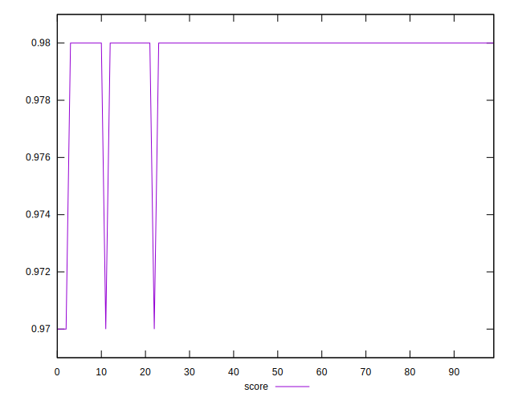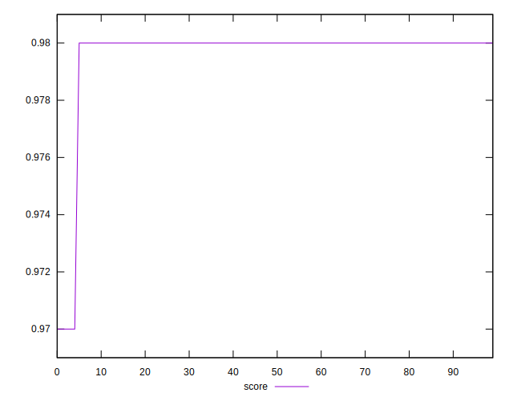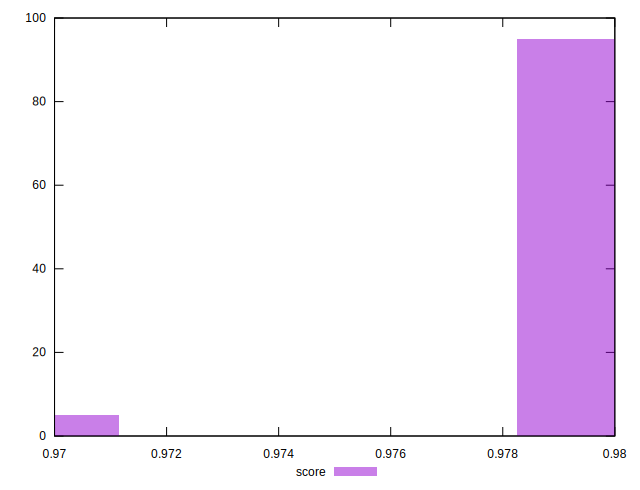
## Raw Estimate

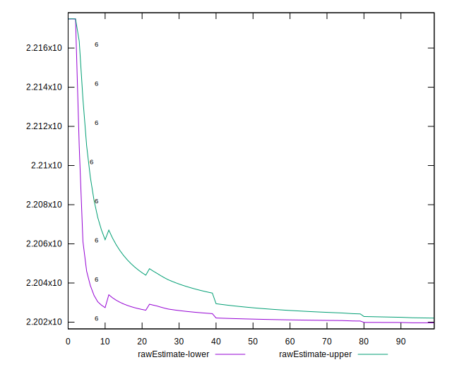
## Score Estimate


## P Score


```yaml
p90min: 0
p90max: 0
p90range: 0
p90mean: 0
p90median: 0
p90stdev: 0
p90skewness: .nan
p90eccentricity: .nan
p90discretization: 94
outlandishness: .nan
confidence: 0
p90confidence: 0

```


## Score Difference


```yaml
p90min: -0.98
p90max: -0.97
p90range: 0.010000000000000009
p90mean: -0.9797872340425534
p90median: -0.98
p90stdev: 0.001443048932579846
p90skewness: 6.634888026970635
p90eccentricity: 1.000000000000003
p90discretization: 47
outlandishness: 0.9994137667243159
confidence: 0.0008543284941589421
p90confidence: 0.0005834386797342845

```

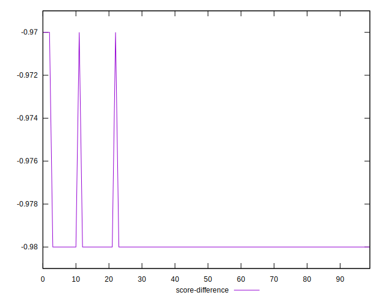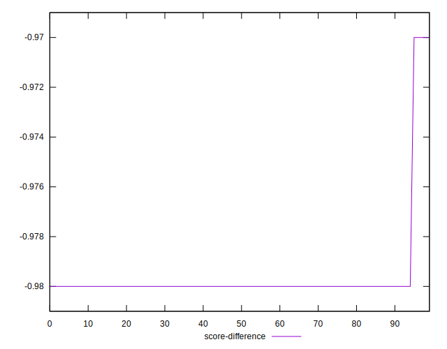
## P Score Difference


```yaml
p90min: -0.98
p90max: -0.97
p90range: 0.010000000000000009
p90mean: -0.9797872340425534
p90median: -0.98
p90stdev: 0.001443048932579846
p90skewness: 6.634888026970635
p90eccentricity: 1.000000000000003
p90discretization: 47
outlandishness: 0.9994137667243159
confidence: 0.0008543284941589421
p90confidence: 0.0005834386797342845

```

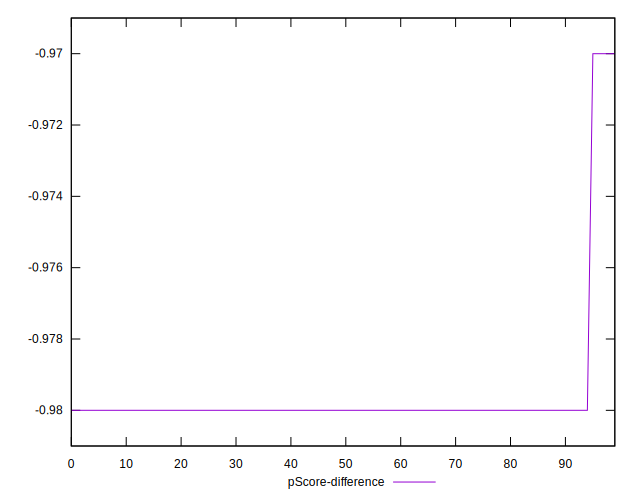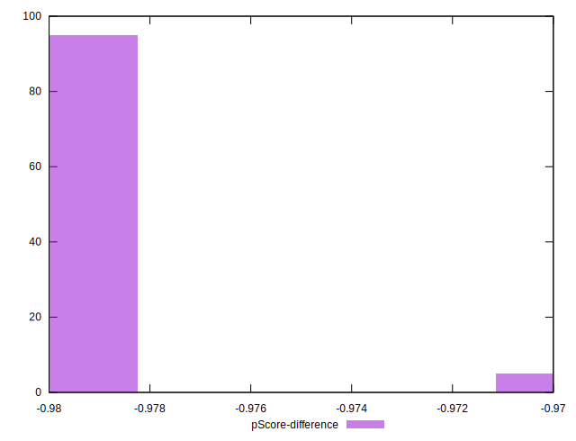