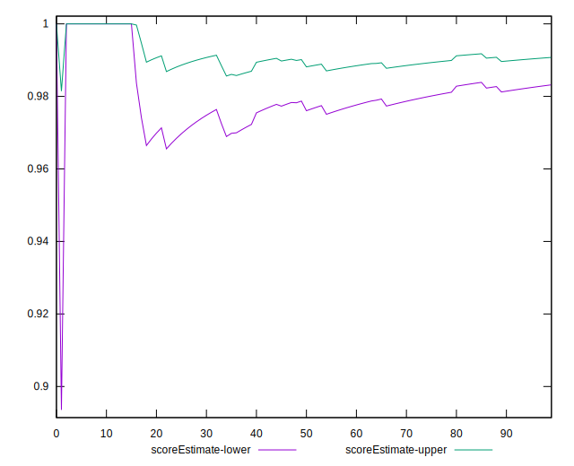
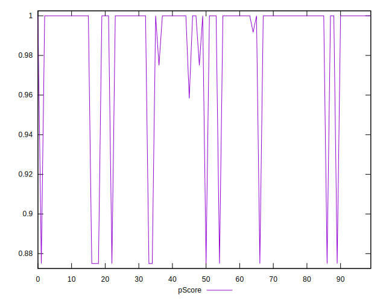

# //unminified-css/samples/pages+cached

[→ Parent](../..)


## Raw


```yaml
p90min: 0
p90max: 150
p90range: 150
p90mean: 15.638297872340425
p90median: 0
p90stdev: 44.23242554329561
p90skewness: 2.6512198650425267
p90eccentricity: 0.9999999999999982
p90discretization: 18.8
outlandishness: 1.5073825905872555
confidence: 19.104813659728816
p90confidence: 17.883598662374187

```


## Score


```yaml
p90min: 0.88
p90max: 1
p90range: 0.12
p90mean: 0.9875531914893617
p90median: 1
p90stdev: 0.03536094041220726
p90skewness: -2.6617529220289473
p90eccentricity: 1.0000000000000038
p90discretization: 18.8
outlandishness: 0.9942300427730656
confidence: 0.015277212072024817
p90confidence: 0.014296771178353212

```


## Raw Estimate


## Score Estimate


## P Score


```yaml
p90min: 0.875
p90max: 1
p90range: 0.125
p90mean: 0.986968085106383
p90median: 1
p90stdev: 0.03686035461941299
p90skewness: -2.651219865042536
p90eccentricity: 0.9999999999999994
p90discretization: 18.8
outlandishness: 0.9939944923730649
confidence: 0.015920678049774
p90confidence: 0.014902998885311816

```


## Score Difference


```yaml
p90min: 0
p90max: 0
p90range: 0
p90mean: 0
p90median: 0
p90stdev: 0
p90skewness: .nan
p90eccentricity: .nan
p90discretization: 94
outlandishness: .nan
confidence: 0
p90confidence: 0

```


## P Score Difference


```yaml
p90min: -0.0050000000000000044
p90max: 0
p90range: 0.0050000000000000044
p90mean: -0.0006028368794326239
p90median: 0
p90stdev: 0.0016098665904703783
p90skewness: -2.3418500610693656
p90eccentricity: 1.0000000000000036
p90discretization: 31.333333333333332
outlandishness: 1.3483307958477502
confidence: 0.0006863295252054016
p90confidence: 0.0006508846768024625

```

