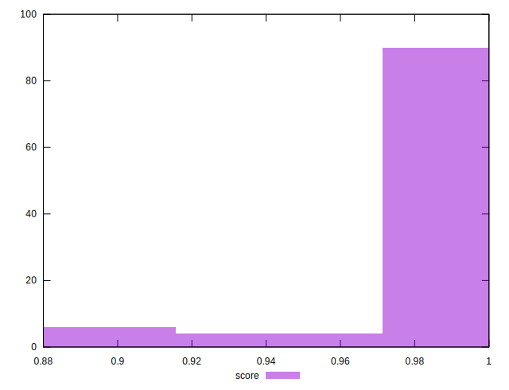
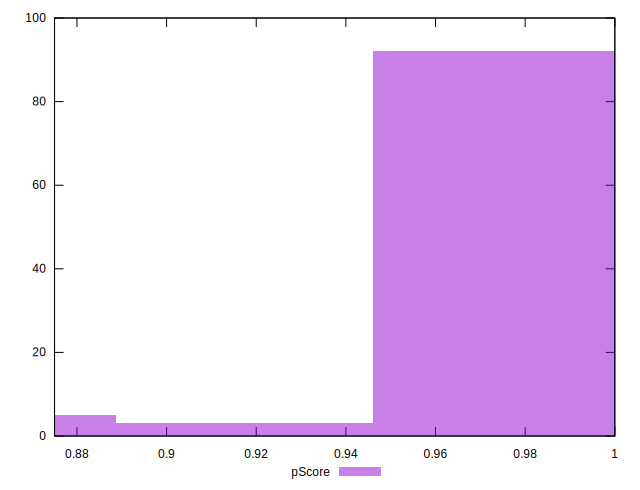

# //unminified-css/samples/pages

[→ Parent](../..)


## Raw


```yaml
p90min: 0
p90max: 150
p90range: 150
p90mean: 7.659574468085107
p90median: 0
p90stdev: 27.959907919783138
p90skewness: 3.9234011074776602
p90eccentricity: 1.0000000000000007
p90discretization: 11.75
outlandishness: 2.3332562499999994
confidence: 14.285488965173123
p90confidence: 11.304461958228034

```


## Score


```yaml
p90min: 0.88
p90max: 1
p90range: 0.12
p90mean: 0.9938297872340425
p90median: 1
p90stdev: 0.0225551986260621
p90skewness: -3.896388372080436
p90eccentricity: 0.9999999999999976
p90discretization: 11.75
outlandishness: 0.993510882586731
confidence: 0.011479701638945348
p90confidence: 0.009119285569899467

```


## Raw Estimate


## Score Estimate


## P Score


```yaml
p90min: 0.875
p90max: 1
p90range: 0.125
p90mean: 0.9936170212765958
p90median: 1
p90stdev: 0.023299923266485962
p90skewness: -3.9234011074776594
p90eccentricity: 1.0000000000000009
p90discretization: 11.75
outlandishness: 0.9932341810281583
confidence: 0.01190457413764427
p90confidence: 0.009420384965190034

```


## Score Difference


```yaml
p90min: 0
p90max: 0
p90range: 0
p90mean: 0
p90median: 0
p90stdev: 0
p90skewness: .nan
p90eccentricity: .nan
p90discretization: 94
outlandishness: .inf
confidence: 6.092792000602807e-18
p90confidence: 0

```


## P Score Difference


```yaml
p90min: -0.0050000000000000044
p90max: 0
p90range: 0.0050000000000000044
p90mean: -0.0002304964539007098
p90median: 0
p90stdev: 0.0009602336641170954
p90skewness: -4.328122601343746
p90eccentricity: 0.9999999999999963
p90discretization: 18.8
outlandishness: 2.305725443786975
confidence: 0.0004914696268032146
p90confidence: 0.0003882317838157534

```

