# //unminified-javascript/samples/pages+cached+noadtech+nomedia+nocss

[→ Parent](../..)


## Raw


```yaml
p90min: 0
p90max: 150
p90range: 150
p90mean: 19.148936170212767
p90median: 0
p90stdev: 50.05655470646208
p90skewness: 2.2315184957216836
p90eccentricity: 0.9999999999999992
p90discretization: 47
outlandishness: 1.3806249999999995
confidence: 20.9954137771717
p90confidence: 20.23835057191955

```

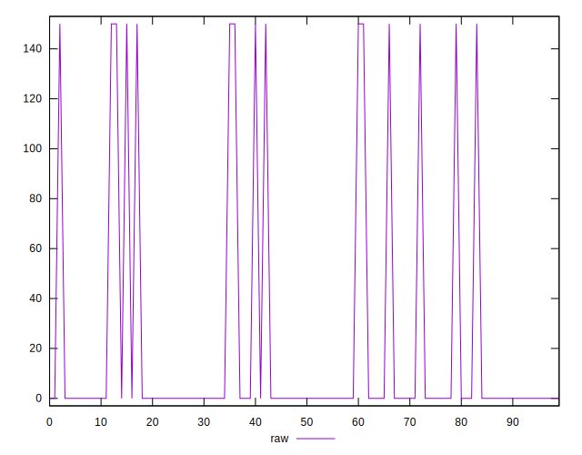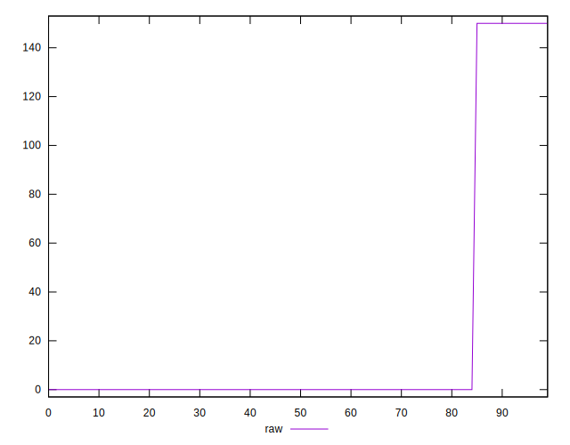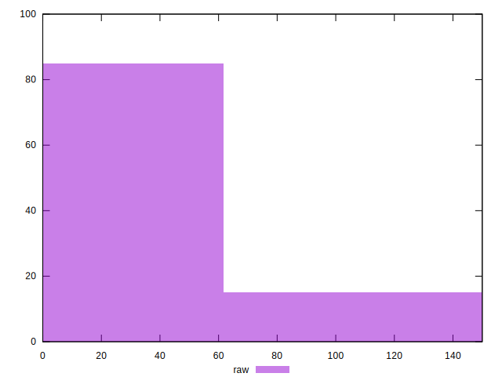
## Score


```yaml
p90min: 0.88
p90max: 1
p90range: 0.12
p90mean: 0.98468085106383
p90median: 1
p90stdev: 0.04004524376516969
p90skewness: -2.231518495721666
p90eccentricity: 0.9999999999999976
p90discretization: 47
outlandishness: 0.9945622956428456
confidence: 0.016796331021737346
p90confidence: 0.01619068045753565

```

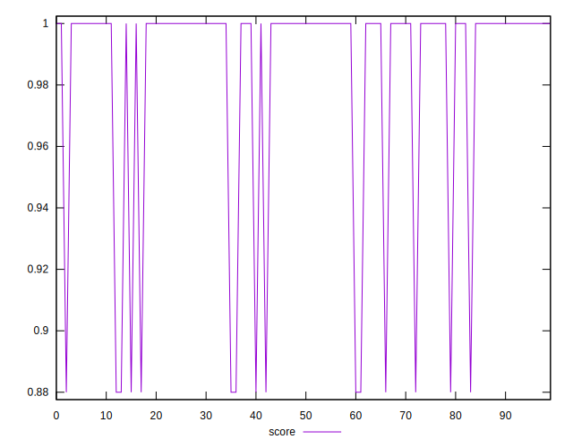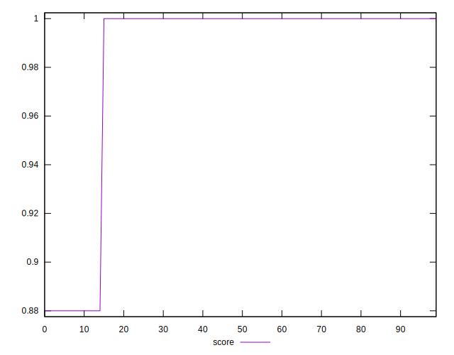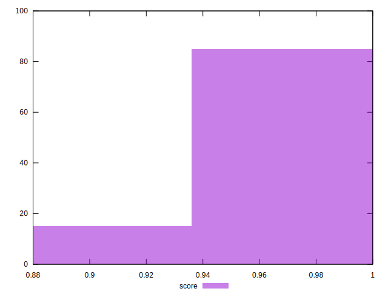
## Raw Estimate

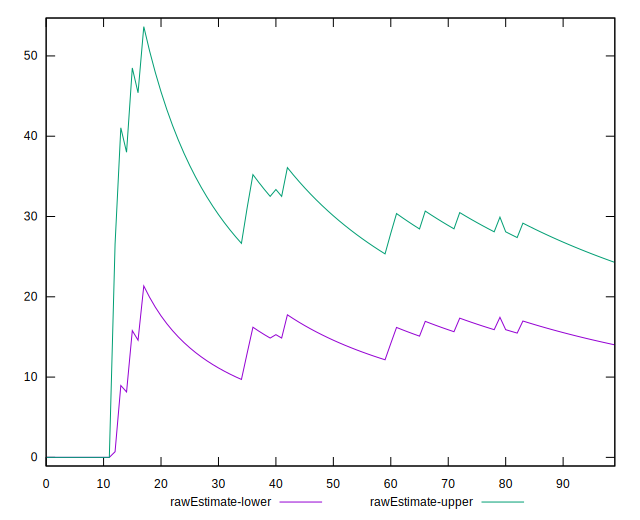
## Score Estimate

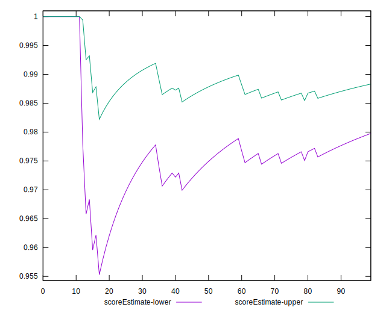
## P Score


```yaml
p90min: 0.875
p90max: 1
p90range: 0.125
p90mean: 0.9840425531914894
p90median: 1
p90stdev: 0.041713795588718405
p90skewness: -2.231518495721682
p90eccentricity: 0.9999999999999982
p90discretization: 47
outlandishness: 0.9943323776479182
confidence: 0.017496178147643097
p90confidence: 0.016865292143266295

```

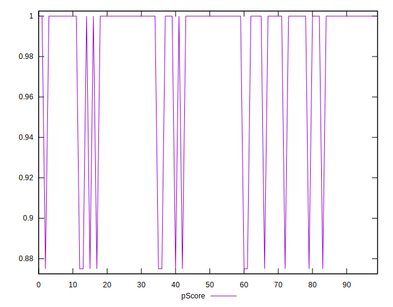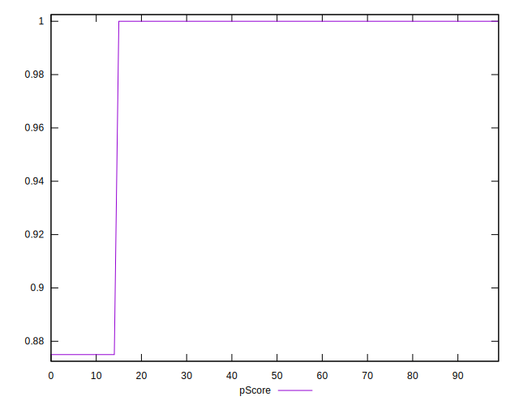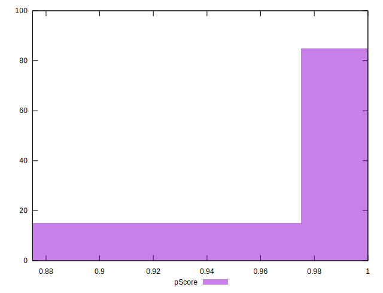
## Score Difference


```yaml
p90min: 0
p90max: 0
p90range: 0
p90mean: 0
p90median: 0
p90stdev: 0
p90skewness: .nan
p90eccentricity: .nan
p90discretization: 94
outlandishness: .nan
confidence: 0
p90confidence: 0

```


## P Score Difference


```yaml
p90min: -0.0050000000000000044
p90max: 0
p90range: 0.0050000000000000044
p90mean: -0.0006382978723404261
p90median: 0
p90stdev: 0.0016685518235487376
p90skewness: -2.231518495721682
p90eccentricity: 0.9999999999999982
p90discretization: 47
outlandishness: 1.3806249999999995
confidence: 0.0006998471259057239
p90confidence: 0.0006746116857306523

```

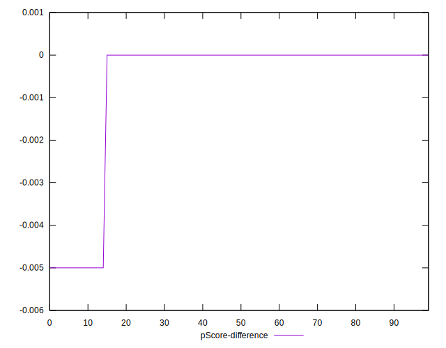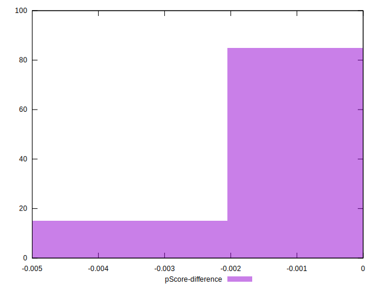