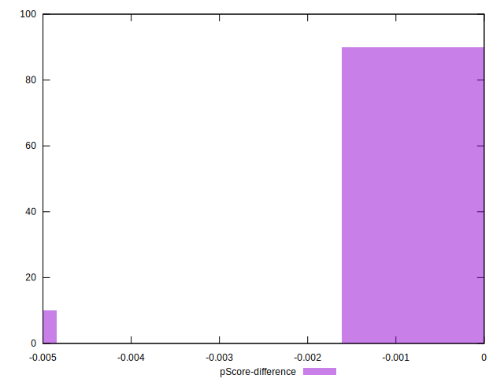

# //unminified-javascript/samples/pages+cached+noadtech

[→ Parent](../..)


## Raw


```yaml
p90min: 0
p90max: 150
p90range: 150
p90mean: 15.957446808510639
p90median: 0
p90stdev: 46.249074721881186
p90skewness: 2.553242569566712
p90eccentricity: 1.0000000000000009
p90discretization: 47
outlandishness: 2.262016
confidence: 25.92492305231868
p90confidence: 18.698949484981235

```


## Score


```yaml
p90min: 0.88
p90max: 1
p90range: 0.12
p90mean: 0.9872340425531914
p90median: 1
p90stdev: 0.03699925977750499
p90skewness: -2.5532425695667014
p90eccentricity: 0.9999999999999971
p90discretization: 47
outlandishness: 0.9864042863081524
confidence: 0.021235556290365533
p90confidence: 0.014959159587985004

```


## Raw Estimate


## Score Estimate


## P Score


```yaml
p90min: 0.875
p90max: 1
p90range: 0.125
p90mean: 0.9867021276595744
p90median: 1
p90stdev: 0.038540895601567655
p90skewness: -2.5532425695667085
p90eccentricity: 1.0000000000000004
p90discretization: 47
outlandishness: 0.9864612317550729
confidence: 0.021604102543598923
p90confidence: 0.01558245790415103

```


## Score Difference


```yaml
p90min: 0
p90max: 0
p90range: 0
p90mean: 0
p90median: 0
p90stdev: 0
p90skewness: .nan
p90eccentricity: .nan
p90discretization: 94
outlandishness: .nan
confidence: 0
p90confidence: 0

```


## P Score Difference


```yaml
p90min: -0.0050000000000000044
p90max: 0
p90range: 0.0050000000000000044
p90mean: -0.00037234042553191524
p90median: 0
p90stdev: 0.001312655604175859
p90skewness: -3.2417635938924367
p90eccentricity: 0.9999999999999999
p90discretization: 47
outlandishness: 1.8032653061224486
confidence: 0.0005879891953620175
p90confidence: 0.0005307193923611436

```

