# //unminified-javascript/samples/pages+cached

[→ Parent](../..)


## Raw


```yaml
p90min: 0
p90max: 150
p90range: 150
p90mean: 14.042553191489361
p90median: 0
p90stdev: 42.006057033763206
p90skewness: 2.8608343815295374
p90eccentricity: 1.0000000000000004
p90discretization: 18.8
outlandishness: 1.588745661157025
confidence: 18.40993659456029
p90confidence: 16.9834562801742

```

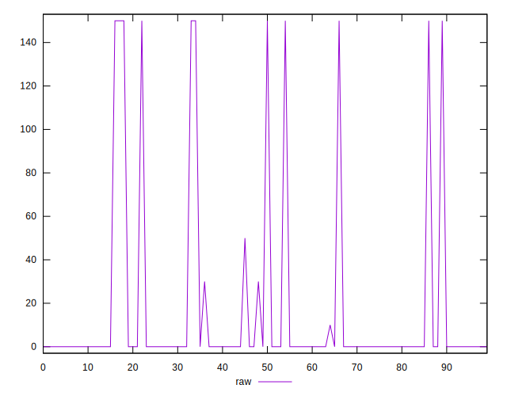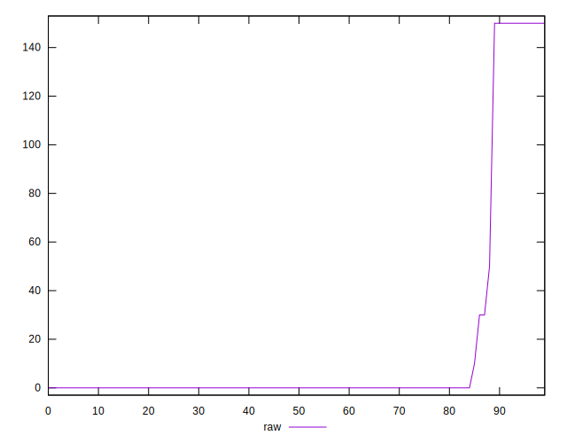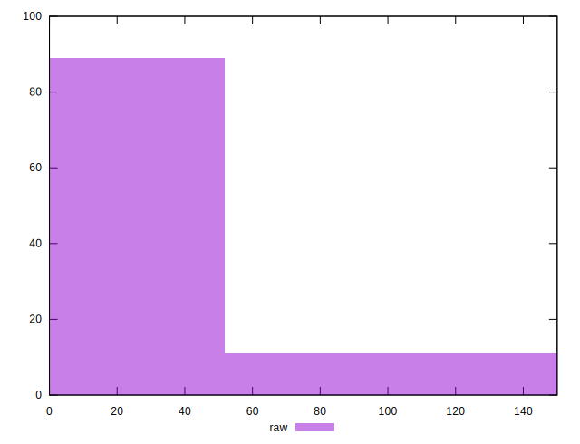
## Score


```yaml
p90min: 0.88
p90max: 1
p90range: 0.12
p90mean: 0.9888297872340426
p90median: 1
p90stdev: 0.03357609277950175
p90skewness: -2.8731116266699246
p90eccentricity: 0.9999999999999961
p90discretization: 18.8
outlandishness: 0.9940830121361237
confidence: 0.014720308168451702
p90confidence: 0.013575139969014476

```

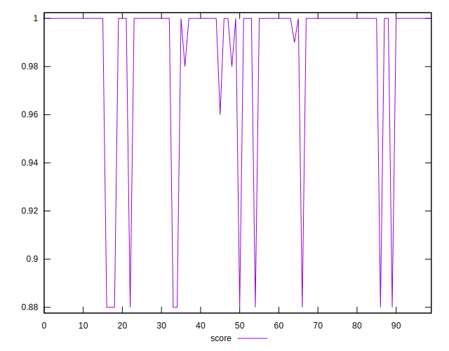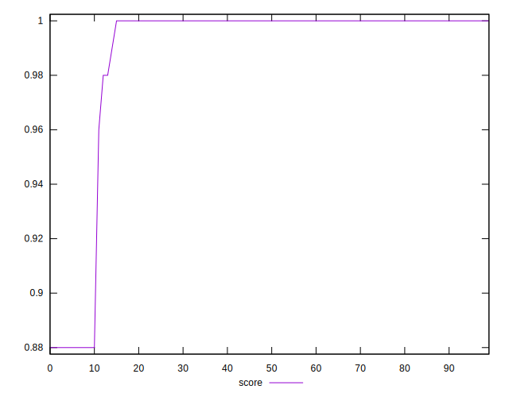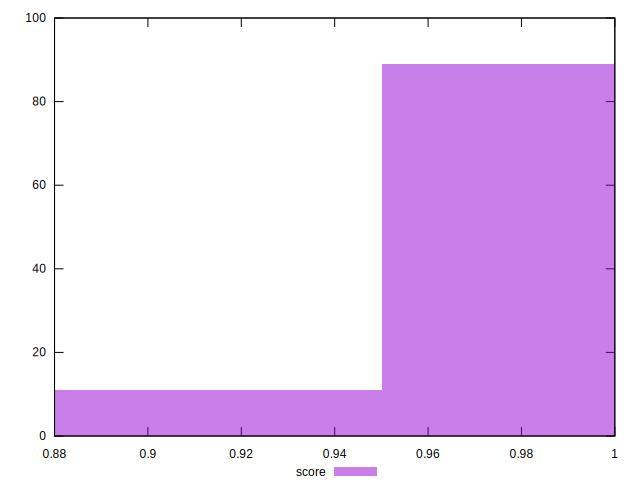
## Raw Estimate

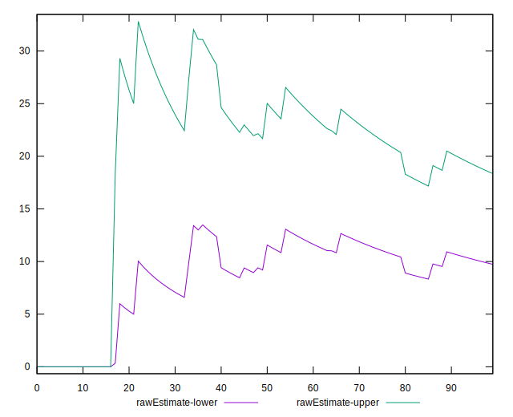
## Score Estimate

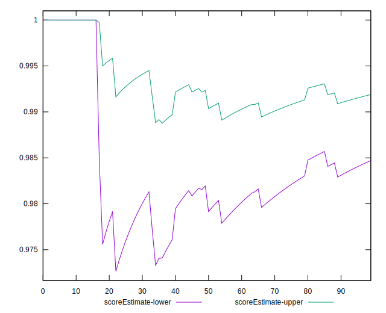
## P Score


```yaml
p90min: 0.875
p90max: 1
p90range: 0.125
p90mean: 0.9882978723404255
p90median: 1
p90stdev: 0.035005047528136005
p90skewness: -2.8608343815295494
p90eccentricity: 1.0000000000000027
p90discretization: 18.8
outlandishness: 0.9938415883196744
confidence: 0.015341613828800236
p90confidence: 0.0141528802334785

```

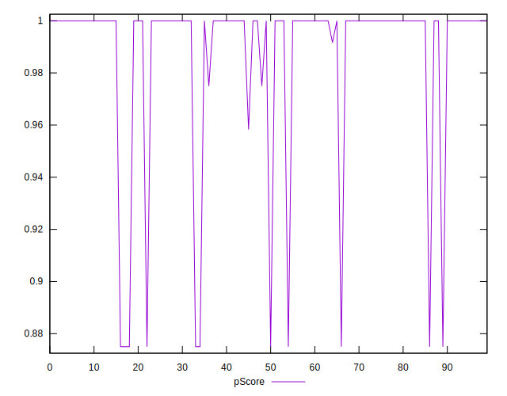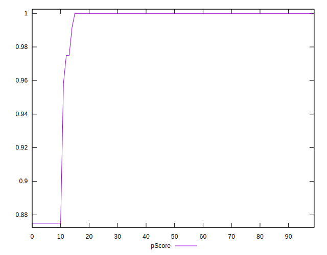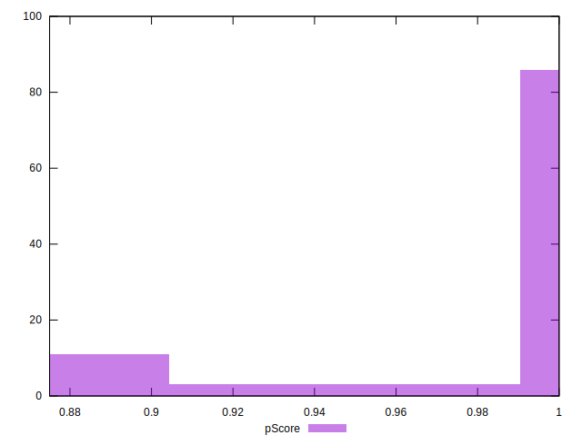
## Score Difference


```yaml
p90min: 0
p90max: 0
p90range: 0
p90mean: 0
p90median: 0
p90stdev: 0
p90skewness: .nan
p90eccentricity: .nan
p90discretization: 94
outlandishness: .nan
confidence: 0
p90confidence: 0

```


## P Score Difference


```yaml
p90min: -0.0050000000000000044
p90max: 0
p90range: 0.0050000000000000044
p90mean: -0.0005496453900709217
p90median: 0
p90stdev: 0.001544996841641451
p90skewness: -2.506835006338856
p90eccentricity: 0.9999999999999991
p90discretization: 31.333333333333332
outlandishness: 1.3984969823100928
confidence: 0.000665586634314125
p90confidence: 0.0006246572081720113

```

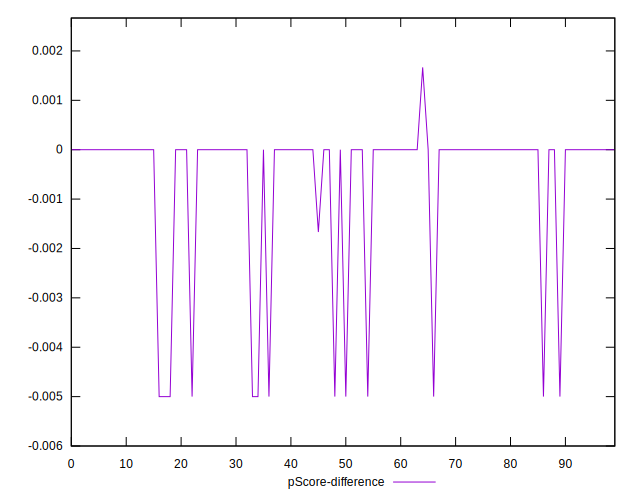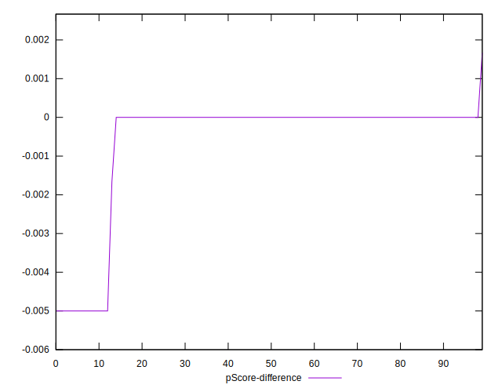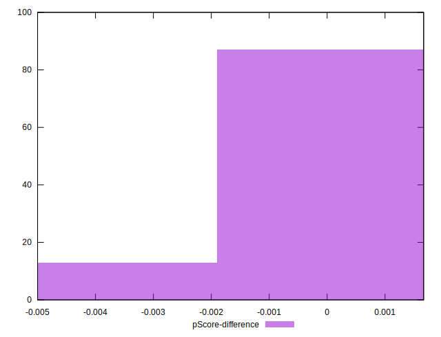