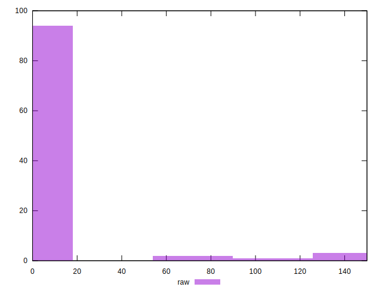
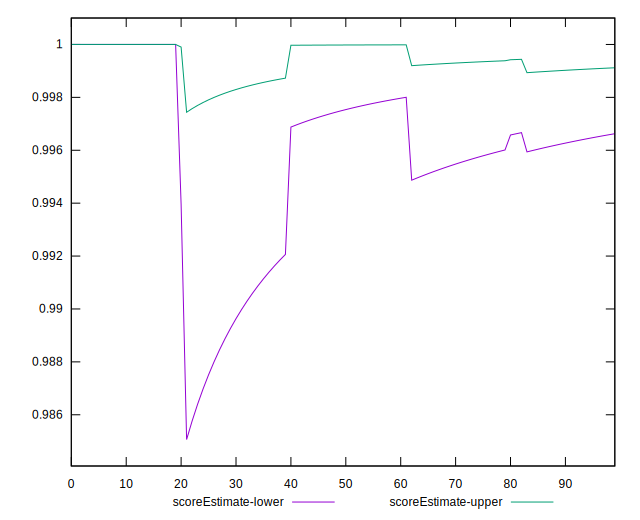
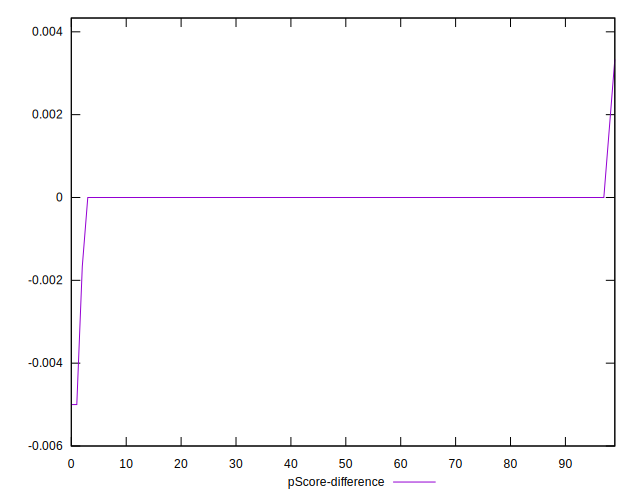

# //unminified-javascript/samples/pages

[→ Parent](../..)


## Raw


```yaml
p90min: 0
p90max: 110
p90range: 110
p90mean: 2.5531914893617023
p90median: 0
p90stdev: 14.581843141004633
p90skewness: 5.954151814901811
p90eccentricity: 1.0000000000000004
p90discretization: 23.5
outlandishness: 7.093344444444443
confidence: 11.1270730371693
p90confidence: 5.895580612828205

```


## Score


```yaml
p90min: 0.91
p90max: 1
p90range: 0.08999999999999997
p90mean: 0.9978723404255319
p90median: 1
p90stdev: 0.012105242439637785
p90skewness: -5.884330102217695
p90eccentricity: 1.000000000000006
p90discretization: 23.5
outlandishness: 0.9930526203463341
confidence: 0.009131328960149149
p90confidence: 0.004894266928439664

```


## Raw Estimate


## Score Estimate


## P Score


```yaml
p90min: 0.9083333333333333
p90max: 1
p90range: 0.09166666666666667
p90mean: 0.9978723404255319
p90median: 1
p90stdev: 0.012151535950837167
p90skewness: -5.95415181490184
p90eccentricity: 1.000000000000004
p90discretization: 23.5
outlandishness: 0.9929194721387481
confidence: 0.009272560864307748
p90confidence: 0.0049129838440234936

```


## Score Difference


```yaml
p90min: 0
p90max: 0
p90range: 0
p90mean: 0
p90median: 0
p90stdev: 0
p90skewness: .nan
p90eccentricity: .nan
p90discretization: 94
outlandishness: .inf
confidence: 6.092792000602807e-18
p90confidence: 0

```


## P Score Difference


```yaml
p90min: 0
p90max: 0
p90range: 0
p90mean: 0
p90median: 0
p90stdev: 0
p90skewness: .nan
p90eccentricity: .nan
p90discretization: 94
outlandishness: .inf
confidence: 0.00031899212509497646
p90confidence: 0

```

