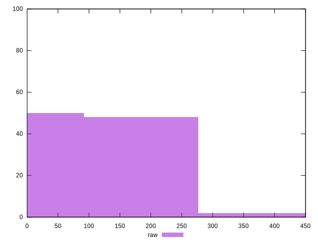

# //unused-css-rules/samples/pages+cached+noadtech+nomedia

[→ Parent](../..)


## Raw


```yaml
p90min: 0
p90max: 150
p90range: 150
p90mean: 75
p90median: 75
p90stdev: 75
p90skewness: 0
p90eccentricity: 1
p90discretization: 47
outlandishness: 1.1236000000000002
confidence: 33.73131613354857
p90confidence: 30.323227433349803

```


## Score


```yaml
p90min: 0.88
p90max: 1
p90range: 0.12
p90mean: 0.9399999999999998
p90median: 0.94
p90stdev: 0.05999999999999995
p90skewness: 2.5010726350491826e-14
p90eccentricity: 1.0000000000000009
p90discretization: 47
outlandishness: 0.9927790402897233
confidence: 0.02660484885880637
p90confidence: 0.024258581946679823

```


## Raw Estimate


## Score Estimate


## P Score


```yaml
p90min: 0.875
p90max: 1
p90range: 0.125
p90mean: 0.9375
p90median: 0.9375
p90stdev: 0.0625
p90skewness: 0
p90eccentricity: 1
p90discretization: 47
outlandishness: 0.9929015308641973
confidence: 0.027445328389808708
p90confidence: 0.02526935619445817

```


## Score Difference


```yaml
p90min: 0
p90max: 0
p90range: 0
p90mean: 0
p90median: 0
p90stdev: 0
p90skewness: .nan
p90eccentricity: .nan
p90discretization: 94
outlandishness: .nan
confidence: 0
p90confidence: 0

```


## P Score Difference


```yaml
p90min: -0.0050000000000000044
p90max: 0
p90range: 0.0050000000000000044
p90mean: -0.0024290780141844
p90median: 0
p90stdev: 0.0024871406106373732
p90skewness: -0.05355726277722474
p90eccentricity: 1
p90discretization: 31.333333333333332
outlandishness: 1.003506718525228
confidence: 0.0009752667347981617
p90confidence: 0.0010055750719343678

```

