# //unused-css-rules/samples/pages+cached+noadtech

[→ Parent](../..)


## Raw


```yaml
p90min: 0
p90max: 300
p90range: 300
p90mean: 154.7872340425532
p90median: 150
p90stdev: 80.2486657064691
p90skewness: 0.02924958414302599
p90eccentricity: 1.0000000000000009
p90discretization: 31.333333333333332
outlandishness: 1.015731491125518
confidence: 35.20086585871288
p90confidence: 32.44531388586828

```

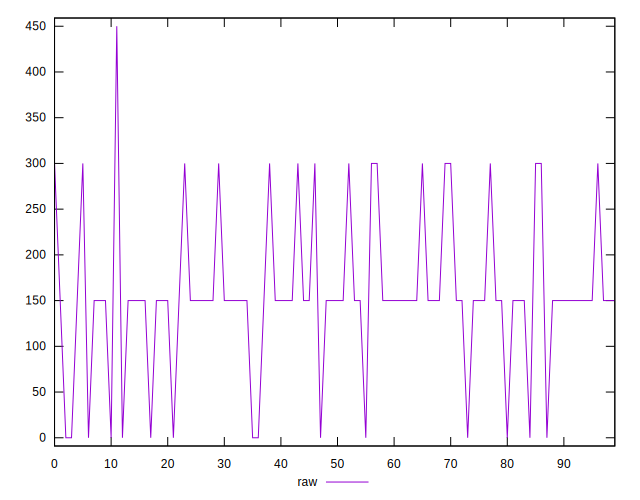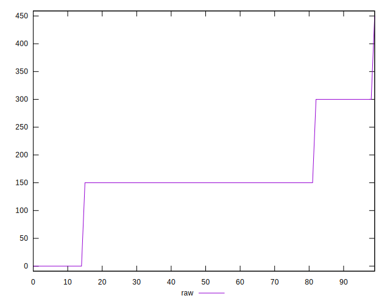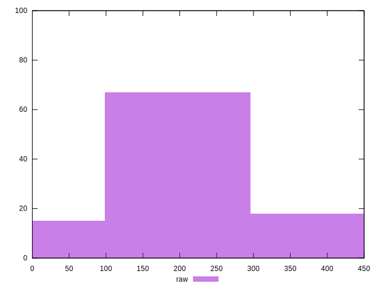
## Score


```yaml
p90min: 0.75
p90max: 1
p90range: 0.25
p90mean: 0.8745744680851062
p90median: 0.88
p90stdev: 0.06712428760455638
p90skewness: -0.1867897949412734
p90eccentricity: 0.9999999999999994
p90discretization: 31.333333333333332
outlandishness: 0.9982297100972685
confidence: 0.02890015910503761
p90confidence: 0.027139000524460617

```

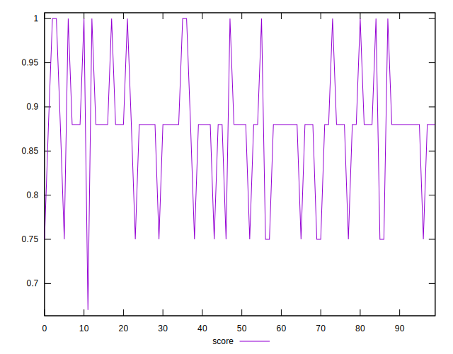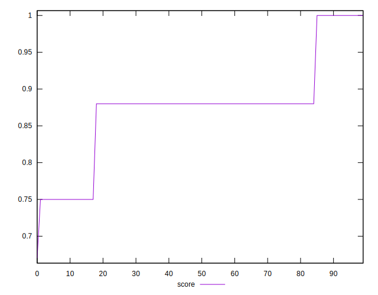
## Raw Estimate

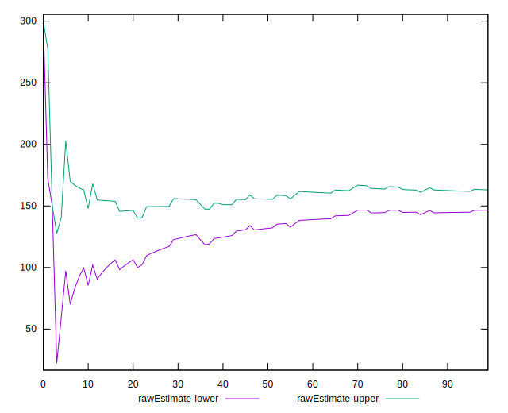
## Score Estimate

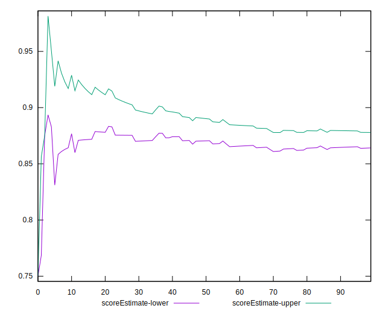
## P Score


```yaml
p90min: 0.75
p90max: 1
p90range: 0.25
p90mean: 0.8710106382978723
p90median: 0.875
p90stdev: 0.06687388808872421
p90skewness: -0.02924958414302429
p90eccentricity: 1.0000000000000016
p90discretization: 31.333333333333332
outlandishness: 0.9986365973492869
confidence: 0.028840177965338165
p90confidence: 0.02703776157155689

```

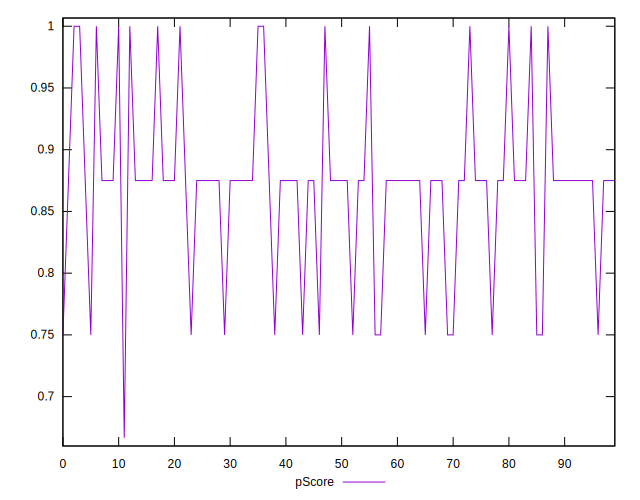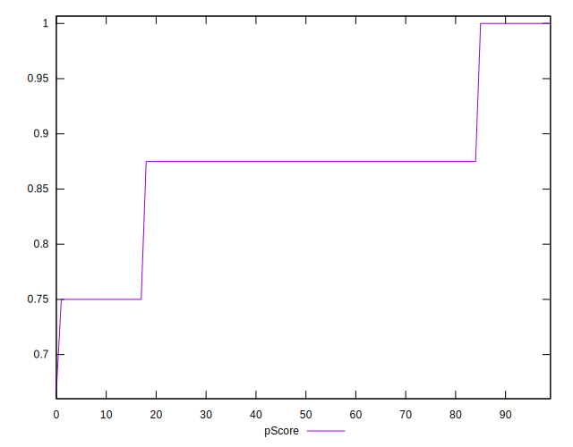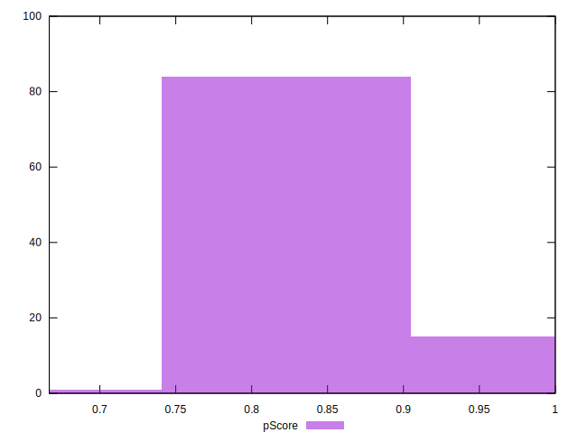
## Score Difference


```yaml
p90min: 0
p90max: 0
p90range: 0
p90mean: 0
p90median: 0
p90stdev: 0
p90skewness: .nan
p90eccentricity: .nan
p90discretization: 94
outlandishness: .nan
confidence: 0
p90confidence: 0

```


## P Score Difference


```yaml
p90min: -0.0050000000000000044
p90max: 0
p90range: 0.0050000000000000044
p90mean: -0.0034397163120567413
p90median: -0.0050000000000000044
p90stdev: 0.002303873173160397
p90skewness: 0.8152567131608136
p90eccentricity: 1.0000000000000009
p90discretization: 31.333333333333332
outlandishness: 0.9674851843979171
confidence: 0.0009121030270397041
p90confidence: 0.0009314782694311469

```

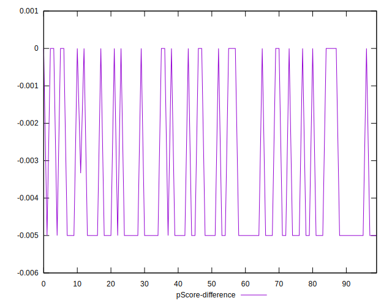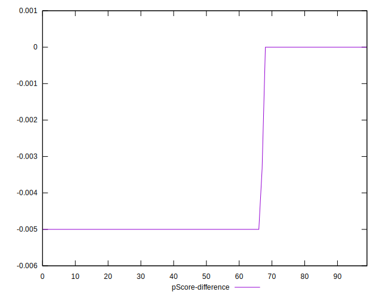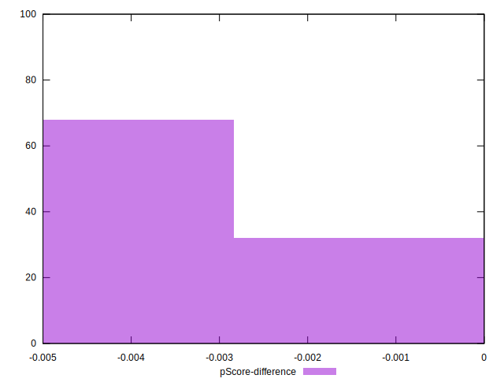