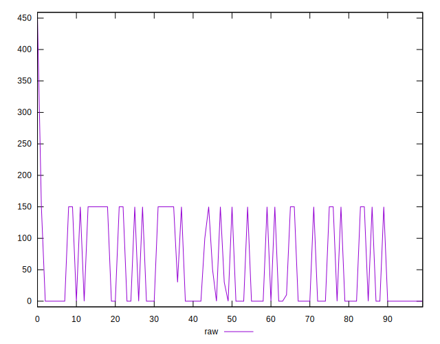

# //unused-css-rules/samples/pages+cached

[→ Parent](../..)


## Raw


```yaml
p90min: 0
p90max: 150
p90range: 150
p90mean: 56.59574468085106
p90median: 0
p90stdev: 71.33309922975482
p90skewness: 0.5181390445259517
p90eccentricity: 1
p90discretization: 15.666666666666666
outlandishness: 1.1502965699021992
confidence: 31.80825302933103
p90confidence: 28.84066388626087

```


## Score


```yaml
p90min: 0.88
p90max: 1
p90range: 0.12
p90mean: 0.9547872340425532
p90median: 1
p90stdev: 0.05708762811537051
p90skewness: -0.5206239650452772
p90eccentricity: 1.0000000000000009
p90discretization: 15.666666666666666
outlandishness: 0.9937524070905716
confidence: 0.02491162798908703
p90confidence: 0.023081081746304997

```


## Raw Estimate


## Score Estimate


## P Score


```yaml
p90min: 0.875
p90max: 1
p90range: 0.125
p90mean: 0.9528368794326241
p90median: 1
p90stdev: 0.059444249358129
p90skewness: -0.5181390445259512
p90eccentricity: 0.9999999999999987
p90discretization: 15.666666666666666
outlandishness: 0.9937055077244792
confidence: 0.025762656116495374
p90confidence: 0.02403388657188405

```


## Score Difference


```yaml
p90min: 0
p90max: 0
p90range: 0
p90mean: 0
p90median: 0
p90stdev: 0
p90skewness: .nan
p90eccentricity: .nan
p90discretization: 94
outlandishness: .nan
confidence: 0
p90confidence: 0

```


## P Score Difference


```yaml
p90min: -0.0050000000000000044
p90max: 0
p90range: 0.0050000000000000044
p90mean: -0.0019503546099290806
p90median: 0
p90stdev: 0.0024022041921191446
p90skewness: -0.4470342989255651
p90eccentricity: 0.9999999999999989
p90discretization: 23.5
outlandishness: 1.0167972231404954
confidence: 0.0009529537581709274
p90confidence: 0.0009712344541196687

```

